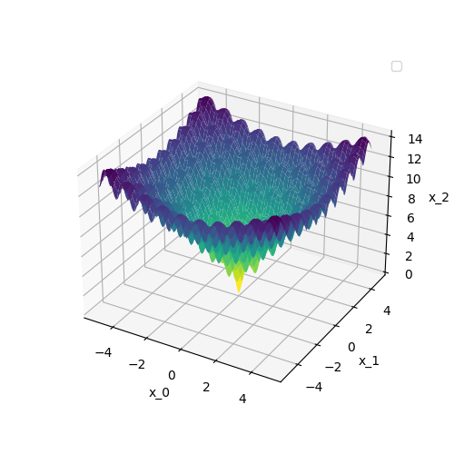
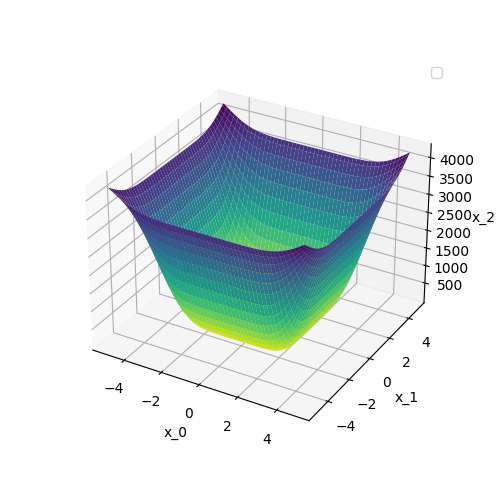
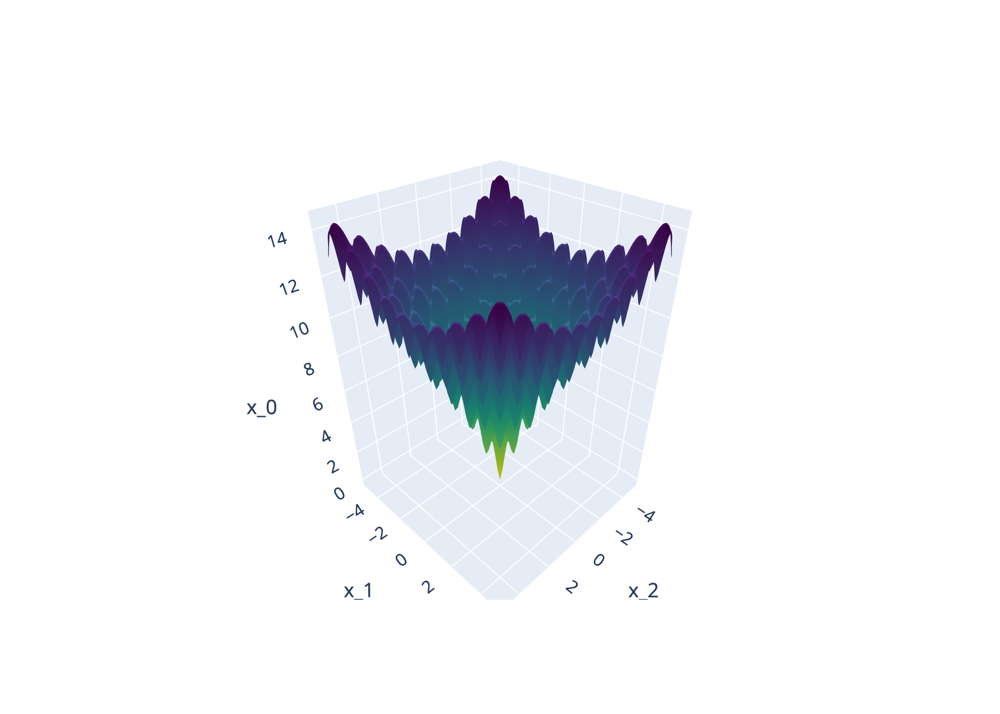
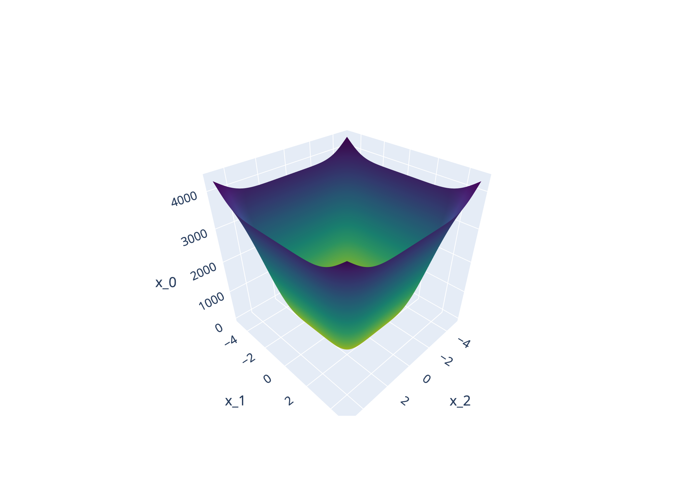

## OptBench Dataset Generation

!!! abstract "Dataset Generation"

    This page describes how to generate the OptBench dataset, which covers a wide range
    a wide range of different formats:

    - [x] Text file based as `*.csv` and `*.json`
    - [x] Binary file based as `*.npy`
    - [x] Image file based as `*.png` for 2D, 3D, and gif animations. Furthermore,
           the image files can also contains series of different functions, if the
           used functions are 2D.

??? Example "Text file based dataset generation"

    === "JSON"

        ```json
        {
            "x_0": [
                [
                -5.0, -4.9, -4.800000000000001, -4.700000000000001, -4.600000000000001,
                -4.500000000000002, -4.400000000000002, -4.3000000000000025,
                -4.200000000000003, -4.100000000000003, -4.0000000000000036,
                -3.900000000000004, -3.8000000000000043, -3.7000000000000046,
                -3.600000000000005, -3.5000000000000053, -3.4000000000000057,
                -3.300000000000006, -3.2000000000000064, -3.1000000000000068,
                -3.000000000000007, -2.9000000000000075, -2.800000000000008,
                -2.700000000000008, -2.6000000000000085, -2.500000000000009,
                -2.4000000000000092, -2.3000000000000096, -2.20000000000001,
                -2.1000000000000103, -2.0000000000000107, -1.900000000000011,
                -1.8000000000000114, -1.7000000000000117, -1.600000000000012,
                -1.5000000000000124, -1.4000000000000128, -1.3000000000000131,
                -1.2000000000000135, -1.1000000000000139, -1.0000000000000142,
                -0.9000000000000146, -0.8000000000000149, -0.7000000000000153,
                -0.6000000000000156, -0.500000000000016, -0.40000000000001634,
                -0.3000000000000167, -0.20000000000001705, -0.10000000000001741,
                -1.7763568394002505e-14, 0.09999999999998188, 0.19999999999998153,
                0.29999999999998117, 0.3999999999999808, 0.49999999999998046,
                0.5999999999999801, 0.6999999999999797, 0.7999999999999794,
                0.899999999999979, 0.9999999999999787, 1.0999999999999783,
                1.199999999999978, 1.2999999999999776, 1.3999999999999773,
                1.499999999999977, 1.5999999999999766, 1.6999999999999762,
                1.7999999999999758, 1.8999999999999755, 1.9999999999999751,
                2.0999999999999748, 2.1999999999999744, 2.299999999999974,
                2.3999999999999737, 2.4999999999999734, 2.599999999999973,
                2.6999999999999726, 2.7999999999999723, 2.899999999999972,
                2.9999999999999716, 3.0999999999999712, 3.199999999999971,
                3.2999999999999705, 3.39999999999997, 3.49999999999997,
                3.5999999999999694, 3.699999999999969, 3.7999999999999687,
                3.8999999999999684, 3.999999999999968, 4.099999999999968,
                4.199999999999967, 4.299999999999967, 4.399999999999967,
                4.499999999999966, 4.599999999999966, 4.6999999999999655,
                4.799999999999965, 4.899999999999965
                ], ...
            ]
        }
        ```

    === "CSV"

        ```csv
        x_0,x_1,x_2
        -5.000000,-5.000000,12.642411
        -5.000000,-4.900000,12.816406
        -5.000000,-4.800000,13.289395
        -5.000000,-4.700000,13.727453
        -5.000000,-4.600000,13.966601
        -5.000000,-4.500000,13.993625
        -5.000000,-4.400000,13.820456
        -5.000000,-4.300000,13.435255
        -5.000000,-4.200000,12.851327
        -5.000000,-4.100000,12.232743
        -5.000000,-4.000000,11.913518
        -5.000000,-3.900000,12.089881
        ...,...,...
        ```

    === "Code"

        For the generation of the dataset, the following code snippet can be used:

        ```python
        es.save_as_csv(dir_name="csv")
        es.save_as_json(dir_name="json")
        ```

??? Example "Image Generation"

    === "Matplotlib `res.plot_style = "matplot"`"


        |                         Example - I                          |
        | :----------------------------------------------------------: |
        |    |
        |  |

        |                                                          Example - II                                                           |
        | :-----------------------------------------------------------------------------------------------------------------------------: |
        |  |

    === "Plotly `res.plot_style = "plotly"`"


        |                         Example - I                         |
        | :---------------------------------------------------------: |
        |    |
        |  |

        |                                                          Example - II                                                          |
        | :----------------------------------------------------------------------------------------------------------------------------: |
        |  |

<!-- prettier-ignore -->
::: umf.core.create.OptBench
    options:
        show_bases: false
        show_source: false
        show_inherited_members: false
        allow_inspection: false
        inheritance_graph: false
        heading_level: 0
        members: None
