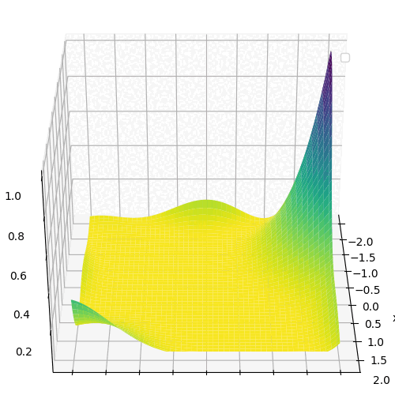
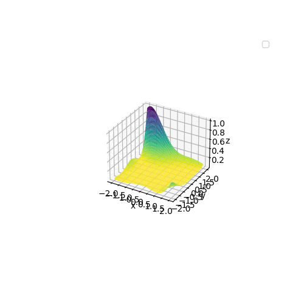
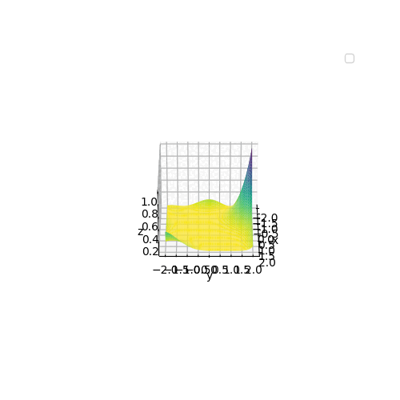

!!! info "About GIFs"

    In addition to the standard image formats, UMF supports exporting plots as animated
    GIFs. This is done by calling the `plot.save_gif` method.

<!-- prettier-ignore -->
::: umf.images.diagrams.ClassicPlot.plot_save_gif
    options:
        show_bases: false
        show_source: false
        show_inherited_members: false
        allow_inspection: false
        inheritance_graph: false
        heading_level: 0
        members: None

|                              Zoom                              |                            Rotation                            |                      Zoom + Rotation                       |
| :------------------------------------------------------------: | :------------------------------------------------------------: | :--------------------------------------------------------: |
|  |  |  |
