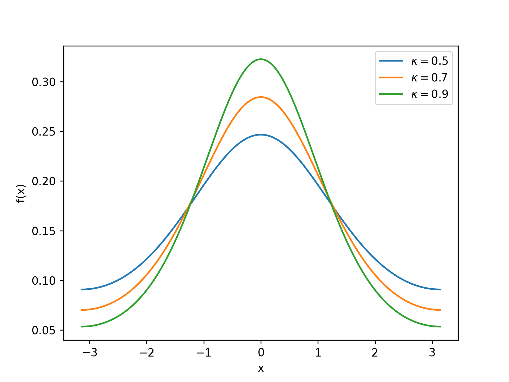
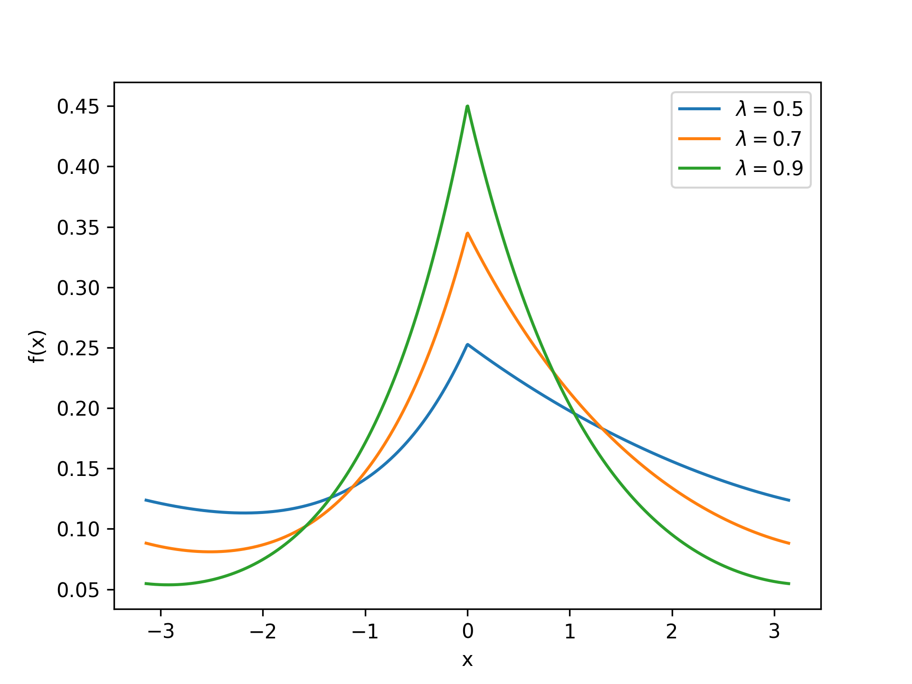

## Von Mises Distribution

<!-- prettier-ignore -->
::: umf.functions.distributions.continuous_2pi_interval.VonMisesDistribution
    options:
        show_bases: false
        show_source: true
        show_inherited_members: false
        allow_inspection: false
        inheritance_graph: false
        heading_level: 0
        members: None

|                      Probability Density Function                       |
| :---------------------------------------------------------------------: |
|  |

## Wrapped Asymmetric Laplace Distribution

<!-- prettier-ignore -->
::: umf.functions.distributions.continuous_2pi_interval.WrappedAsymLaplaceDistribution
    options:
        show_bases: false
        show_source: true
        show_inherited_members: false
        allow_inspection: false
        inheritance_graph: false
        heading_level: 0
        members: None

|                                   Probability Density Function                                    |
| :-----------------------------------------------------------------------------------------------: |
|  |
