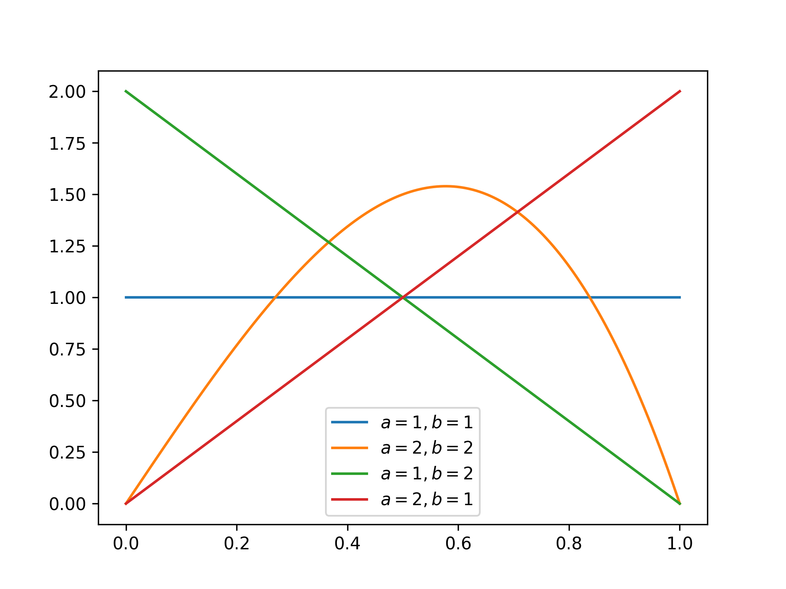
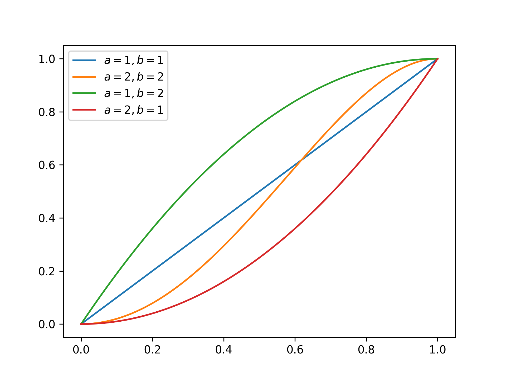

## Kumaraswamy Distribution

<!-- prettier-ignore -->
::: umf.functions.distributions.continuous_bounded_interval.KumaraswamyDistribution
    options:
        show_bases: false
        show_source: true
        show_inherited_members: false
        allow_inspection: false
        inheritance_graph: false
        heading_level: 0
        members: None

|                         Probability Density Function                          |                           Cumulative Distribution Function                            |
| :---------------------------------------------------------------------------: | :-----------------------------------------------------------------------------------: |
|  |  |
