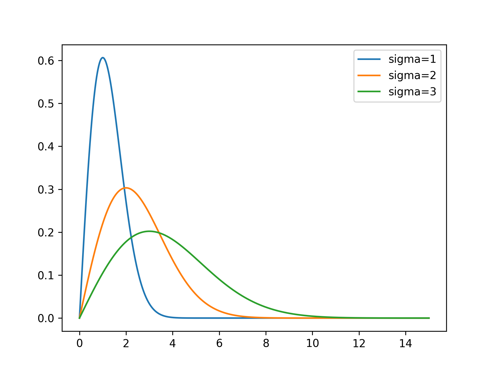
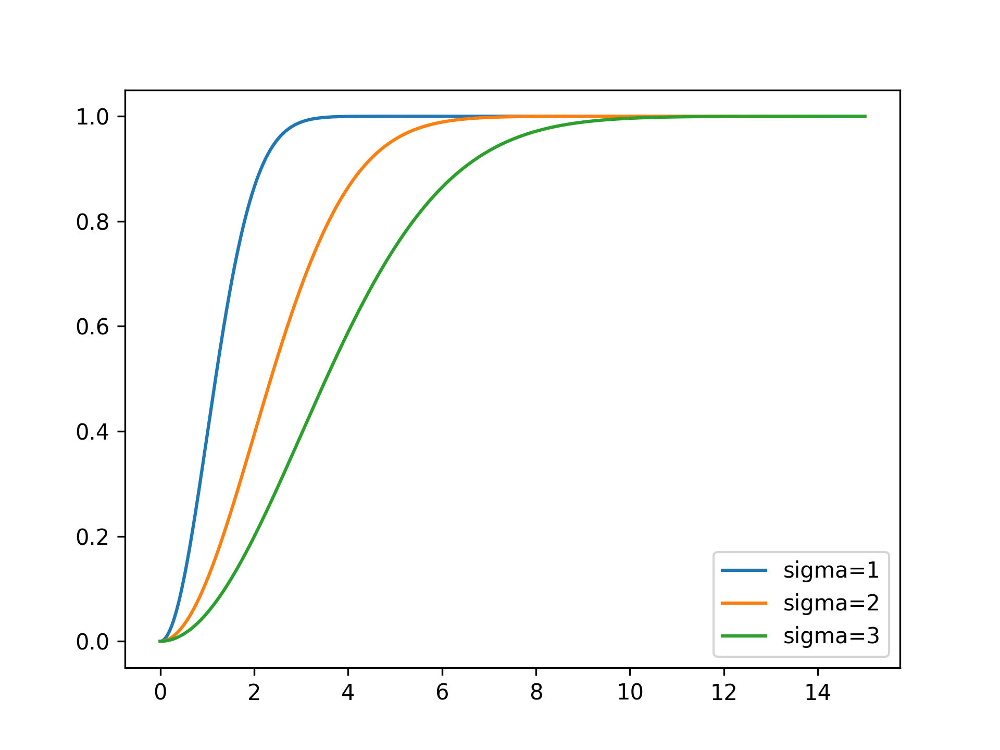
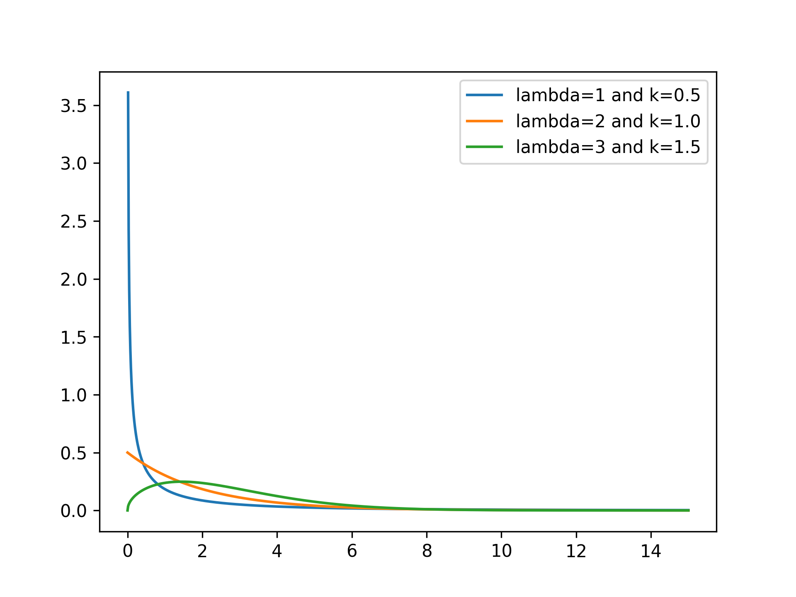
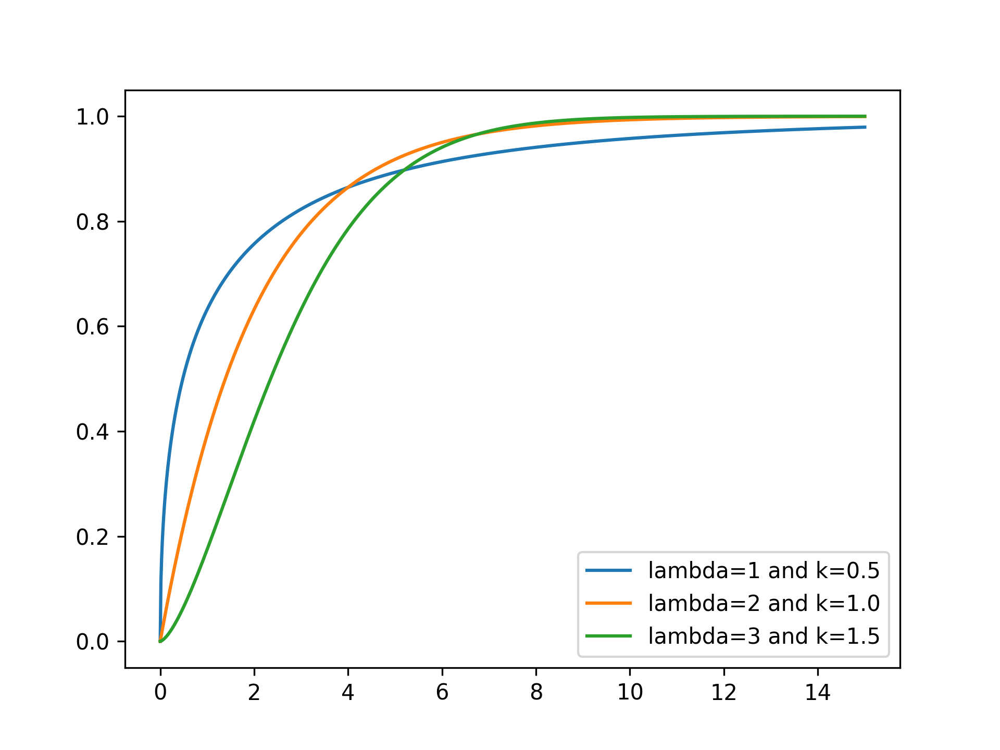
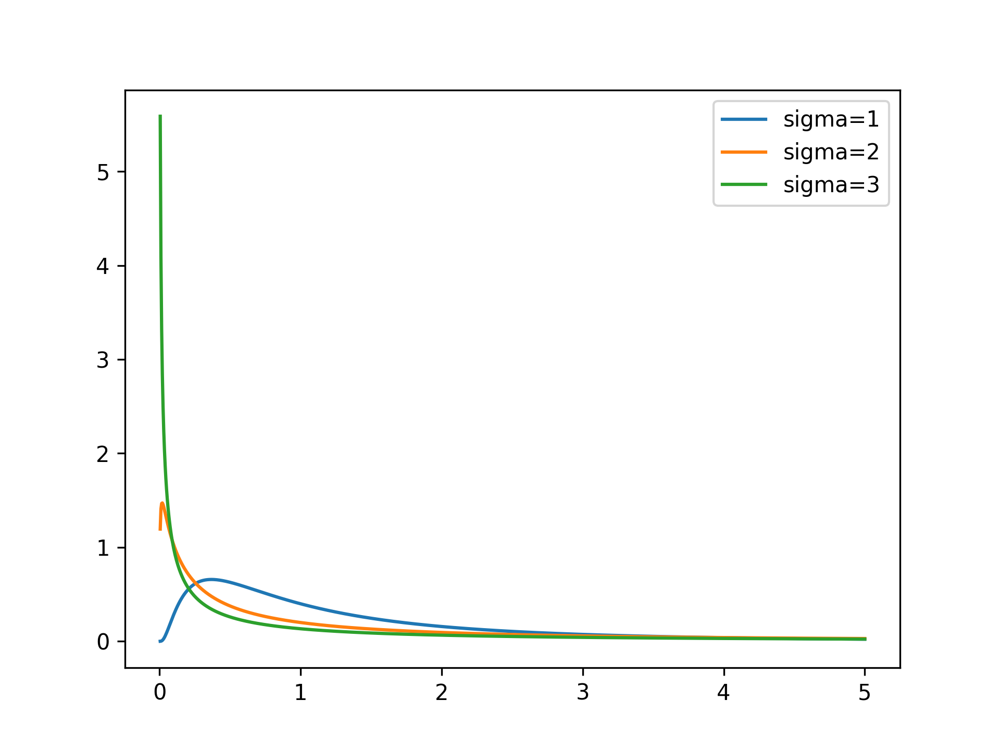
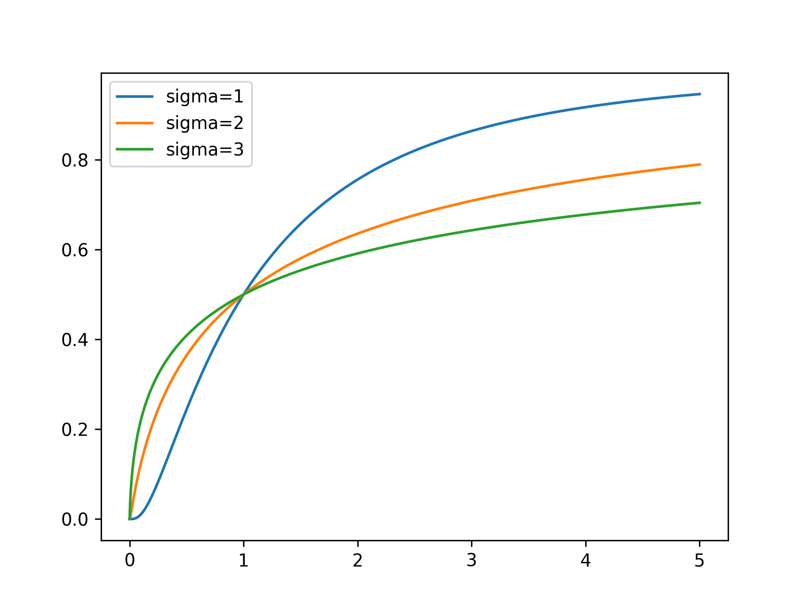
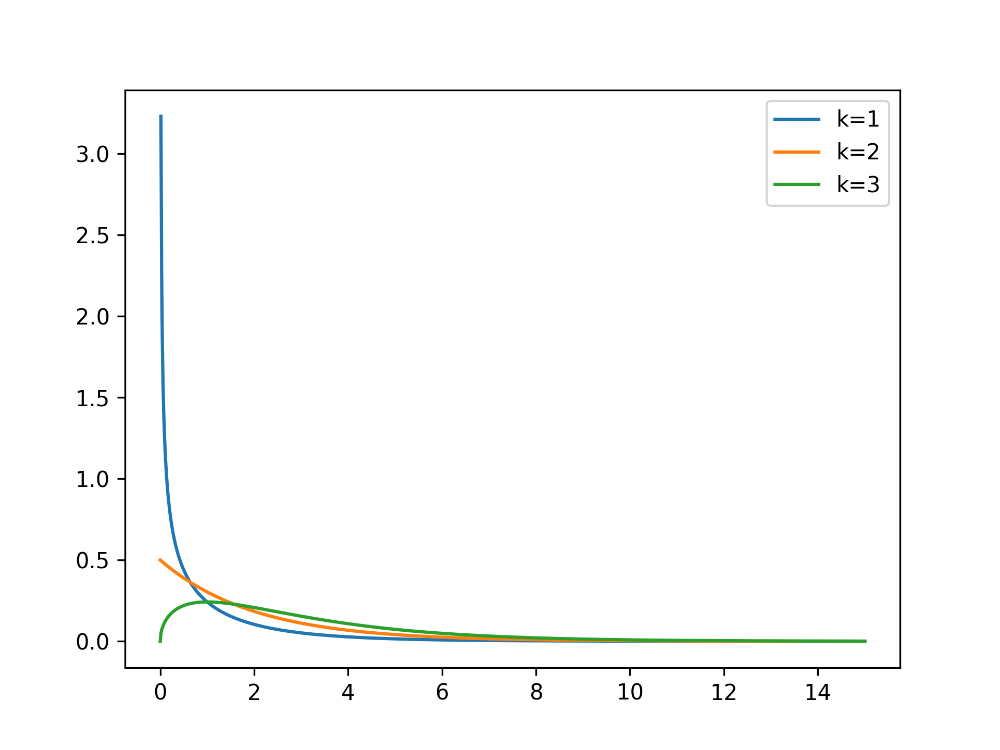
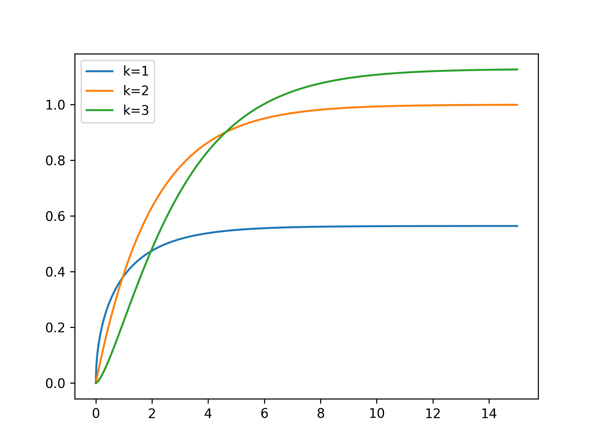
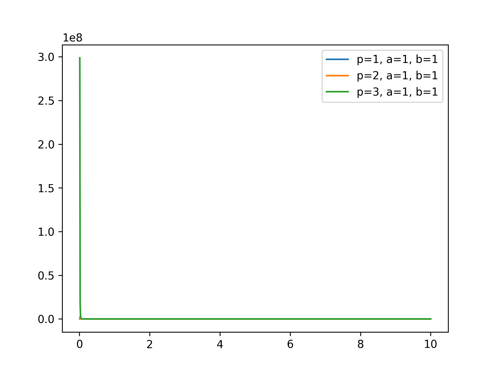

## Rayleigh Distribution

<!-- prettier-ignore -->
::: umf.functions.distributions.continuous_semi_infinite_interval.RayleighDistribution
    options:
        show_bases: false
        show_source: true
        show_inherited_members: false
        allow_inspection: false
        inheritance_graph: false
        heading_level: 0
        members: None

|                      Probability Density Function                       |                        Cumulative Distribution Function                         |
| :---------------------------------------------------------------------: | :-----------------------------------------------------------------------------: |
|  |  |

## Weibull Distribution

<!-- prettier-ignore -->
::: umf.functions.distributions.continuous_semi_infinite_interval.WeibullDistribution
    options:
        show_bases: false
        show_source: true
        show_inherited_members: false
        allow_inspection: false
        inheritance_graph: false
        heading_level: 0
        members: None

|                     Probability Density Function                      |                       Cumulative Distribution Function                        |
| :-------------------------------------------------------------------: | :---------------------------------------------------------------------------: |
|  |  |

## Log-Normal Distribution

<!-- prettier-ignore -->
::: umf.functions.distributions.continuous_semi_infinite_interval.LogNormalDistribution
    options:
        show_bases: false
        show_source: true
        show_inherited_members: false
        allow_inspection: false
        inheritance_graph: false
        heading_level: 0
        members: None

|                       Probability Density Function                        |                         Cumulative Distribution Function                          |
| :-----------------------------------------------------------------------: | :-------------------------------------------------------------------------------: |
|  |  |

## Chi-Squared Distribution

<!-- prettier-ignore -->
::: umf.functions.distributions.continuous_semi_infinite_interval.ChiSquaredDistribution
    options:
        show_bases: false
        show_source: true
        show_inherited_members: false
        allow_inspection: false
        inheritance_graph: false
        heading_level: 0
        members: None

|                        Probability Density Function                         |                          Cumulative Distribution Function                           |
| :-------------------------------------------------------------------------: | :---------------------------------------------------------------------------------: |
|  |  |

## Dagum Distribution

<!-- prettier-ignore -->
::: umf.functions.distributions.continuous_semi_infinite_interval.DagumDistribution
    options:
        show_bases: false
        show_source: true
        show_inherited_members: false
        allow_inspection: false
        inheritance_graph: false
        heading_level: 0
        members: None

|                   Probability Density Function                    |
| :---------------------------------------------------------------: |
|  |
