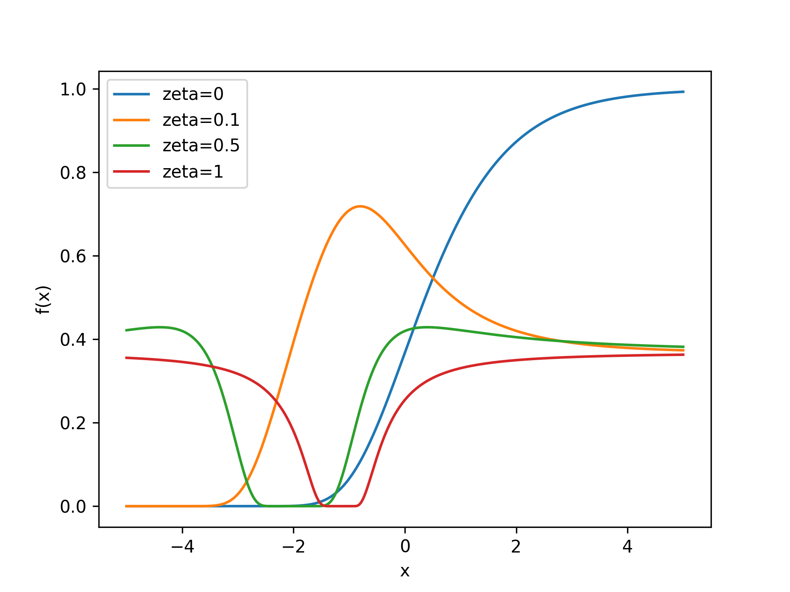
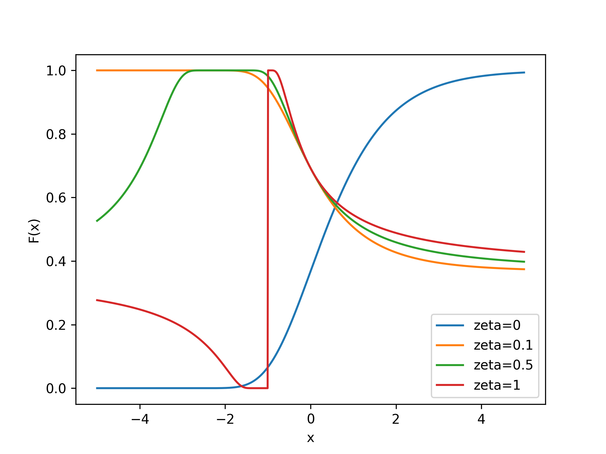
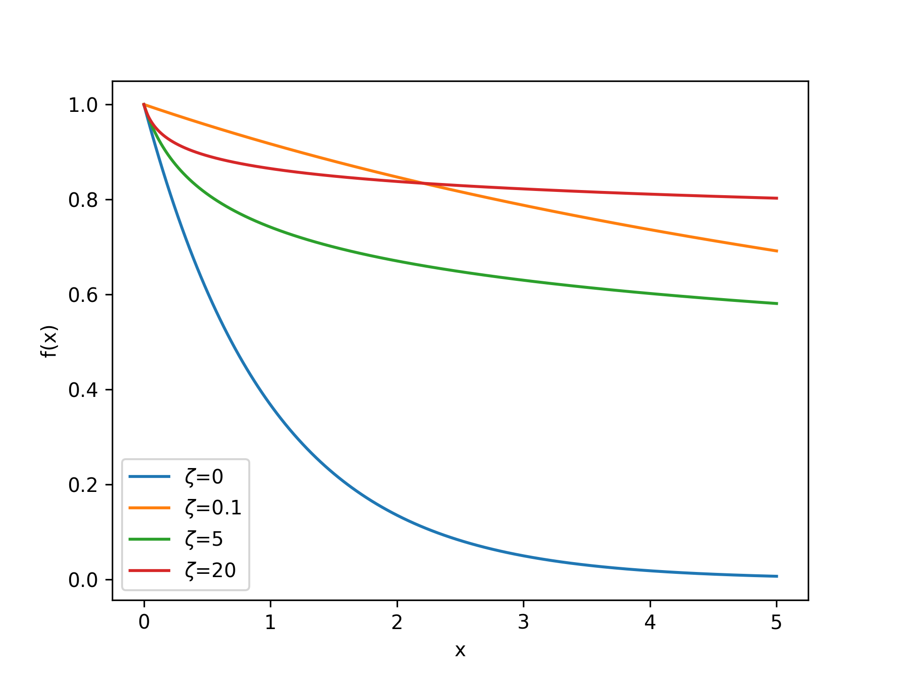
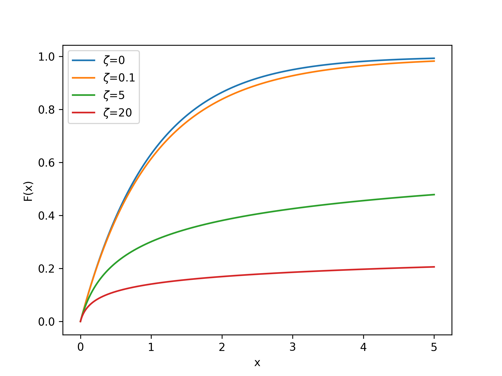

## Generalized Extreme-Value Distribution

<!-- prettier-ignore -->
::: umf.functions.distributions.continuous_variable_support.GeneralizedExtremeValueDistribution
    options:
        show_bases: false
        show_source: true
        show_inherited_members: false
        allow_inspection: false
        inheritance_graph: false
        heading_level: 0
        members: None

|                                     Probability Density Function                                      |                                       Cumulative Distribution Function                                        |
| :---------------------------------------------------------------------------------------------------: | :-----------------------------------------------------------------------------------------------------------: |
|  |  |

## Generalized Pareto Distribution

<!-- prettier-ignore -->
::: umf.functions.distributions.continuous_variable_support.GeneralizedParetoDistribution
    options:
        show_bases: false
        show_source: true
        show_inherited_members: false
        allow_inspection: false
        inheritance_graph: false
        heading_level: 0
        members: None

|                               Probability Density Function                                |                                 Cumulative Distribution Function                                  |
| :---------------------------------------------------------------------------------------: | :-----------------------------------------------------------------------------------------------: |
|  |  |
