## Generalized Normal Distribution

<!-- prettier-ignore -->
::: umf.functions.distributions.continuous_whole_line_support.GeneralizedNormalDistribution
    options:
        show_bases: false
        show_source: true
        show_inherited_members: false
        allow_inspection: false
        inheritance_graph: false
        heading_level: 0
        members: None

|                               Probability Density Function                                |                                 Cumulative Distribution Function                                  |
| :---------------------------------------------------------------------------------------: | :-----------------------------------------------------------------------------------------------: |
| 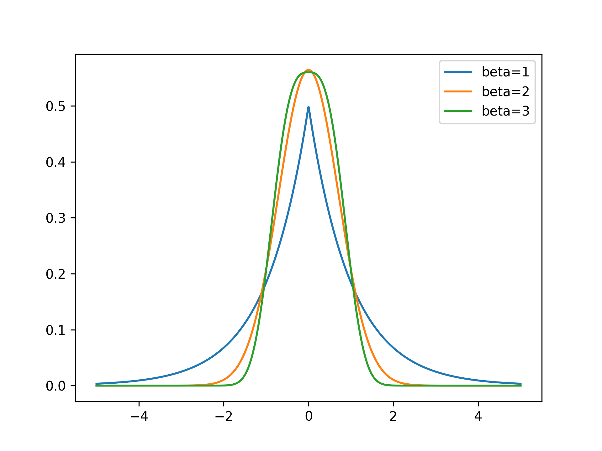 | 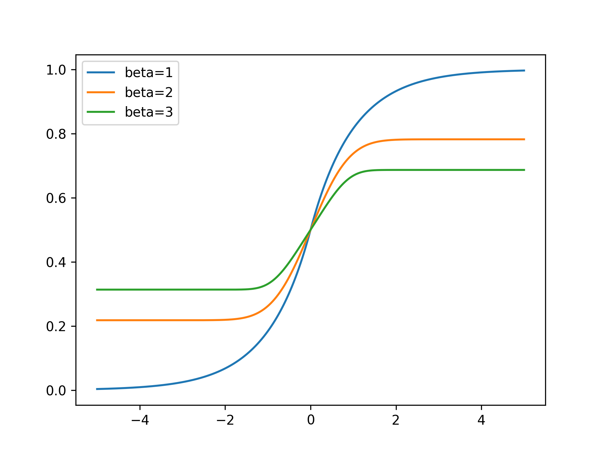 |

## Gaussian Distribution

<!-- prettier-ignore -->
::: umf.functions.distributions.continuous_whole_line_support.GaussianDistribution
    options:
        show_bases: false
        show_source: true
        show_inherited_members: false
        allow_inspection: false
        inheritance_graph: false
        heading_level: 0
        members: None

|                      Probability Density Function                       |                        Cumulative Distribution Function                         |
| :---------------------------------------------------------------------: | :-----------------------------------------------------------------------------: |
| 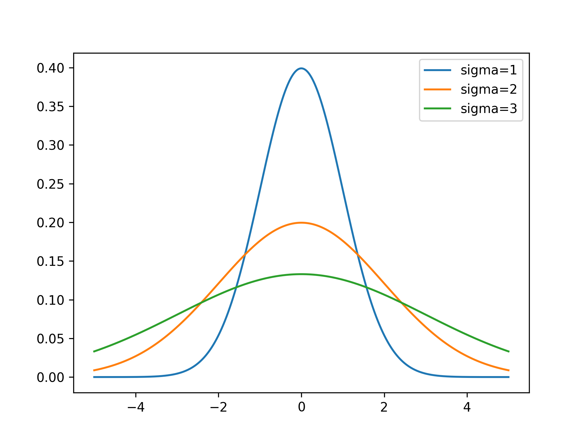 | 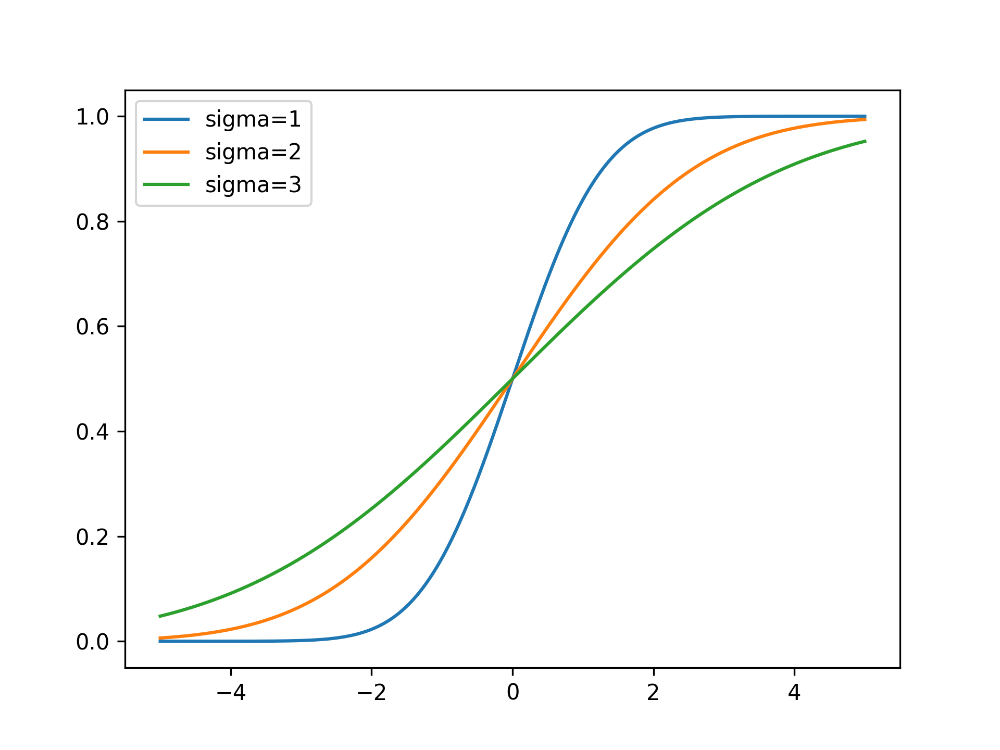 |

## Skew Gaussian Distribution

<!-- prettier-ignore -->
::: umf.functions.distributions.continuous_whole_line_support.SkewGaussianDistribution
    options:
        show_bases: false
        show_source: true
        show_inherited_members: false
        allow_inspection: false
        inheritance_graph: false
        heading_level: 0
        members: None

|                          Probability Density Function                           |                            Cumulative Distribution Function                             |
| :-----------------------------------------------------------------------------: | :-------------------------------------------------------------------------------------: |
| 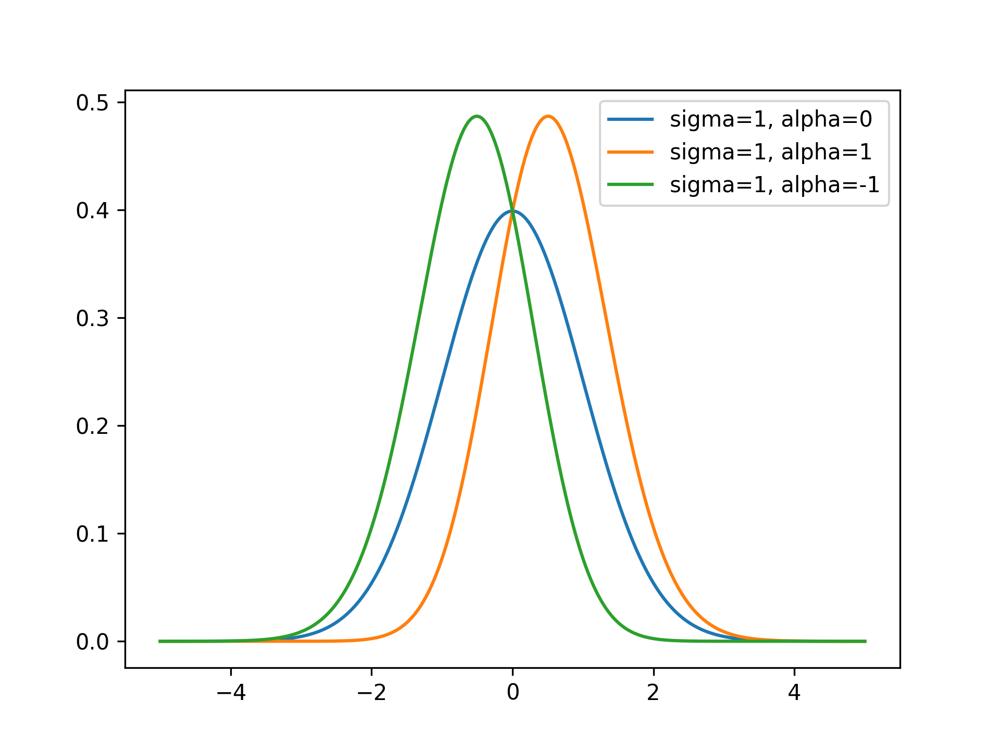 |  |

## Laplace Distribution

<!-- prettier-ignore -->
::: umf.functions.distributions.continuous_whole_line_support.LaplaceDistribution
    options:
        show_bases: false
        show_source: true
        show_inherited_members: false
        allow_inspection: false
        inheritance_graph: false
        heading_level: 0
        members: None

|                     Probability Density Function                      |                       Cumulative Distribution Function                        |
| :-------------------------------------------------------------------: | :---------------------------------------------------------------------------: |
| 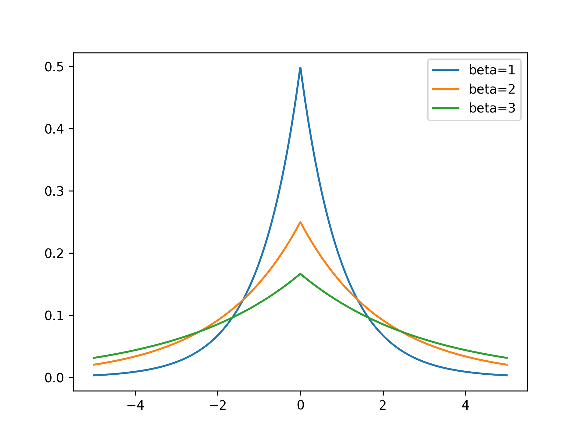 | 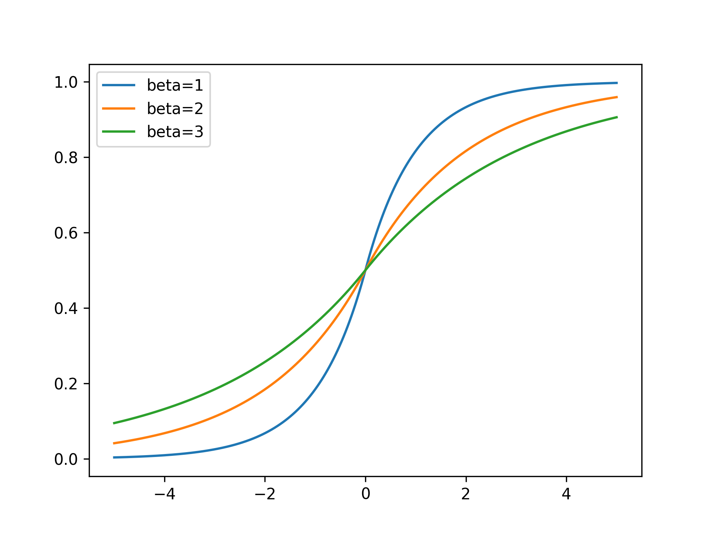 |

## Logistic Distribution

<!-- prettier-ignore -->
::: umf.functions.distributions.continuous_whole_line_support.LogisticDistribution
    options:
        show_bases: false
        show_source: true
        show_inherited_members: false
        allow_inspection: false
        inheritance_graph: false
        heading_level: 0
        members: None

|                      Probability Density Function                       |                        Cumulative Distribution Function                         |
| :---------------------------------------------------------------------: | :-----------------------------------------------------------------------------: |
| 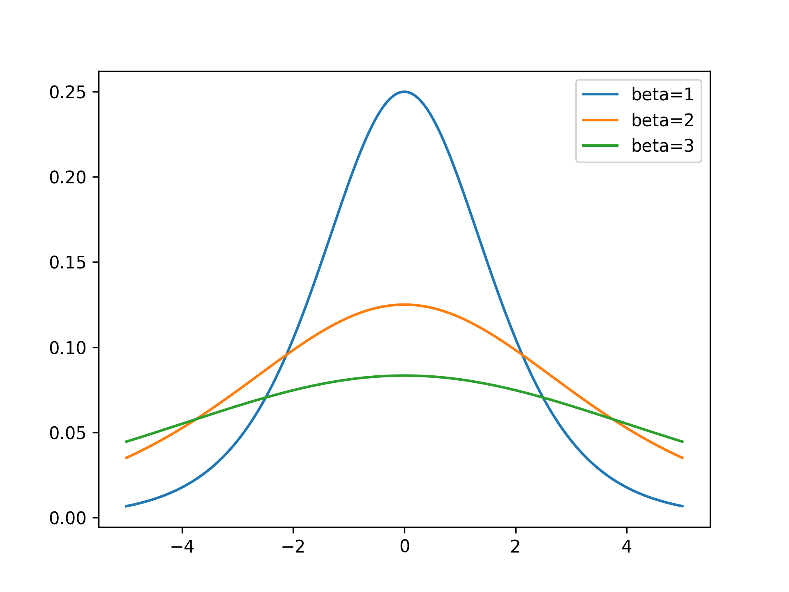 | 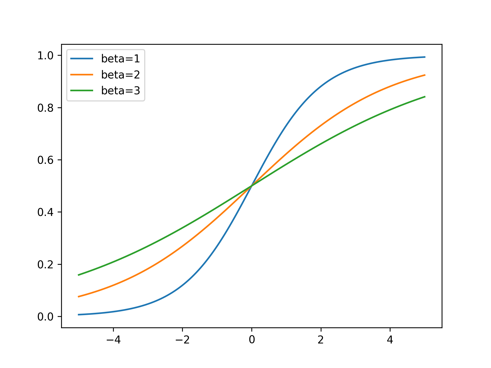 |

## Voigt Distribution

<!-- prettier-ignore -->
::: umf.functions.distributions.continuous_whole_line_support.VoigtDistribution
    options:
        show_bases: false
        show_source: true
        show_inherited_members: false
        allow_inspection: false
        inheritance_graph: false
        heading_level: 0
        members: None

|                   Probability Density Function                    |                     Cumulative Distribution Function                      |
| :---------------------------------------------------------------: | :-----------------------------------------------------------------------: |
| 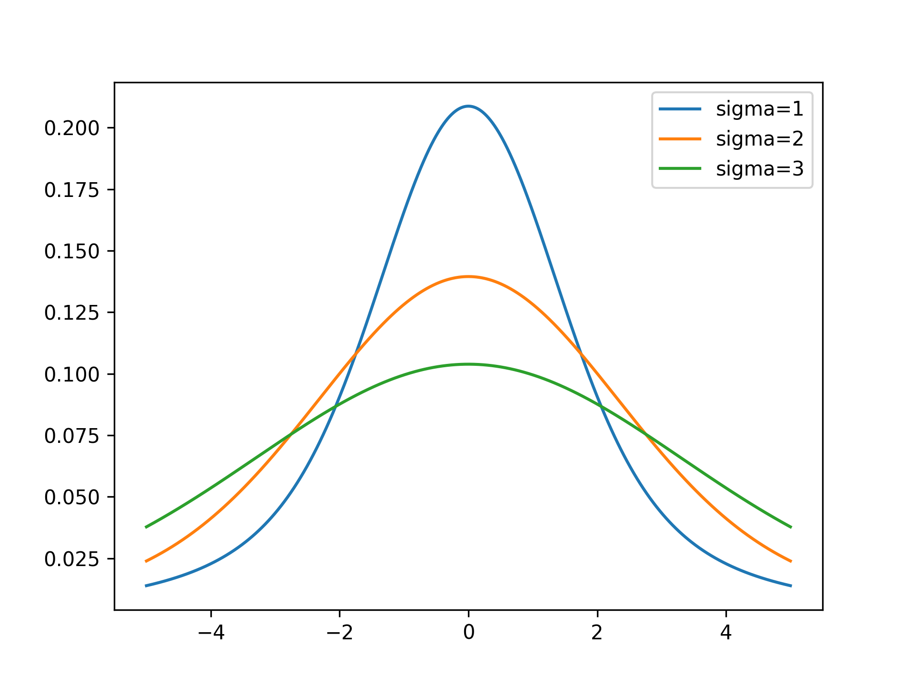 |  |

## Cauchy Distribution

<!-- prettier-ignore -->
::: umf.functions.distributions.continuous_whole_line_support.CauchyDistribution
    options:
        show_bases: false
        show_source: true
        show_inherited_members: false
        allow_inspection: false
        inheritance_graph: false
        heading_level: 0
        members: None

|                    Probability Density Function                     |                      Cumulative Distribution Function                       |
| :-----------------------------------------------------------------: | :-------------------------------------------------------------------------: |
| 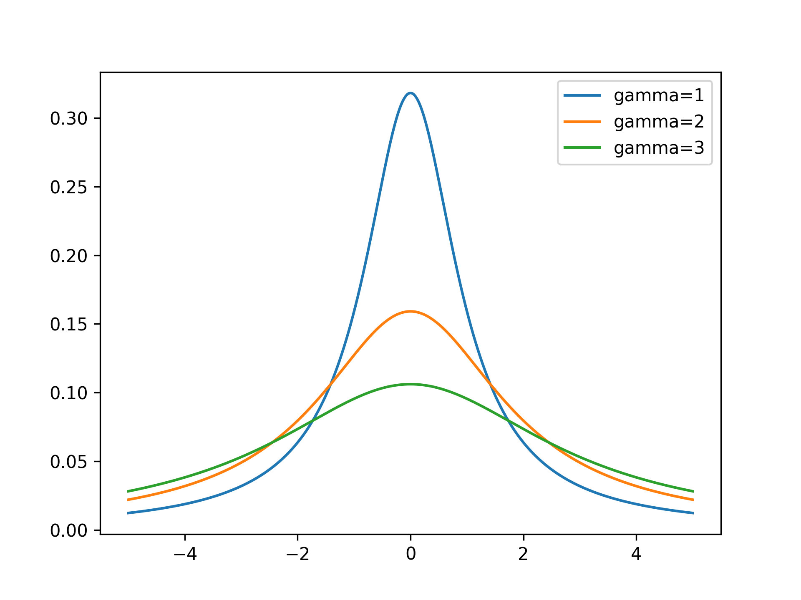 | 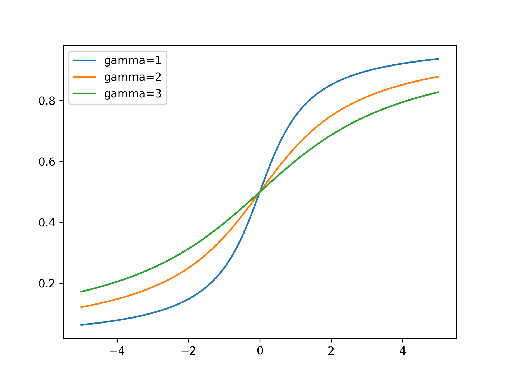 |

## Gumbel Distribution

<!-- prettier-ignore -->
::: umf.functions.distributions.continuous_whole_line_support.GumbelDistribution
    options:
        show_bases: false
        show_source: true
        show_inherited_members: false
        allow_inspection: false
        inheritance_graph: false
        heading_level: 0
        members: None

|                    Probability Density Function                     |                      Cumulative Distribution Function                       |
| :-----------------------------------------------------------------: | :-------------------------------------------------------------------------: |
| 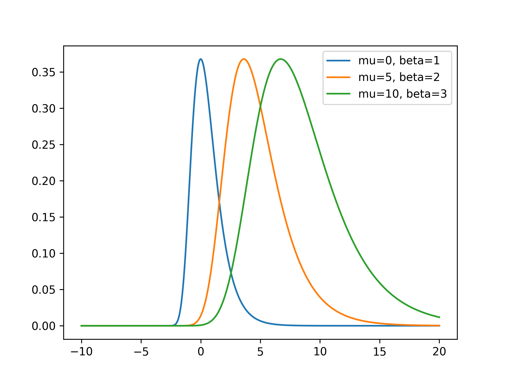 | 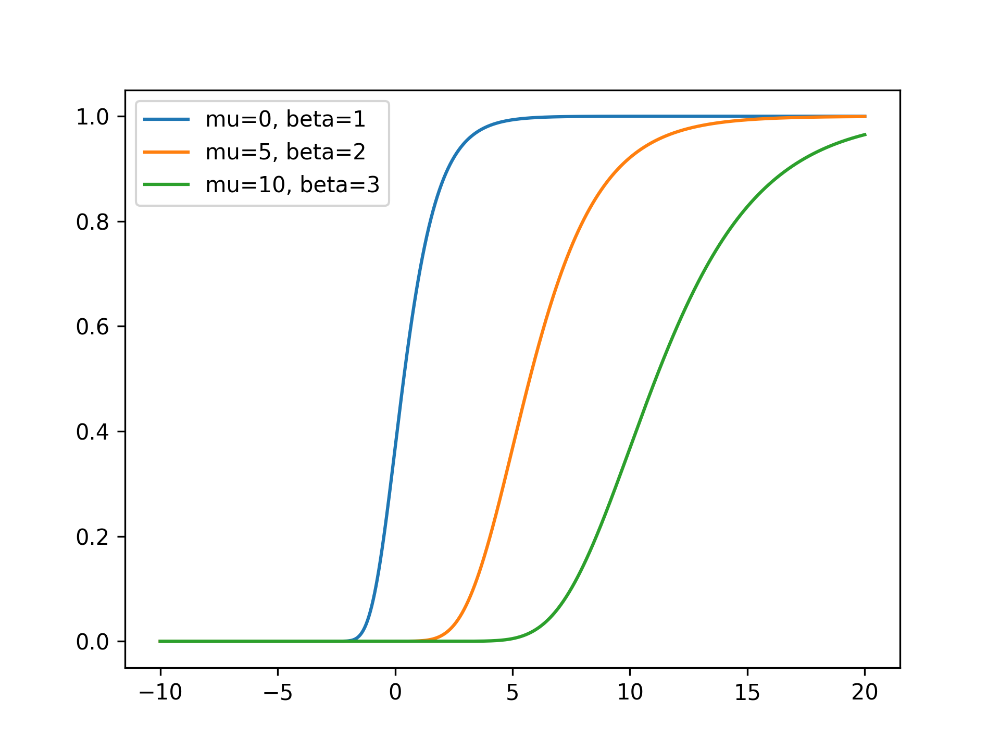 |

## Exponential Distribution

<!-- prettier-ignore -->
::: umf.functions.distributions.continuous_whole_line_support.ExponentialDistribution
    options:
        show_bases: false
        show_source: true
        show_inherited_members: false
        allow_inspection: false
        inheritance_graph: false
        heading_level: 0
        members: None

|                         Probability Density Function                          |                           Cumulative Distribution Function                            |
| :---------------------------------------------------------------------------: | :-----------------------------------------------------------------------------------: |
| 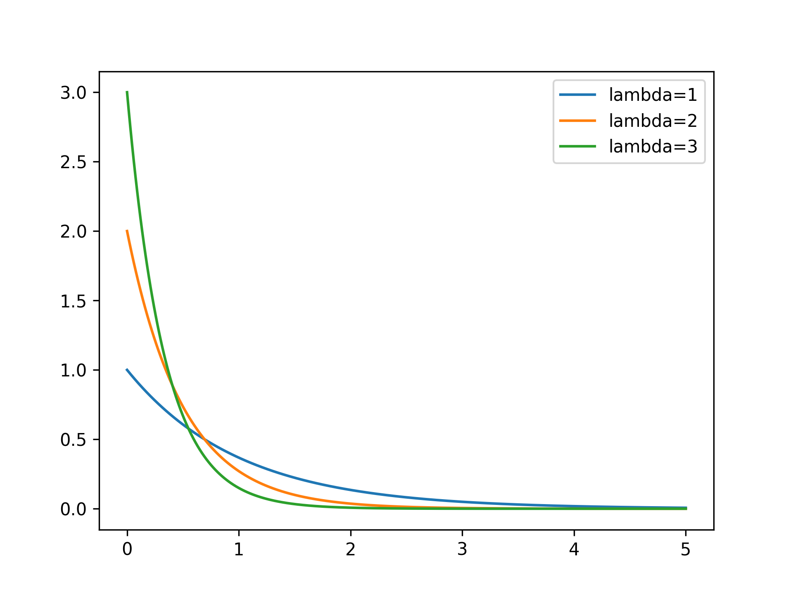 | 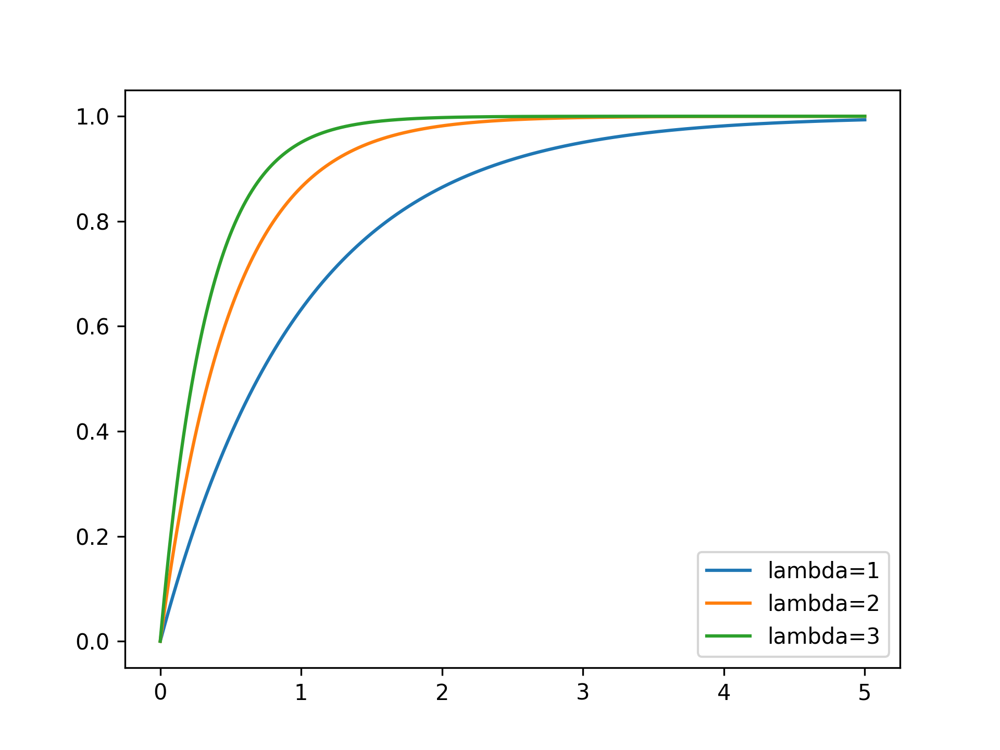 |
