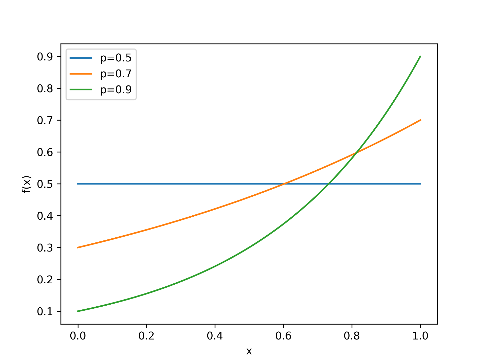
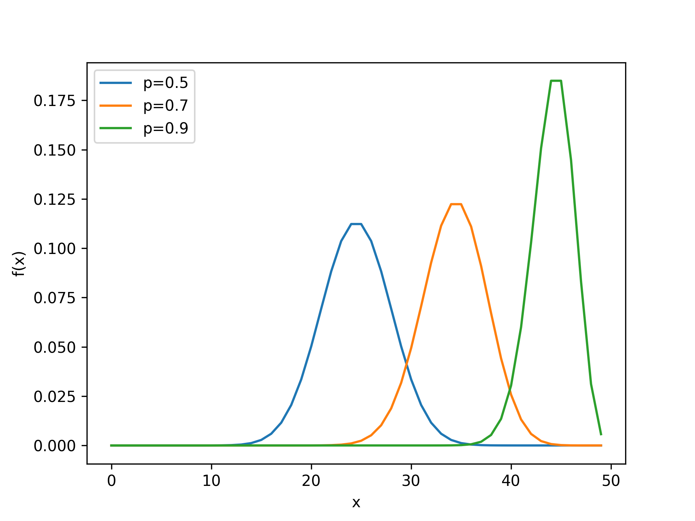
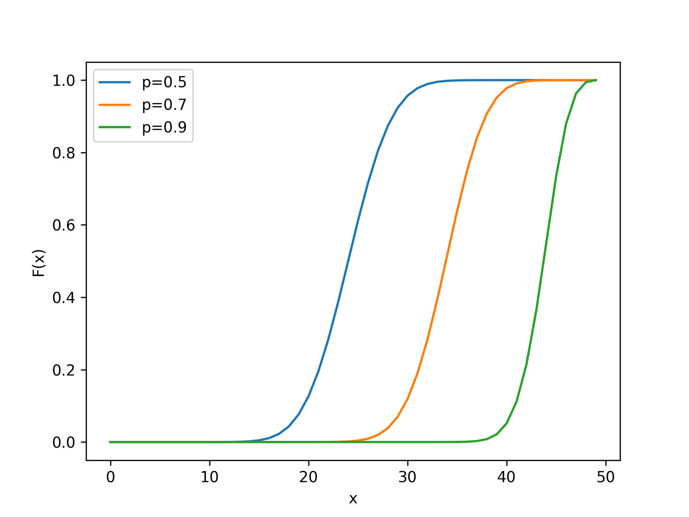

## Bernoulli Distribution

<!-- prettier-ignore -->
::: umf.functions.distributions.discrete_finite_support.BernoulliDistribution
    options:
        show_bases: false
        show_source: true
        show_inherited_members: false
        allow_inspection: false
        inheritance_graph: false
        heading_level: 0
        members: None

|                         Probability Mass Function                         |
| :-----------------------------------------------------------------------: |
|  |

## Binomial Distribution

<!-- prettier-ignore -->
::: umf.functions.distributions.discrete_finite_support.BinomialDistribution
    options:
        show_bases: false
        show_source: true
        show_inherited_members: false
        allow_inspection: false
        inheritance_graph: false
        heading_level: 0
        members: None

|                        Probability Mass Function                        |                           Cumulative Density Function                           |
| :---------------------------------------------------------------------: | :-----------------------------------------------------------------------------: |
|  |  |
