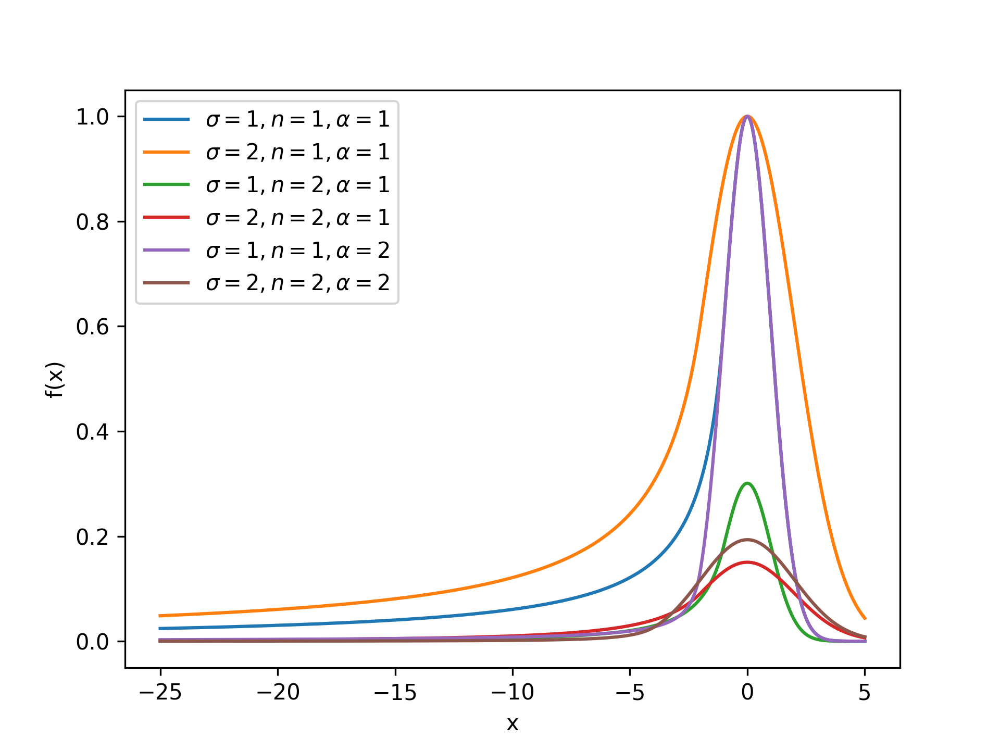
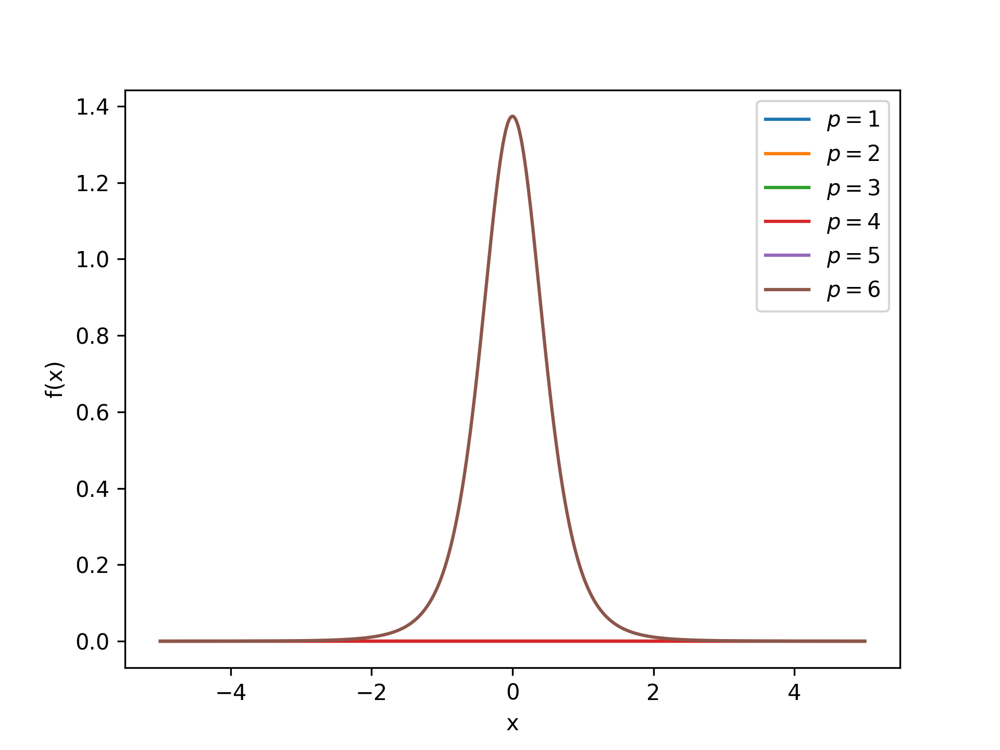
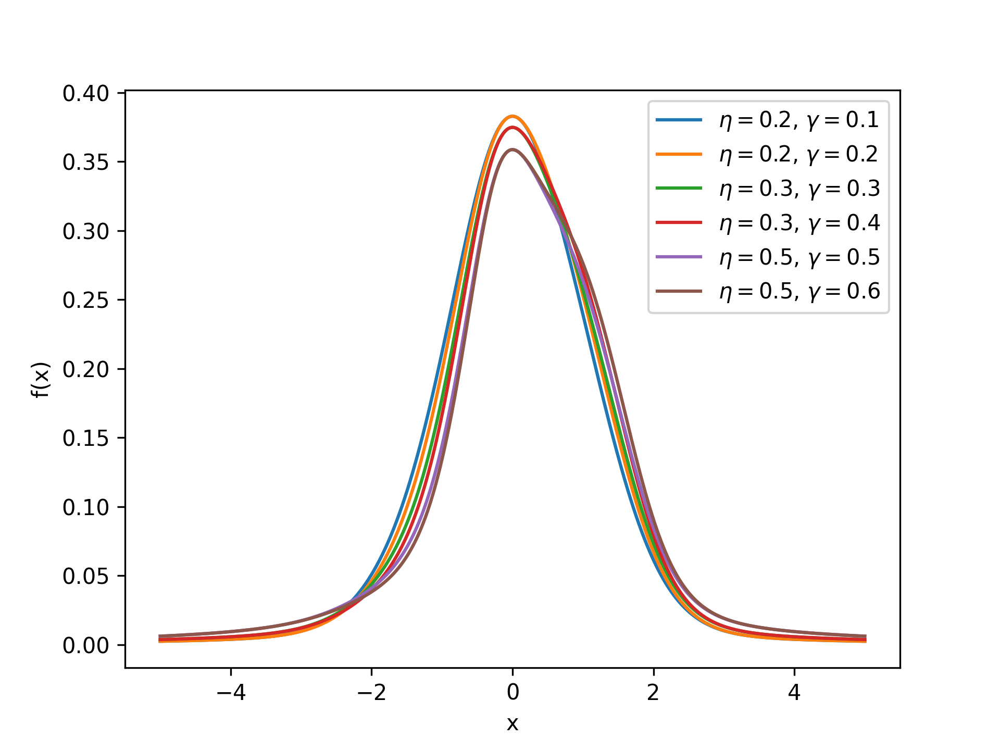
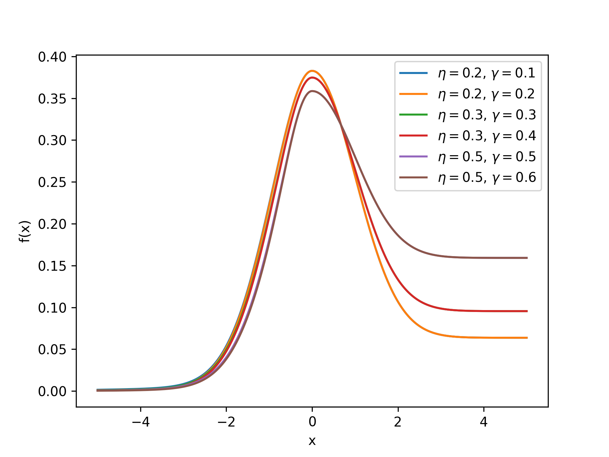

## Crystal Ball Distribution

<!-- prettier-ignore -->
::: umf.functions.distributions.mixed_discrete_continuous.CrystalBallDistribution
    options:
        show_bases: false
        show_source: true
        show_inherited_members: false
        allow_inspection: false
        inheritance_graph: false
        heading_level: 0
        members: None

|                         Probability Density Function                          |
| :---------------------------------------------------------------------------: |
|  |

## Pearson Type VII Distribution

<!-- prettier-ignore -->
::: umf.functions.distributions.mixed_discrete_continuous.PearsonVIIDistribution
    options:
        show_bases: false
        show_source: true
        show_inherited_members: false
        allow_inspection: false
        inheritance_graph: false
        heading_level: 0
        members: None

|                    Probability Density Function                     |
| :-----------------------------------------------------------------: |
|  |

## Asymmetric Random Lineshape Distribution

<!-- prettier-ignore -->
::: umf.functions.distributions.mixed_discrete_continuous.AsymmetricRamanLineshape
    options:
        show_bases: false
        show_source: true
        show_inherited_members: false
        allow_inspection: false
        inheritance_graph: false
        heading_level: 0
        members: None

|                          Probability Density Function                           |
| :-----------------------------------------------------------------------------: |
|  |

## Modified Doniach-Sunjic Distribution

<!-- prettier-ignore -->
::: umf.functions.distributions.mixed_discrete_continuous.ModifiedDoniachSunjicDistribution
    options:
        show_bases: false
        show_source: true
        show_inherited_members: false
        allow_inspection: false
        inheritance_graph: false
        heading_level: 0
        members: None

|                                   Probability Density Function                                    |
| :-----------------------------------------------------------------------------------------------: |
|  |
