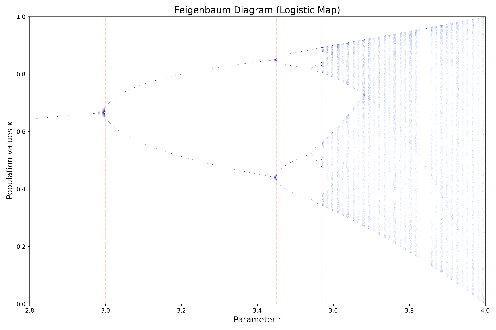

## Mandelbrot Set

<!-- prettier-ignore -->
::: umf.functions.fractal_set.complex_fractals.MandelbrotSet
    options:
        show_bases: false
        show_source: true
        show_inherited_members: false
        allow_inspection: false
        inheritance_graph: false
        heading_level: 0
        members: None

|                      Mandelbrot Set                       |
| :-------------------------------------------------------: |
|  |

## Julia Set

<!-- prettier-ignore -->
::: umf.functions.fractal_set.complex_fractals.JuliaSet
    options:
        show_bases: false
        show_source: true
        show_inherited_members: false
        allow_inspection: false
        inheritance_graph: false
        heading_level: 0
        members: None

|                      Julia Set                      |
| :-------------------------------------------------: |
|  |

## FeigenbaumDiagram

<!-- prettier-ignore -->
::: umf.functions.fractal_set.complex_fractals.FeigenbaumDiagram
    options:
        show_bases: false
        show_source: true
        show_inherited_members: false
        allow_inspection: false
        inheritance_graph: false
        heading_level: 0
        members: None

|                        Feigenbaum Diagram                         |
| :---------------------------------------------------------------: |
|  |

## LyapunovExponent
