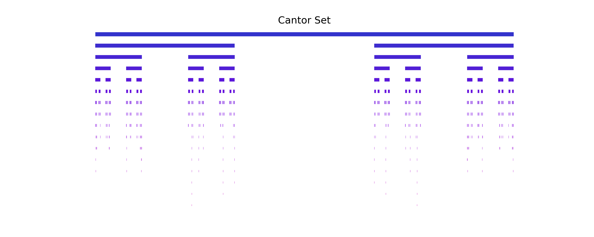
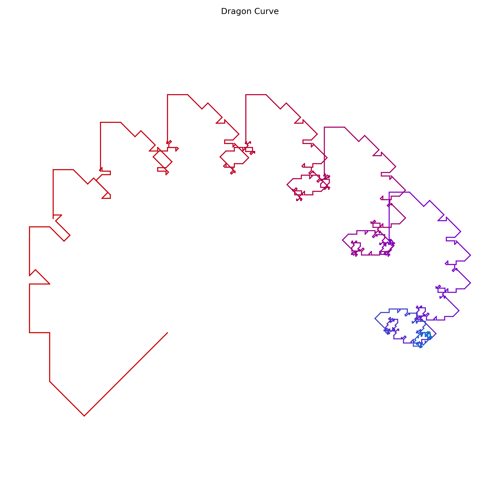
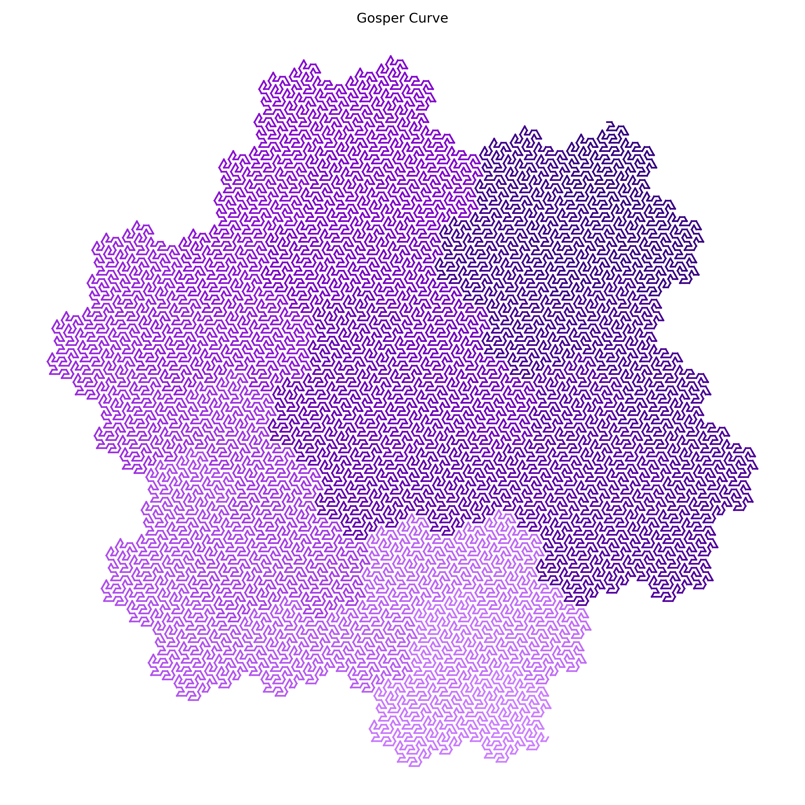
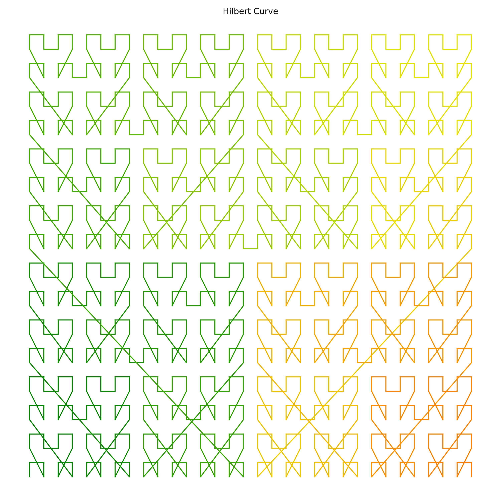
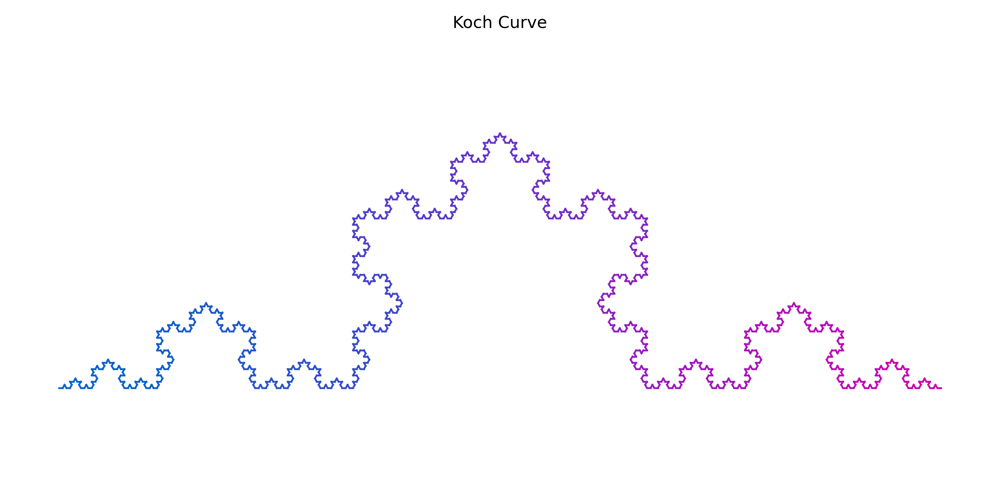
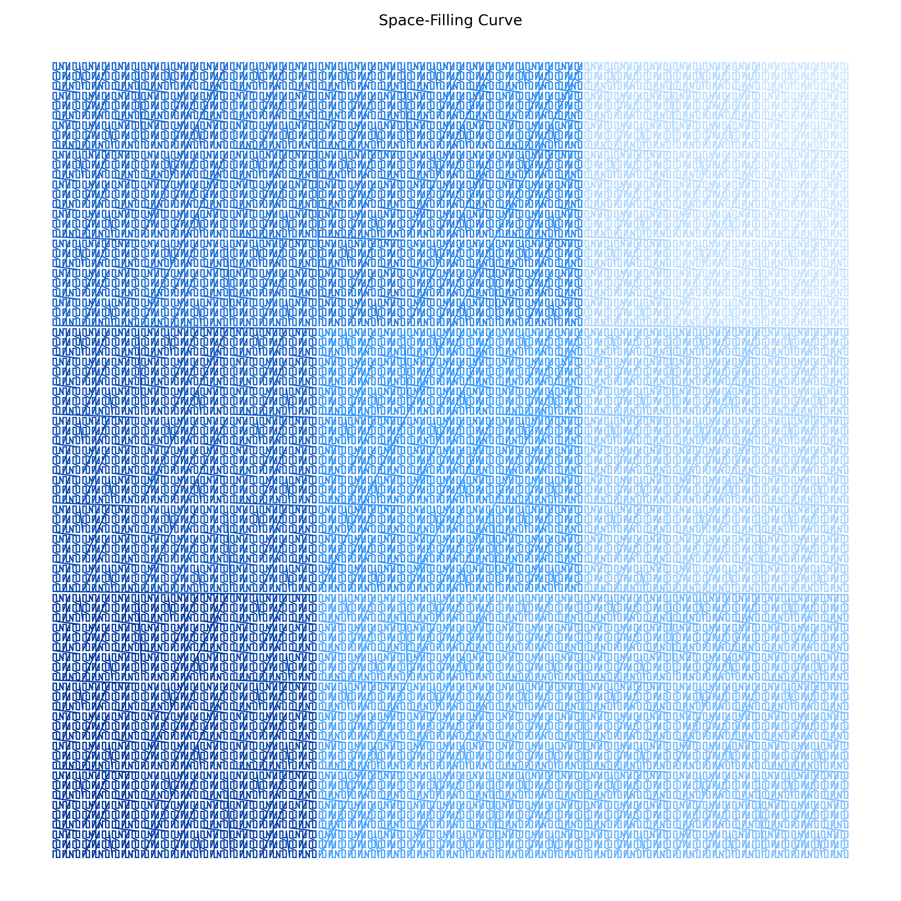

## Cantor Set

<!-- prettier-ignore -->
::: umf.functions.fractal_set.curve.CantorSet
    options:
        show_bases: false
        show_source: true
        show_inherited_members: false
        allow_inspection: false
        inheritance_graph: false
        heading_level: 0
        members: None

|                    Cantor Set                     |
| :-----------------------------------------------: |
|  |

## Dragon Curve

<!-- prettier-ignore -->
::: umf.functions.fractal_set.curve.DragonCurve
    options:
        show_bases: false
        show_source: true
        show_inherited_members: false
        allow_inspection: false
        inheritance_graph: false
        heading_level: 0
        members: None

|                     Dragon Curve                      |
| :---------------------------------------------------: |
|  |

## Gosper Curve

<!-- prettier-ignore -->
::: umf.functions.fractal_set.curve.GosperCurve
    options:
        show_bases: false
        show_source: true
        show_inherited_members: false
        allow_inspection: false
        inheritance_graph: false
        heading_level: 0
        members: None

|                     Gosper Curve                      |
| :---------------------------------------------------: |
|  |

## Hilbert Curve

<!-- prettier-ignore -->
::: umf.functions.fractal_set.curve.HilbertCurve
    options:
        show_bases: false
        show_source: true
        show_inherited_members: false
        allow_inspection: false
        inheritance_graph: false
        heading_level: 0
        members: None

|                      Hilbert Curve                      |
| :-----------------------------------------------------: |
|  |

## Koch Curve

<!-- prettier-ignore -->
::: umf.functions.fractal_set.curve.KochCurve
    options:
        show_bases: false
        show_source: true
        show_inherited_members: false
        allow_inspection: false
        inheritance_graph: false
        heading_level: 0
        members: None

|                    Koch Curve                     |
| :-----------------------------------------------: |
|  |

## Space Filling Curve

<!-- prettier-ignore -->
::: umf.functions.fractal_set.curve.SpaceFillingCurve
    options:
        show_bases: false
        show_source: true
        show_inherited_members: false
        allow_inspection: false
        inheritance_graph: false
        heading_level: 0
        members: None

|                        Space Filling Curve                        |
| :---------------------------------------------------------------: |
|  |
