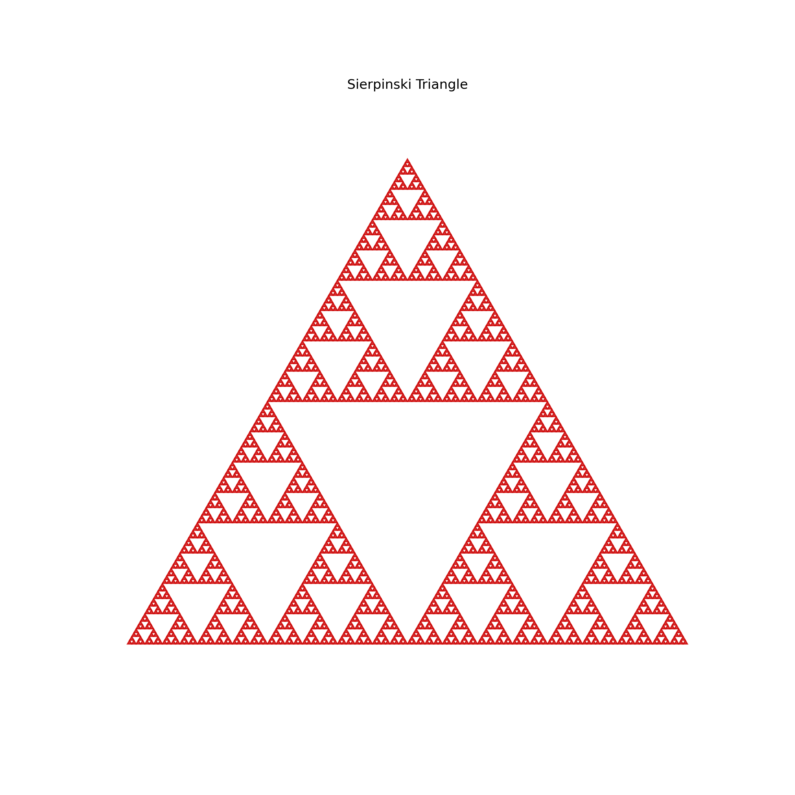
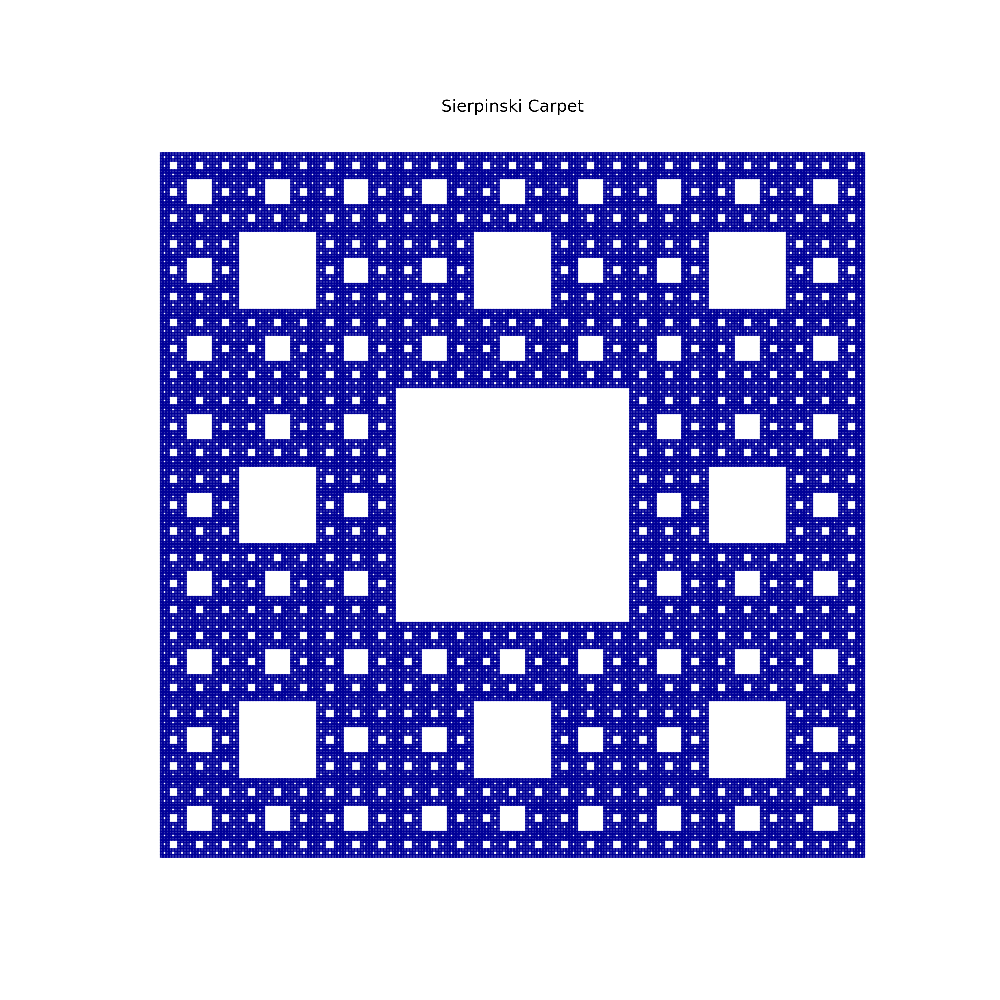
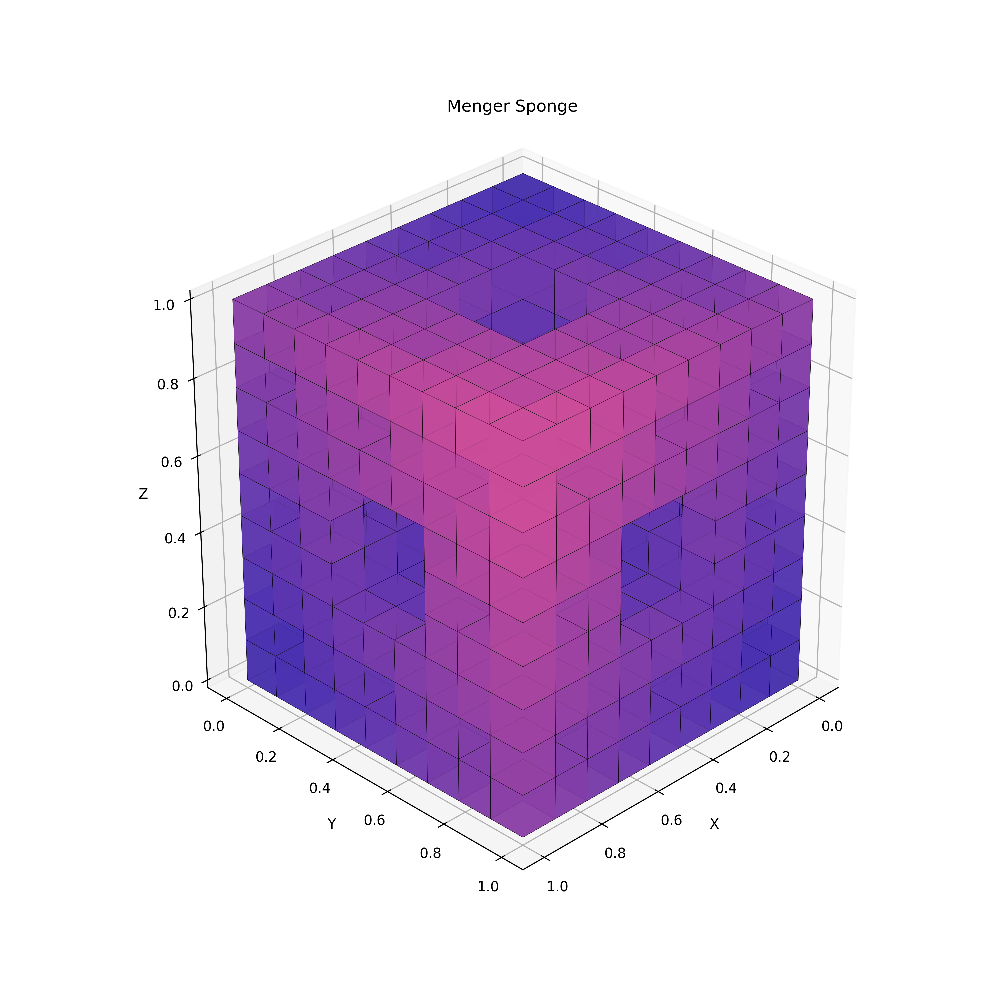
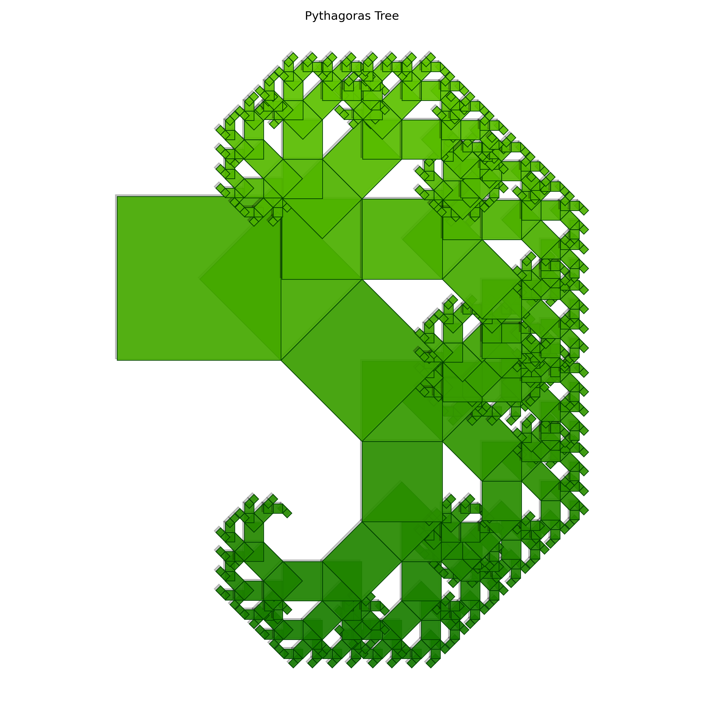
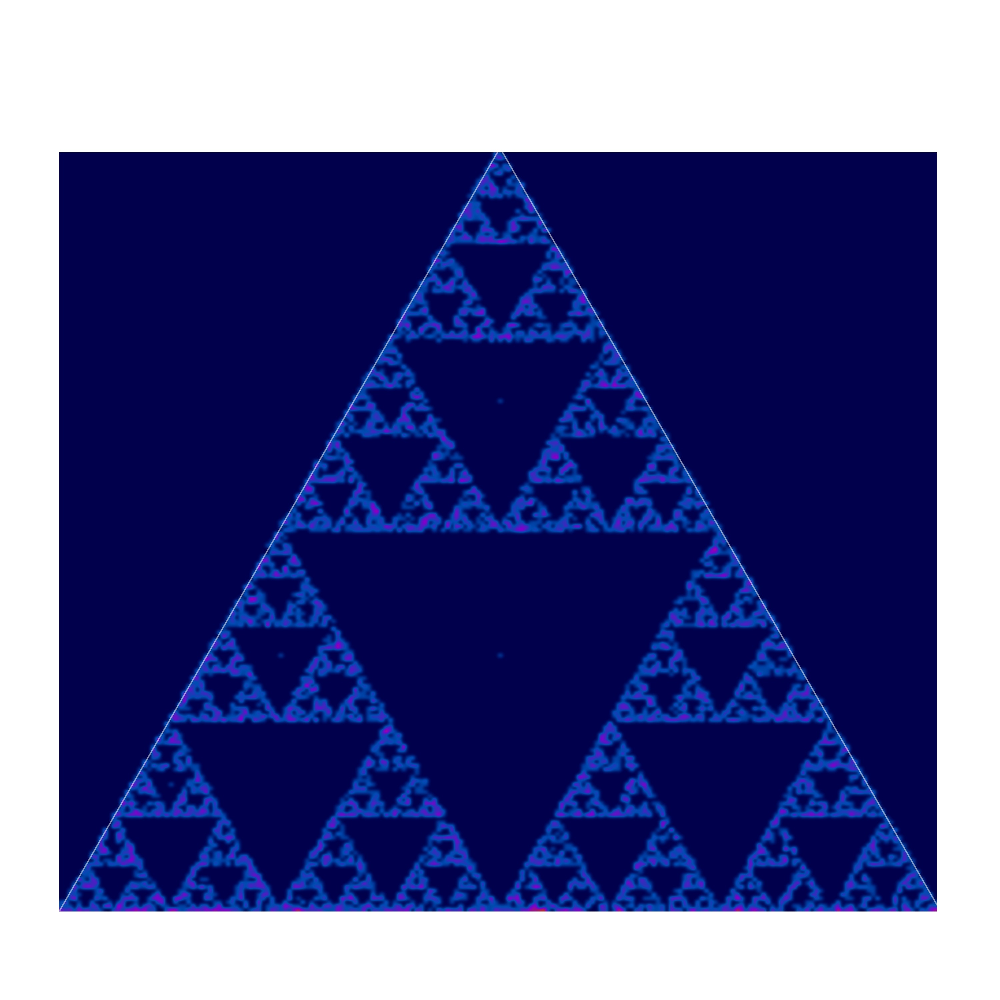

## Sierpinski Triangle

<!-- prettier-ignore -->
::: umf.functions.fractal_set.geometric.SierpinskiTriangle
    options:
        show_bases: false
        show_source: true
        show_inherited_members: false
        allow_inspection: false
        inheritance_graph: false
        heading_level: 0
        members: None

|                         Sierpinski Triangle                         |
| :-----------------------------------------------------------------: |
|  |

## Sierpinski Carpet

<!-- prettier-ignore -->
::: umf.functions.fractal_set.geometric.SierpinskiCarpet
    options:
        show_bases: false
        show_source: true
        show_inherited_members: false
        allow_inspection: false
        inheritance_graph: false
        heading_level: 0
        members: None

|                        Sierpinski Carpet                        |
| :-------------------------------------------------------------: |
|  |

## Menger Sponge

<!-- prettier-ignore -->
::: umf.functions.fractal_set.geometric.MengerSponge
    options:
        show_bases: false
        show_source: true
        show_inherited_members: false
        allow_inspection: false
        inheritance_graph: false
        heading_level: 0
        members: None

|                      Menger Sponge                      |
| :-----------------------------------------------------: |
|  |

## Pythagoras Tree

<!-- prettier-ignore -->
::: umf.functions.fractal_set.geometric.PythagorasTree
    options:
        show_bases: false
        show_source: true
        show_inherited_members: false
        allow_inspection: false
        inheritance_graph: false
        heading_level: 0
        members: None

|                       Pythagoras Tree                       |
| :---------------------------------------------------------: |
|  |

## Uniform Mass Center Triangle

<!-- prettier-ignore -->
::: umf.functions.fractal_set.geometric.UniformMassCenterTriangle
    options:
        show_bases: false
        show_source: true
        show_inherited_members: false
        allow_inspection: false
        inheritance_graph: false
        heading_level: 0
        members: None

|                           Uniform Mass Center Triangle                            |
| :-------------------------------------------------------------------------------: |
|  |
