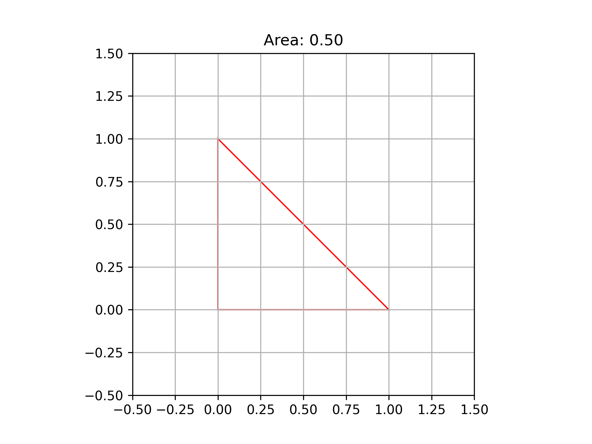

## Area Function

<!-- prettier-ignore -->
::: umf.functions.hyperbolic.area.AreaFunction
    options:
        show_bases: false
        show_source: true
        show_inherited_members: false
        allow_inspection: false
        inheritance_graph: false
        heading_level: 0
        members: None

|                      Area Function                       |
| :------------------------------------------------------: |
|  |
