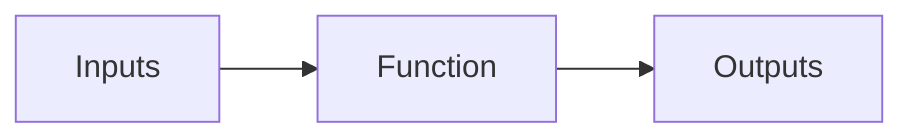

# Functions

_In the field of mathematics, a function refers to a connection between a set
of_ _possible inputs and a set of potential outputs. It is essential to note
that_ _each input corresponds to one output. Therefore, a function can be
regarded as a_ _set of rules that assigns one specific element from the set of
potential outputs_ _to each item in the possible inputs. Functions are widely
used in various fields_ _such as physics, economics, computer science,
chemistry, and spectroscopy to_ _describe the relationship between quantities,
represent geometric shapes, and model real-world situations._

> Sometimes, all that's necessary are functions that can link together inputs
> and outputs.

## Hyperbolic Plane Functions

The hyperbolic plane functions module includes functions for various
calculations in the hyperbolic plane, such as distance, angle, area, geodesic,
and isometry.

### Hyperbolic Distance Function

The hyperbolic distance function calculates the distance between two points in
the hyperbolic plane.

### Hyperbolic Angle Function

The hyperbolic angle function computes the angle between two vectors in the
hyperbolic plane.

### Hyperbolic Area Function

The hyperbolic area function calculates the area of a polygon in the hyperbolic
plane.

### Hyperbolic Geodesic Function

The hyperbolic geodesic function determines the shortest path between two points
in the hyperbolic plane.

### Hyperbolic Isometry Function

The hyperbolic isometry function applies isometries (transformations that
preserve distances) in the hyperbolic plane.
