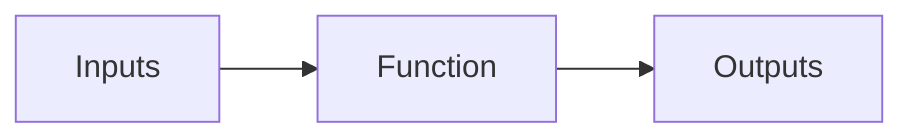

# Functions

_In the field of mathematics, a function refers to a connection between a set
of_ _possible inputs and a set of potential outputs. It is essential to note
that_ _each input corresponds to one output. Therefore, a function can be
regarded as a_ _set of rules that assigns one specific element from the set of
potential outputs_ _to each item in the possible inputs. Functions are widely
used in various fields_ _such as physics, economics, computer science,
chemistry, and spectroscopy to_ _describe the relationship between quantities,
represent geometric shapes, and model real-world situations._

> Sometimes, all that's necessary are functions that can link together inputs
> and outputs.

