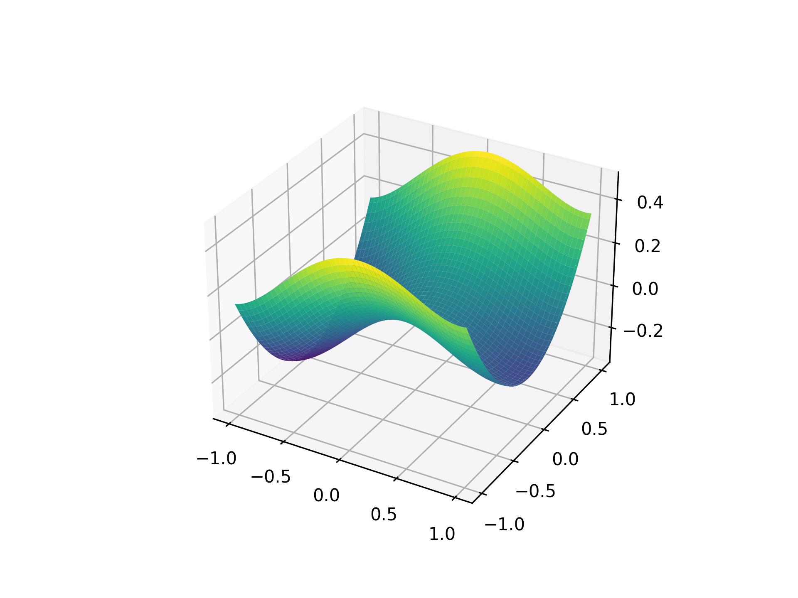

## Perm Beta D function

<!-- prettier-ignore -->
::: umf.functions.optimization.bowl_shaped.PermBetaDFunction
    options:
        show_bases: false
        show_source: true
        show_inherited_members: false
        allow_inspection: false
        inheritance_graph: false
        heading_level: 0
        members: None

|                                                                   |
| :---------------------------------------------------------------: |
|  |

## Trid Function

<!-- prettier-ignore -->
::: umf.functions.optimization.bowl_shaped.TridFunction
    options:
        show_bases: false
        show_source: true
        show_inherited_members: false
        allow_inspection: false
        inheritance_graph: false
        heading_level: 0
        members: None

|                                                         |
| :-----------------------------------------------------: |
|  |

## Sum Squares Function

<!-- prettier-ignore -->
::: umf.functions.optimization.bowl_shaped.SumSquaresFunction
    options:
        show_bases: false
        show_source: true
        show_inherited_members: false
        allow_inspection: false
        inheritance_graph: false
        heading_level: 0
        members: None

|                                                                     |
| :-----------------------------------------------------------------: |
|  |

## Sum of Different Power Function

<!-- prettier-ignore -->
::: umf.functions.optimization.bowl_shaped.SumOfDifferentPowersFunction
    options:
        show_bases: false
        show_source: true
        show_inherited_members: false
        allow_inspection: false
        inheritance_graph: false
        heading_level: 0
        members: None

|                                                                               |
| :---------------------------------------------------------------------------: |
|  |

## Zirilli Function

<!-- prettier-ignore -->
::: umf.functions.optimization.bowl_shaped.ZirilliFunction
    options:
        show_bases: false
        show_source: true
        show_inherited_members: false
        allow_inspection: false
        inheritance_graph: false
        heading_level: 0
        members: None

|                                                               |
| :-----------------------------------------------------------: |
|  |

## Sphere Function

<!-- prettier-ignore -->
::: umf.functions.optimization.bowl_shaped.SphereFunction
    options:
        show_bases: false
        show_source: true
        show_inherited_members: false
        allow_inspection: false
        inheritance_graph: false
        heading_level: 0
        members: None

|                                                             |
| :---------------------------------------------------------: |
|  |

## Rotated Hyper-Ellipsoid Function

<!-- prettier-ignore -->
::: umf.functions.optimization.bowl_shaped.RotatedHyperEllipseFunction
    options:
        show_bases: false
        show_source: true
        show_inherited_members: false
        allow_inspection: false
        inheritance_graph: false
        heading_level: 0
        members: None

|                                                                                         |
| :-------------------------------------------------------------------------------------: |
|  |

> Reference: Original implementation can be found
> [here](http://www.sfu.ca/~ssurjano/rothyp.html)

## Bohachevsky Function Type 1

<!-- prettier-ignore -->
::: umf.functions.optimization.bowl_shaped.BohachevskyFunctionType1
    options:
        show_bases: false
        show_source: true
        show_inherited_members: false
        allow_inspection: false
        inheritance_graph: false
        heading_level: 0
        members: None

|                                                                                 |
| :-----------------------------------------------------------------------------: |
|  |

## Bohachevsky Function Type 2

<!-- prettier-ignore -->
::: umf.functions.optimization.bowl_shaped.BohachevskyFunctionType2
    options:
        show_bases: false
        show_source: true
        show_inherited_members: false
        allow_inspection: false
        inheritance_graph: false
        heading_level: 0
        members: None

|                                                                                 |
| :-----------------------------------------------------------------------------: |
|  |

## Bochachevsky Function Type 3

<!-- prettier-ignore -->
::: umf.functions.optimization.bowl_shaped.BohachevskyFunctionType3
    options:
        show_bases: false
        show_source: true
        show_inherited_members: false
        allow_inspection: false
        inheritance_graph: false
        heading_level: 0
        members: None

|                                                                                 |
| :-----------------------------------------------------------------------------: |
|  |
