# Line Shaped Functions

<!-- markdownlint-disable MD013 MD060 -->

## Identity Square Line Function

<!-- prettier-ignore -->
::: umf.functions.optimization.line_shaped.IdentitySquareLineFunction
    options:
        show_bases: false
        show_source: true
        show_inherited_members: false
        allow_inspection: false
        inheritance_graph: false
        heading_level: 0

|                                                                                     |
| :---------------------------------------------------------------------------------: |
| 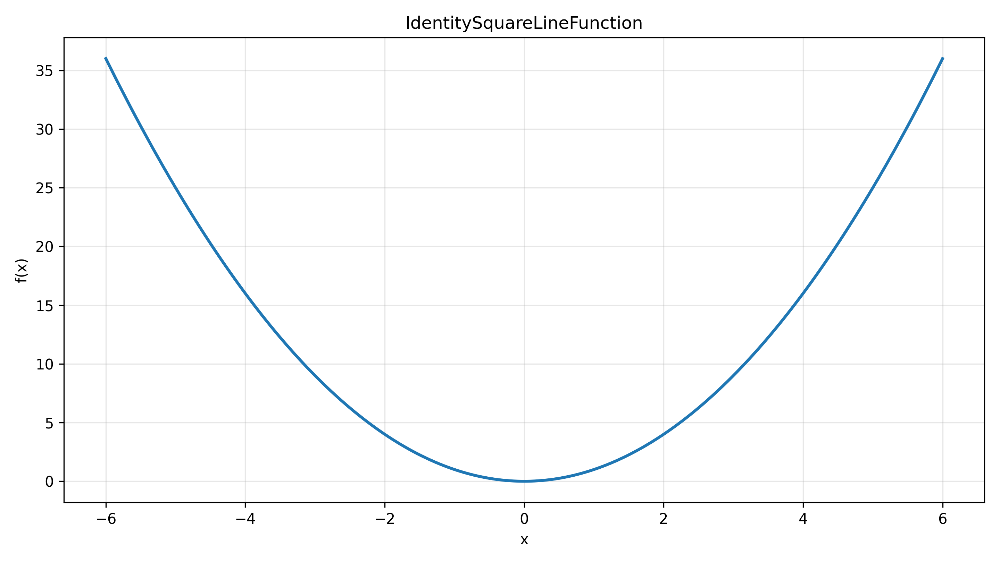 |

## Shifted Identity Square Line Function

<!-- prettier-ignore -->
::: umf.functions.optimization.line_shaped.ShiftedIdentitySquareLineFunction
    options:
        show_bases: false
        show_source: true
        show_inherited_members: false
        allow_inspection: false
        inheritance_graph: false
        heading_level: 0

|                                                                                                   |
| :-----------------------------------------------------------------------------------------------: |
| 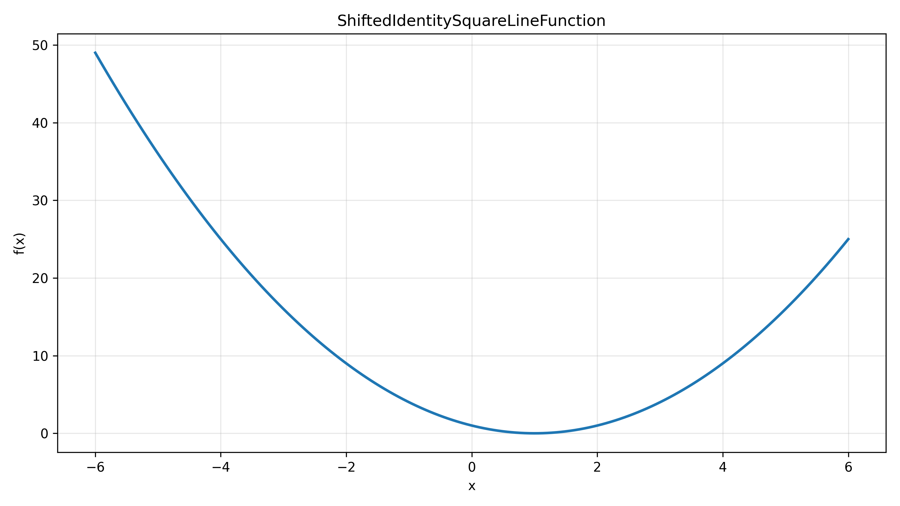 |

## Absolute Line Function

<!-- prettier-ignore -->
::: umf.functions.optimization.line_shaped.AbsoluteLineFunction
    options:
        show_bases: false
        show_source: true
        show_inherited_members: false
        allow_inspection: false
        inheritance_graph: false
        heading_level: 0

|                                                                         |
| :---------------------------------------------------------------------: |
| 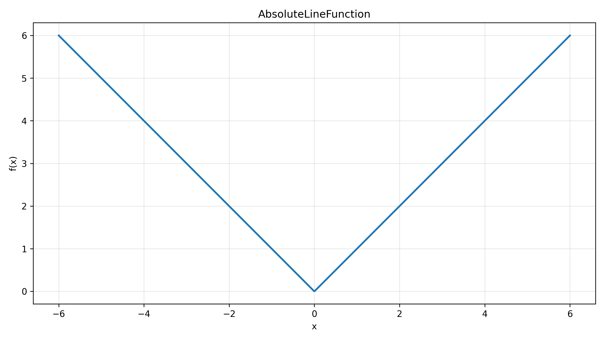 |

## Quartic Line Function

<!-- prettier-ignore -->
::: umf.functions.optimization.line_shaped.QuarticLineFunction
    options:
        show_bases: false
        show_source: true
        show_inherited_members: false
        allow_inspection: false
        inheritance_graph: false
        heading_level: 0

|                                                                       |
| :-------------------------------------------------------------------: |
| 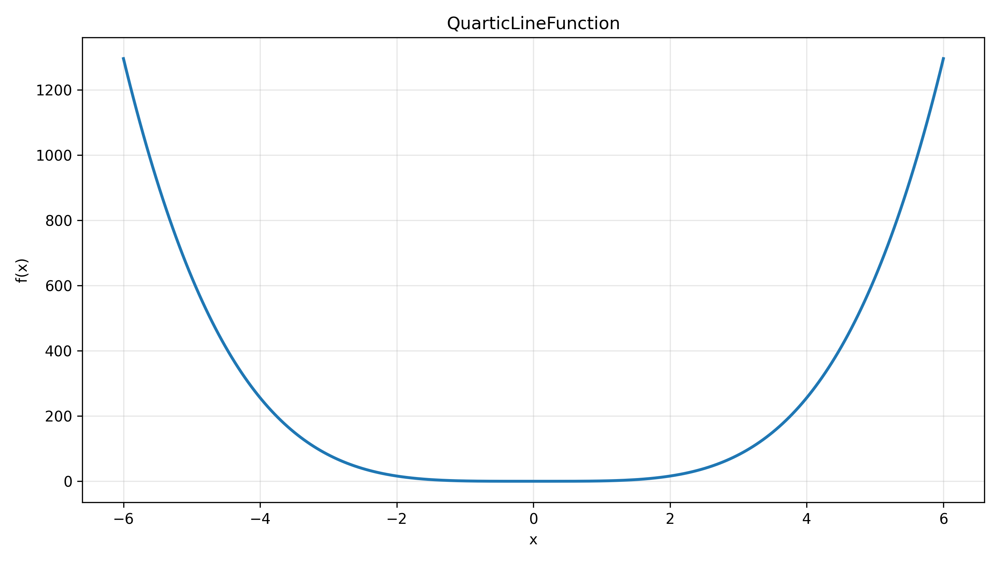 |

## Sextic Line Function

<!-- prettier-ignore -->
::: umf.functions.optimization.line_shaped.SexticLineFunction
    options:
        show_bases: false
        show_source: true
        show_inherited_members: false
        allow_inspection: false
        inheritance_graph: false
        heading_level: 0

|                                                                     |
| :-----------------------------------------------------------------: |
| 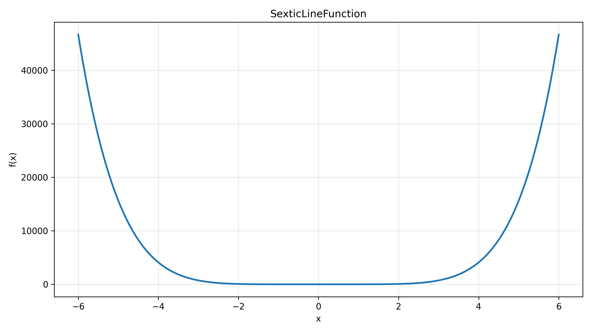 |

## Double Well Line Function

<!-- prettier-ignore -->
::: umf.functions.optimization.line_shaped.DoubleWellLineFunction
    options:
        show_bases: false
        show_source: true
        show_inherited_members: false
        allow_inspection: false
        inheritance_graph: false
        heading_level: 0

|                                                                             |
| :-------------------------------------------------------------------------: |
| 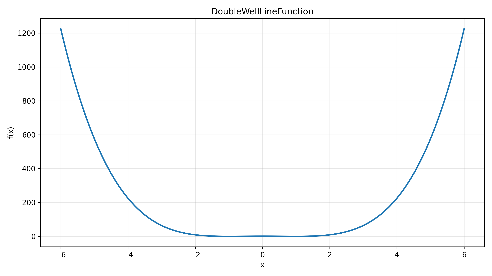 |

## Cosine Bowl Line Function

<!-- prettier-ignore -->
::: umf.functions.optimization.line_shaped.CosineBowlLineFunction
    options:
        show_bases: false
        show_source: true
        show_inherited_members: false
        allow_inspection: false
        inheritance_graph: false
        heading_level: 0

|                                                                             |
| :-------------------------------------------------------------------------: |
| 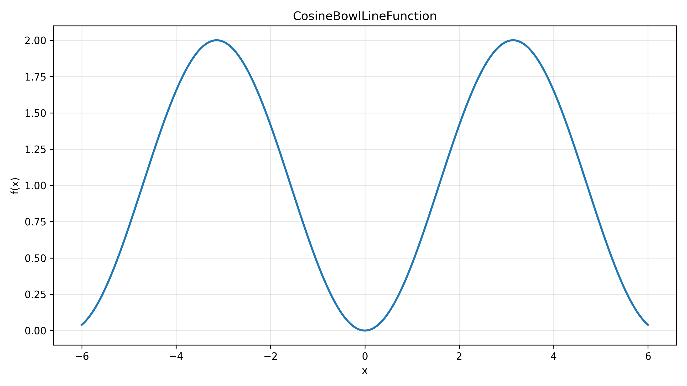 |

## Sine Squared Line Function

<!-- prettier-ignore -->
::: umf.functions.optimization.line_shaped.SineSquaredLineFunction
    options:
        show_bases: false
        show_source: true
        show_inherited_members: false
        allow_inspection: false
        inheritance_graph: false
        heading_level: 0

|                                                                               |
| :---------------------------------------------------------------------------: |
| 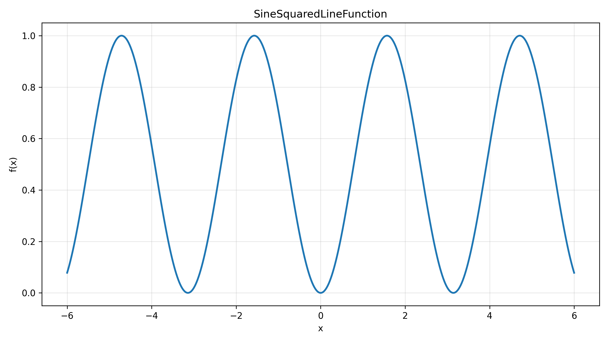 |

## Damped Oscillation Line Function

<!-- prettier-ignore -->
::: umf.functions.optimization.line_shaped.DampedOscillationLineFunction
    options:
        show_bases: false
        show_source: true
        show_inherited_members: false
        allow_inspection: false
        inheritance_graph: false
        heading_level: 0

|                                                                                           |
| :---------------------------------------------------------------------------------------: |
| 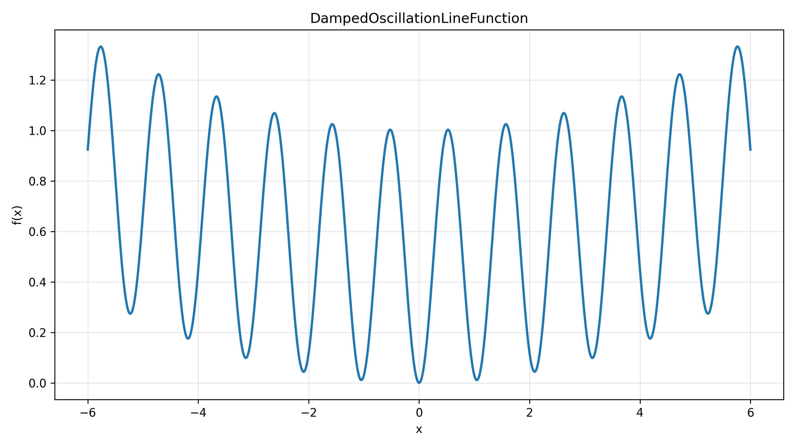 |

## Exponential Square Line Function

<!-- prettier-ignore -->
::: umf.functions.optimization.line_shaped.ExponentialSquareLineFunction
    options:
        show_bases: false
        show_source: true
        show_inherited_members: false
        allow_inspection: false
        inheritance_graph: false
        heading_level: 0

|                                                                                           |
| :---------------------------------------------------------------------------------------: |
| 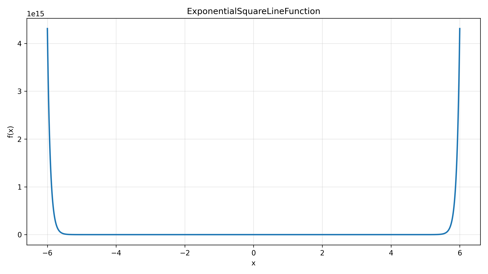 |

## Log Cosh Line Function

<!-- prettier-ignore -->
::: umf.functions.optimization.line_shaped.LogCoshLineFunction
    options:
        show_bases: false
        show_source: true
        show_inherited_members: false
        allow_inspection: false
        inheritance_graph: false
        heading_level: 0

|                                                                       |
| :-------------------------------------------------------------------: |
| 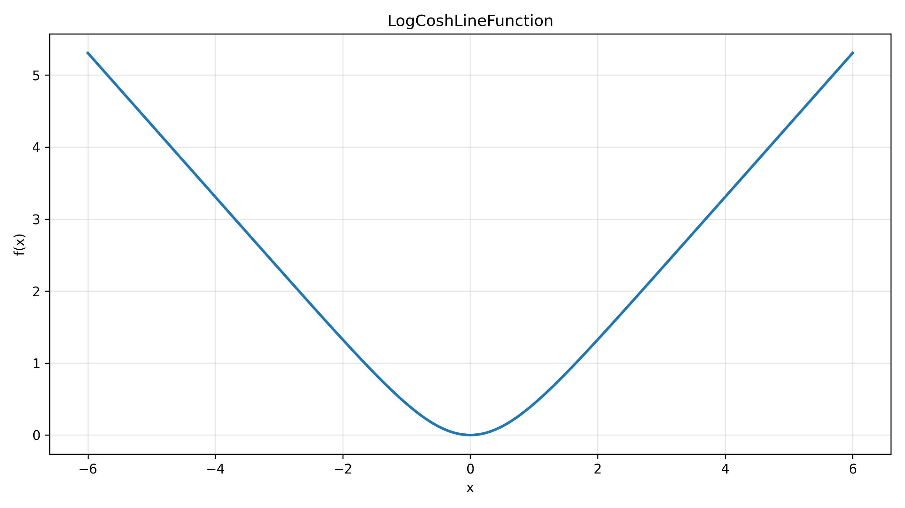 |

## Softplus Symmetric Line Function

<!-- prettier-ignore -->
::: umf.functions.optimization.line_shaped.SoftplusSymmetricLineFunction
    options:
        show_bases: false
        show_source: true
        show_inherited_members: false
        allow_inspection: false
        inheritance_graph: false
        heading_level: 0

|                                                                                           |
| :---------------------------------------------------------------------------------------: |
| 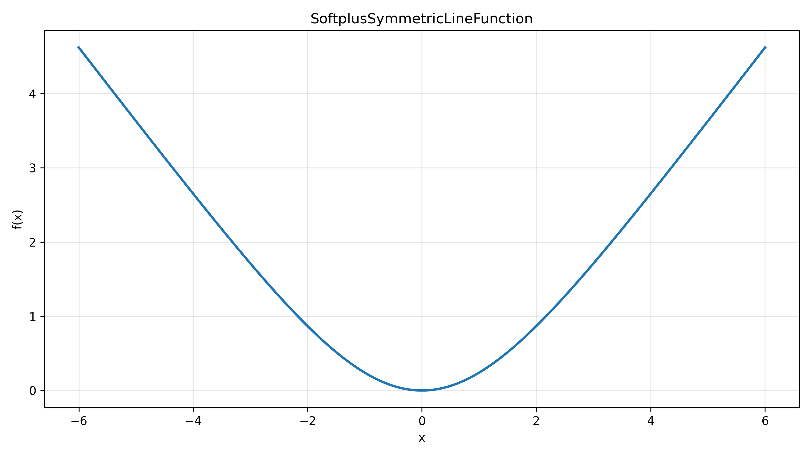 |

## Rational Bowl Line Function

<!-- prettier-ignore -->
::: umf.functions.optimization.line_shaped.RationalBowlLineFunction
    options:
        show_bases: false
        show_source: true
        show_inherited_members: false
        allow_inspection: false
        inheritance_graph: false
        heading_level: 0

|                                                                                 |
| :-----------------------------------------------------------------------------: |
| 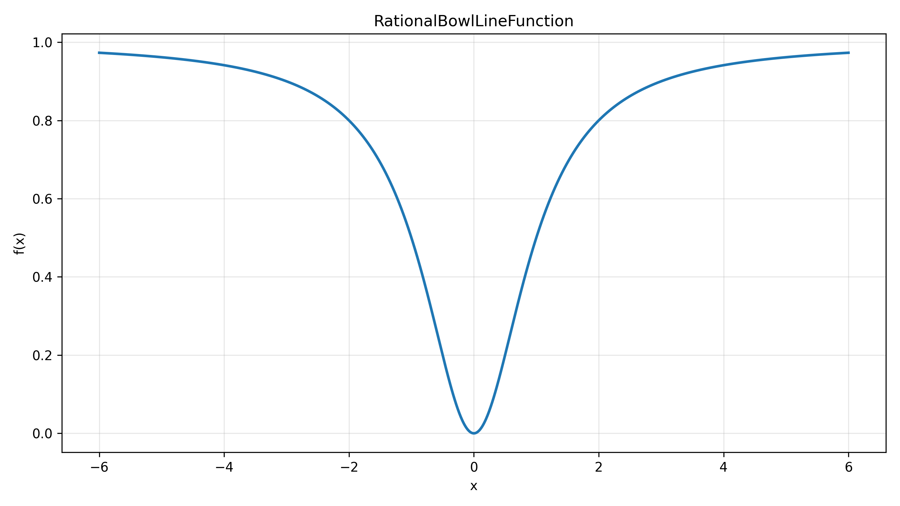 |

## Arctangent Square Line Function

<!-- prettier-ignore -->
::: umf.functions.optimization.line_shaped.ArctanSquareLineFunction
    options:
        show_bases: false
        show_source: true
        show_inherited_members: false
        allow_inspection: false
        inheritance_graph: false
        heading_level: 0

|                                                                                 |
| :-----------------------------------------------------------------------------: |
| 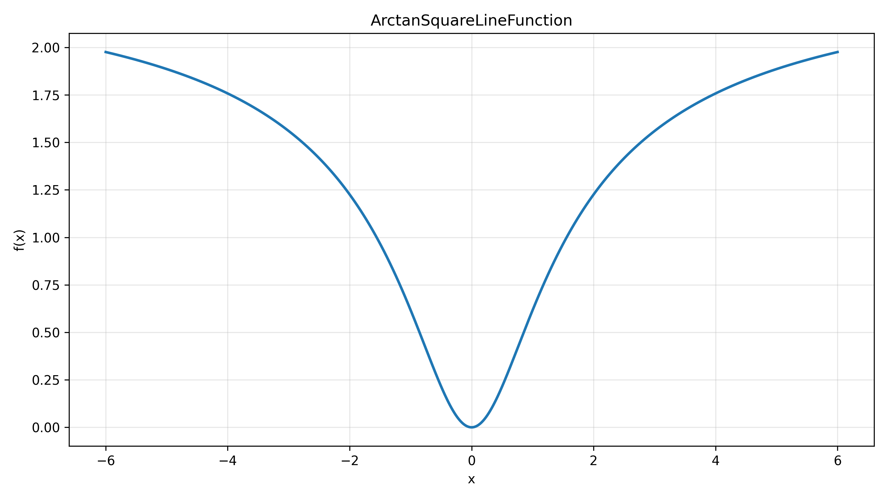 |

## Cauchy Loss Line Function

<!-- prettier-ignore -->
::: umf.functions.optimization.line_shaped.CauchyLossLineFunction
    options:
        show_bases: false
        show_source: true
        show_inherited_members: false
        allow_inspection: false
        inheritance_graph: false
        heading_level: 0

|                                                                             |
| :-------------------------------------------------------------------------: |
| 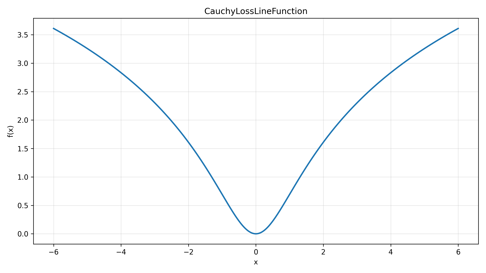 |

## Elastic Net Line Function

<!-- prettier-ignore -->
::: umf.functions.optimization.line_shaped.ElasticNetLineFunction
    options:
        show_bases: false
        show_source: true
        show_inherited_members: false
        allow_inspection: false
        inheritance_graph: false
        heading_level: 0

|                                                                             |
| :-------------------------------------------------------------------------: |
| 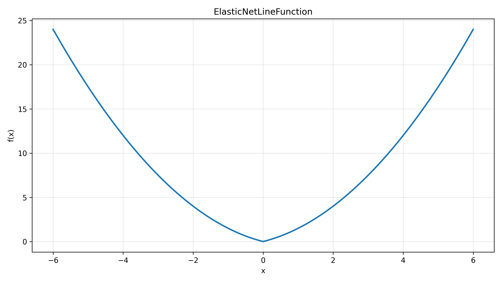 |

## Shifted Elastic Line Function

<!-- prettier-ignore -->
::: umf.functions.optimization.line_shaped.ShiftedElasticLineFunction
    options:
        show_bases: false
        show_source: true
        show_inherited_members: false
        allow_inspection: false
        inheritance_graph: false
        heading_level: 0

|                                                                                     |
| :---------------------------------------------------------------------------------: |
| 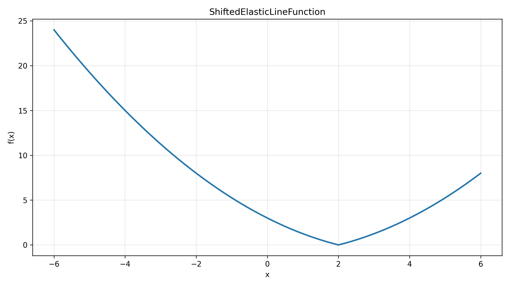 |

## Gaussian Valley Line Function

<!-- prettier-ignore -->
::: umf.functions.optimization.line_shaped.GaussianValleyLineFunction
    options:
        show_bases: false
        show_source: true
        show_inherited_members: false
        allow_inspection: false
        inheritance_graph: false
        heading_level: 0

|                                                                                     |
| :---------------------------------------------------------------------------------: |
| 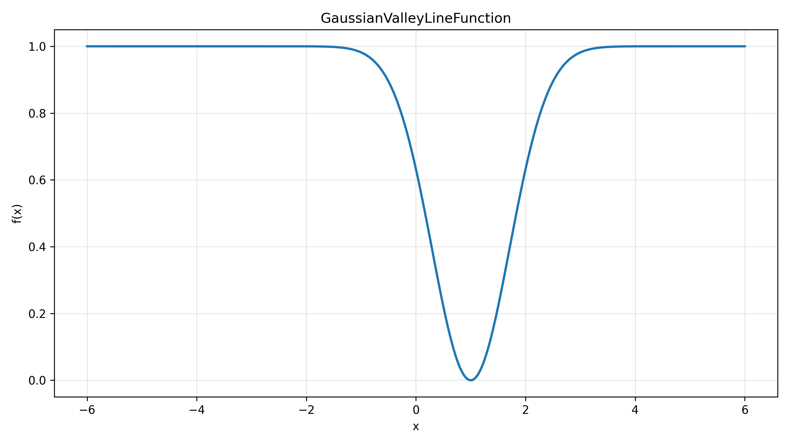 |

## Sinc Square Line Function

<!-- prettier-ignore -->
::: umf.functions.optimization.line_shaped.SincSquareLineFunction
    options:
        show_bases: false
        show_source: true
        show_inherited_members: false
        allow_inspection: false
        inheritance_graph: false
        heading_level: 0

|                                                                             |
| :-------------------------------------------------------------------------: |
| 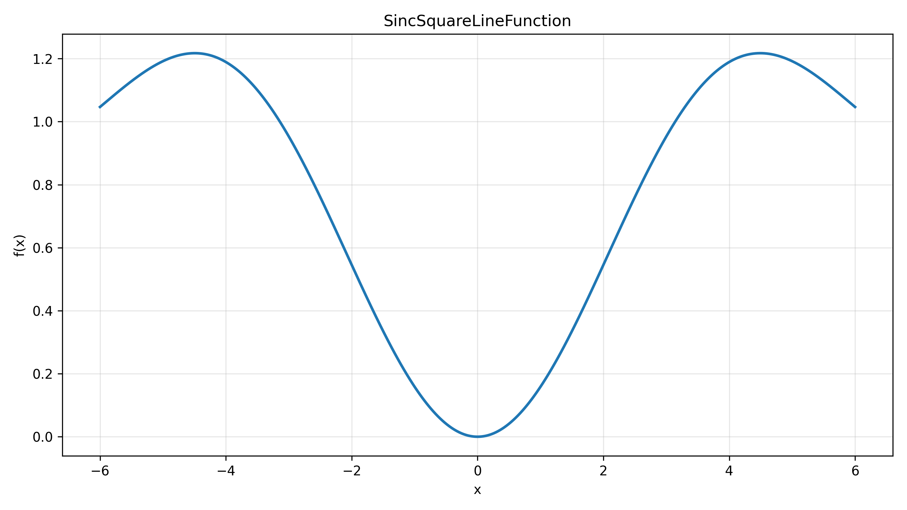 |

## Tilted Parabola Ripple Line Function

<!-- prettier-ignore -->
::: umf.functions.optimization.line_shaped.TiltedParabolaRippleLineFunction
    options:
        show_bases: false
        show_source: true
        show_inherited_members: false
        allow_inspection: false
        inheritance_graph: false
        heading_level: 0

|                                                                                                 |
| :---------------------------------------------------------------------------------------------: |
| 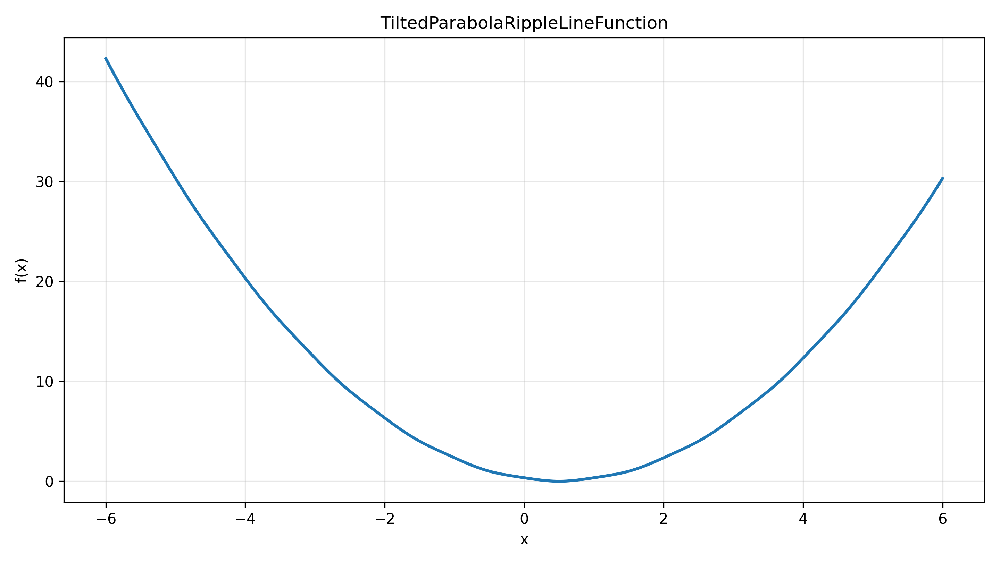 |
