# Many Local Minima Functions

<!-- markdownlint-disable MD013 MD058 MD060 -->

## Ackley Function

<!-- prettier-ignore -->
::: umf.functions.optimization.many_local_minima.AckleyFunction
    options:
        show_bases: false
        show_source: true
        show_inherited_members: false
        allow_inspection: false
        inheritance_graph: false
        heading_level: 0

|                                                             |
| :---------------------------------------------------------: |
| 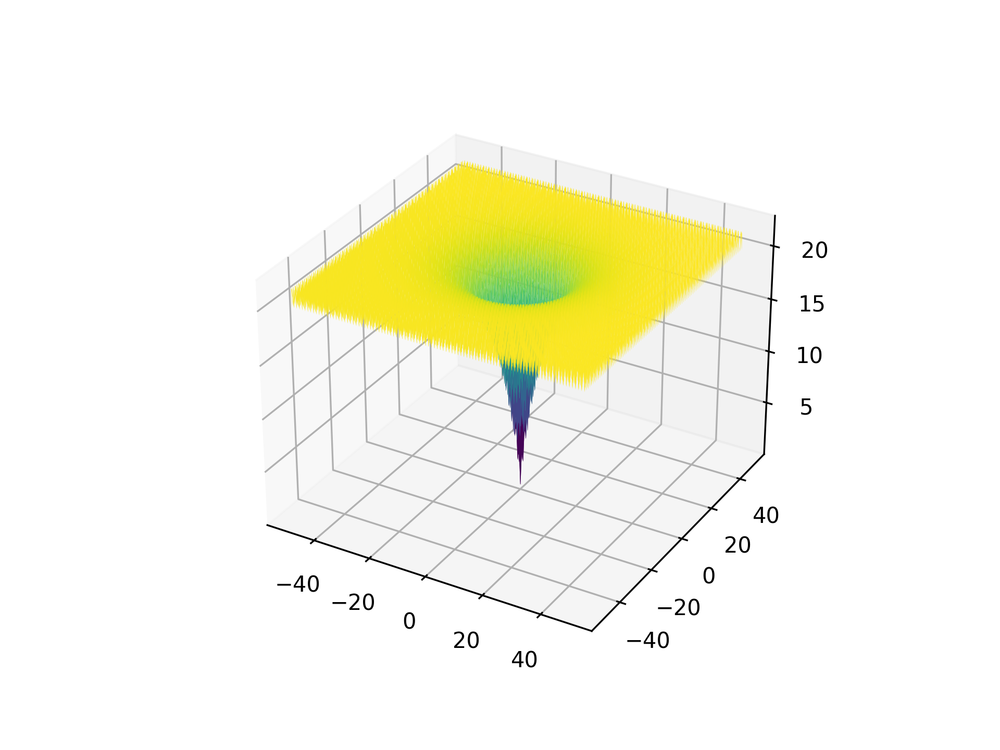 |

## Bukin Function N. 6

<!-- prettier-ignore -->
::: umf.functions.optimization.many_local_minima.BukinN6Function
    options:
        show_bases: false
        show_source: true
        show_inherited_members: false
        allow_inspection: false
        inheritance_graph: false
        heading_level: 0

|                                                               |
| :-----------------------------------------------------------: |
| 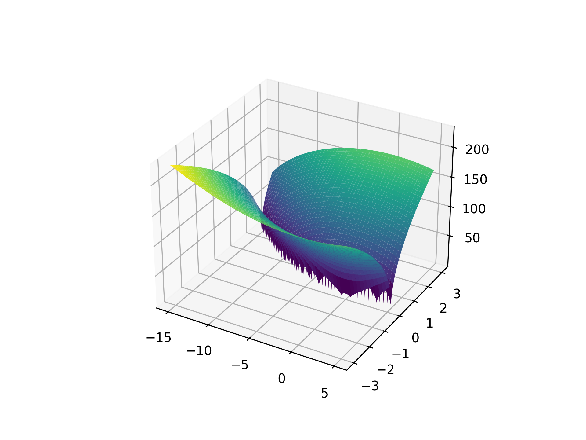 |

## Cross-in-Tray Function

<!-- prettier-ignore -->
::: umf.functions.optimization.many_local_minima.CrossInTrayFunction
    options:
        show_bases: false
        show_source: true
        show_inherited_members: false
        allow_inspection: false
        inheritance_graph: false
        heading_level: 0

|                                                                       |
| :-------------------------------------------------------------------: |
| 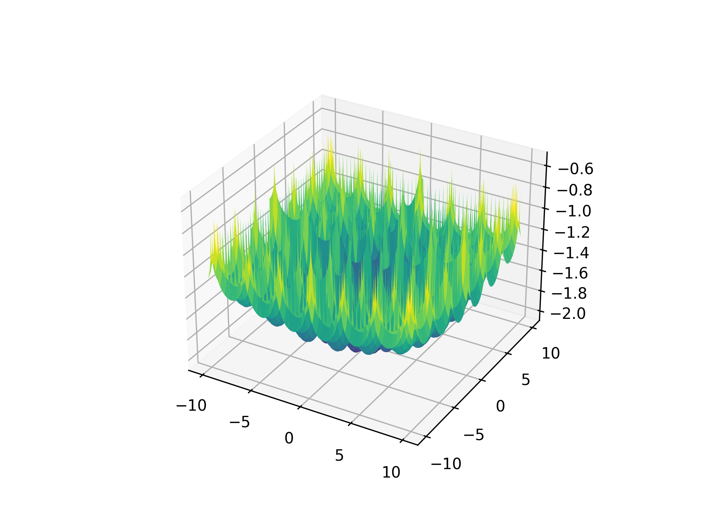 |

## Drop Wave Function

<!-- prettier-ignore -->
::: umf.functions.optimization.many_local_minima.DropWaveFunction
    options:
        show_bases: false
        show_source: true
        show_inherited_members: false
        allow_inspection: false
        inheritance_graph: false
        heading_level: 0

|                                                                 |
| :-------------------------------------------------------------: |
| 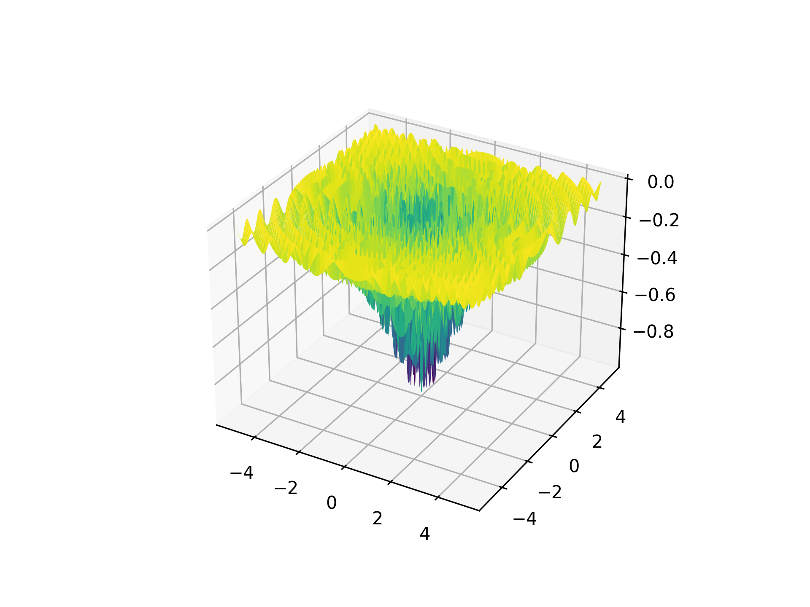 |

## Egg Holder Function

<!-- prettier-ignore -->
::: umf.functions.optimization.many_local_minima.EggHolderFunction
    options:
        show_bases: false
        show_source: true
        show_inherited_members: false
        allow_inspection: false
        inheritance_graph: false
        heading_level: 0

|                                                                   |
| :---------------------------------------------------------------: |
| 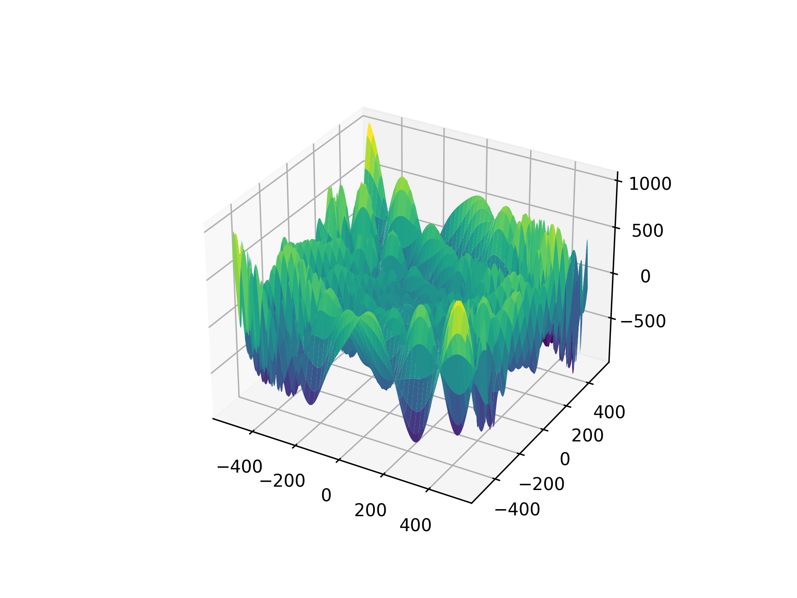 |

## Griewank Function

<!-- prettier-ignore -->
::: umf.functions.optimization.many_local_minima.GriewankFunction
    options:
        show_bases: false
        show_source: true
        show_inherited_members: false
        allow_inspection: false
        inheritance_graph: false
        heading_level: 0

|                                                                 |
| :-------------------------------------------------------------: |
| 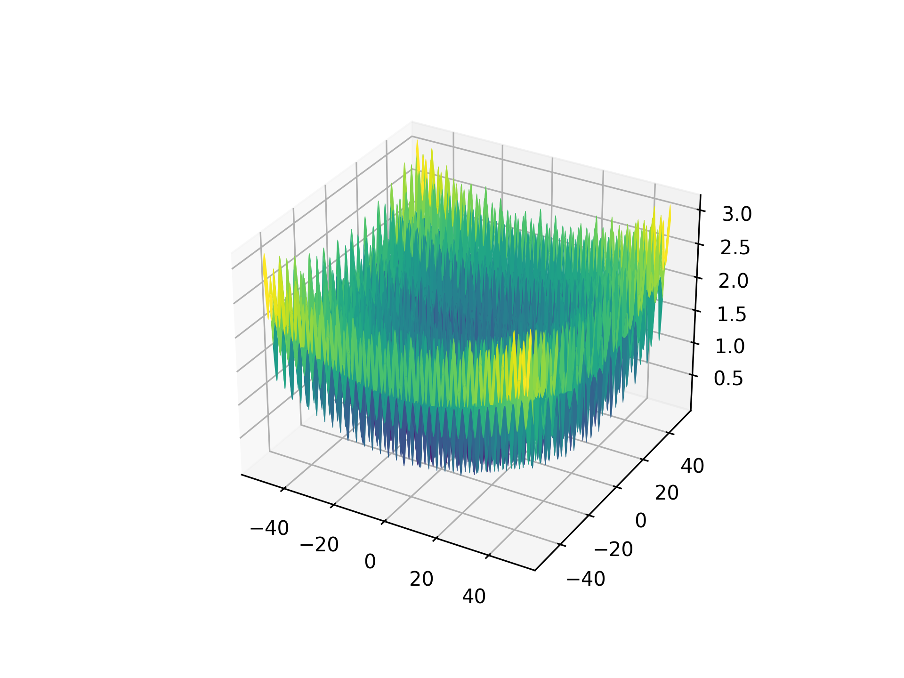 |

## Holder Table Function

<!-- prettier-ignore -->
::: umf.functions.optimization.many_local_minima.HolderTableFunction
    options:
        show_bases: false
        show_source: true
        show_inherited_members: false
        allow_inspection: false
        inheritance_graph: false
        heading_level: 0

|                                                                       |
| :-------------------------------------------------------------------: |
| 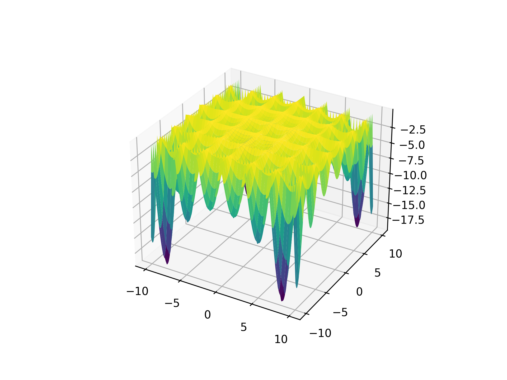 |

## Langermann Function

<!-- prettier-ignore -->
::: umf.functions.optimization.many_local_minima.LangermannFunction
    options:
        show_bases: false
        show_source: true
        show_inherited_members: false
        allow_inspection: false
        inheritance_graph: false
        heading_level: 0

|                                                                     |
| :-----------------------------------------------------------------: |
|  |

## Levy Function

<!-- prettier-ignore -->
::: umf.functions.optimization.many_local_minima.LevyFunction
    options:
        show_bases: false
        show_source: true
        show_inherited_members: false
        allow_inspection: false
        inheritance_graph: false
        heading_level: 0

|                                                         |
| :-----------------------------------------------------: |
| 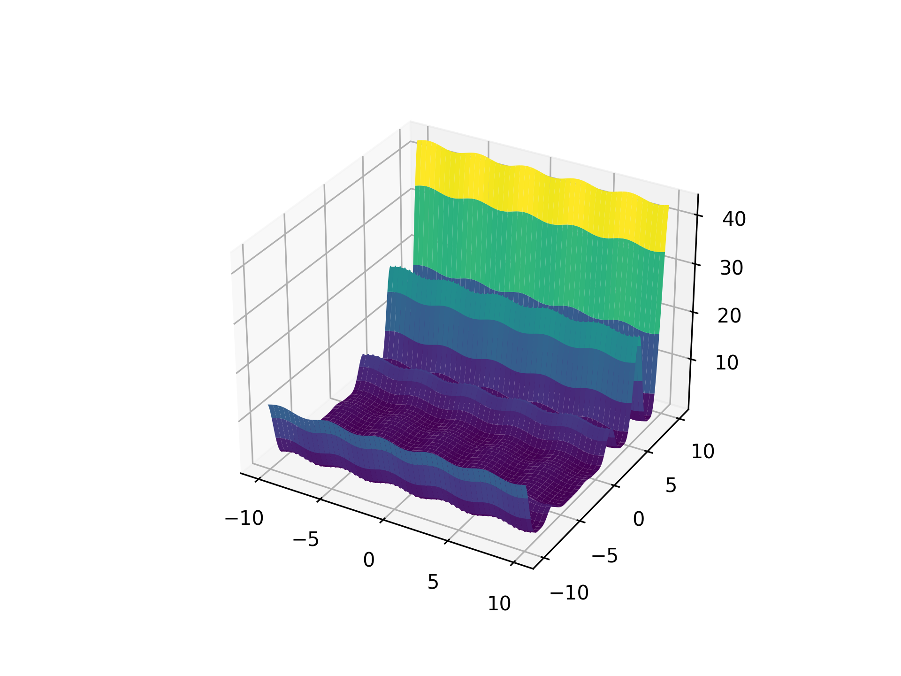 |

## Levy Function N. 13

<!-- prettier-ignore -->
::: umf.functions.optimization.many_local_minima.LevyN13Function
    options:
        show_bases: false
        show_source: true
        show_inherited_members: false
        allow_inspection: false
        inheritance_graph: false
        heading_level: 0

|                                                               |
| :-----------------------------------------------------------: |
| 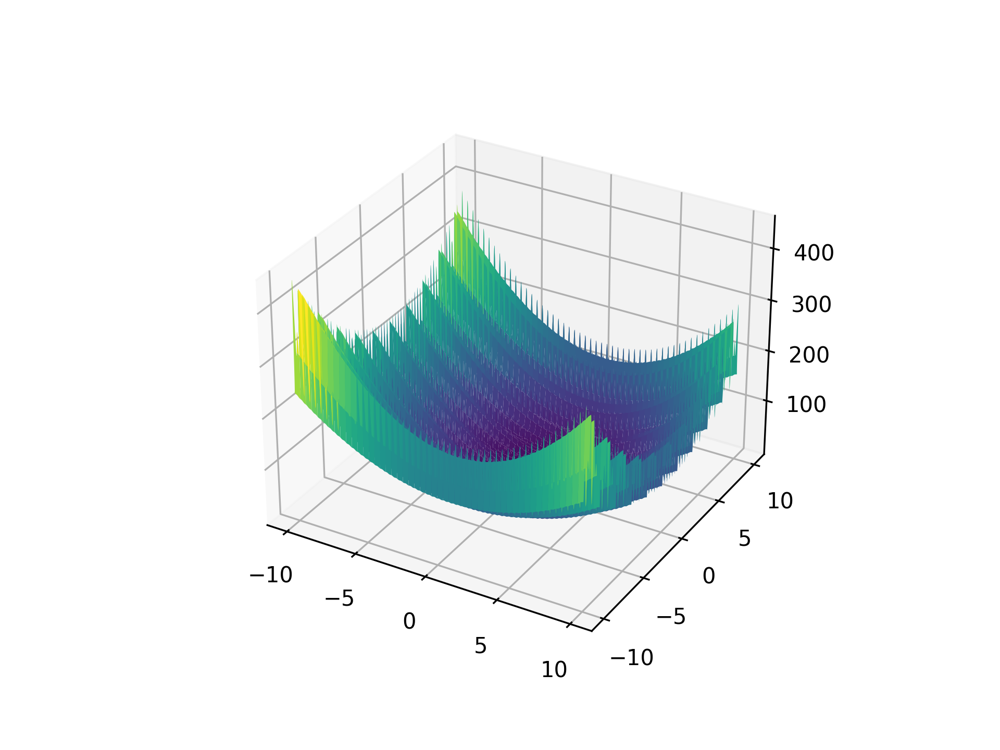 |

## Rastrigin Function

<!-- prettier-ignore -->
::: umf.functions.optimization.many_local_minima.RastriginFunction
    options:
        show_bases: false
        show_source: true
        show_inherited_members: false
        allow_inspection: false
        inheritance_graph: false
        heading_level: 0

|                                                                   |
| :---------------------------------------------------------------: |
| 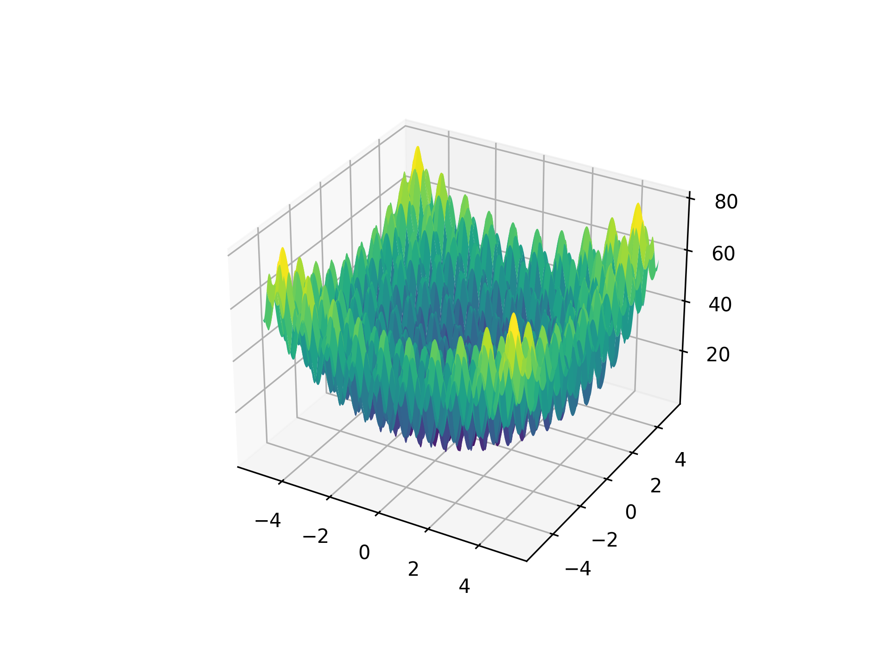 |

## Schaffer Function N. 2

<!-- prettier-ignore -->
::: umf.functions.optimization.many_local_minima.SchafferN2Function
    options:
        show_bases: false
        show_source: true
        show_inherited_members: false
        allow_inspection: false
        inheritance_graph: false
        heading_level: 0
|                     |
| :-----------------: |
|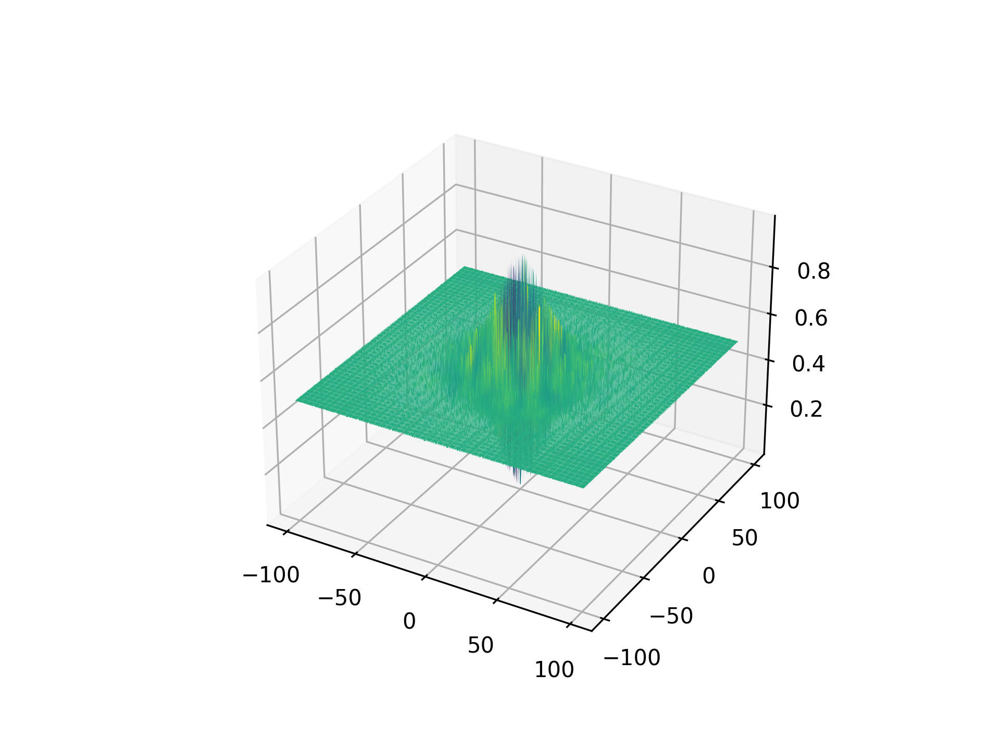|

## Schaffer Function N. 4

<!-- prettier-ignore -->
::: umf.functions.optimization.many_local_minima.SchafferN4Function
    options:
        show_bases: false
        show_source: true
        show_inherited_members: false
        allow_inspection: false
        inheritance_graph: false
        heading_level: 0

|                                                                     |
| :-----------------------------------------------------------------: |
| 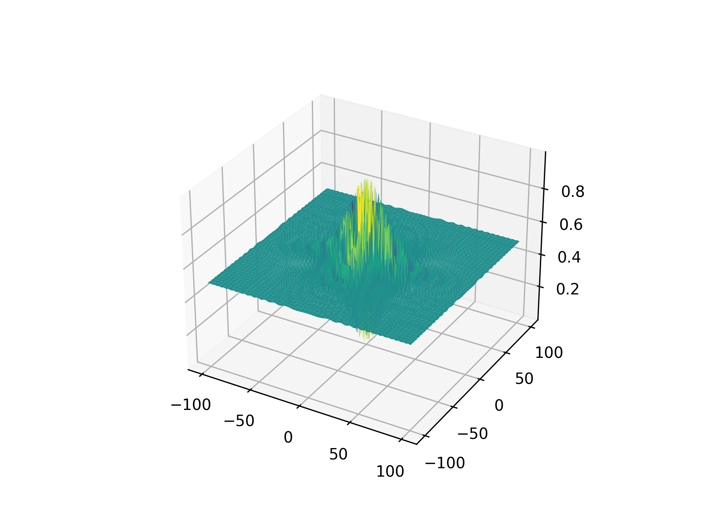 |

## Schwefel Function

<!-- prettier-ignore -->
::: umf.functions.optimization.many_local_minima.SchwefelFunction
    options:
        show_bases: false
        show_source: true
        show_inherited_members: false
        allow_inspection: false
        inheritance_graph: false
        heading_level: 0

|                                                                 |
| :-------------------------------------------------------------: |
| 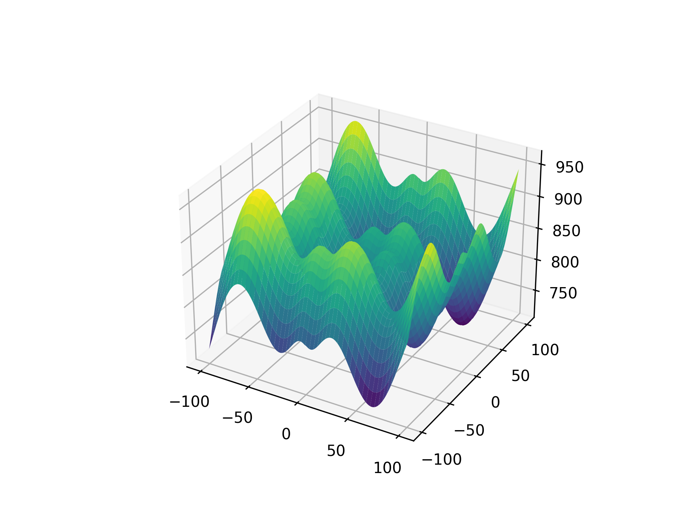 |

## Shubert Function

<!-- prettier-ignore -->
::: umf.functions.optimization.many_local_minima.ShubertFunction
    options:
        show_bases: false
        show_source: true
        show_inherited_members: false
        allow_inspection: false
        inheritance_graph: false
        heading_level: 0

|                                                               |
| :-----------------------------------------------------------: |
| 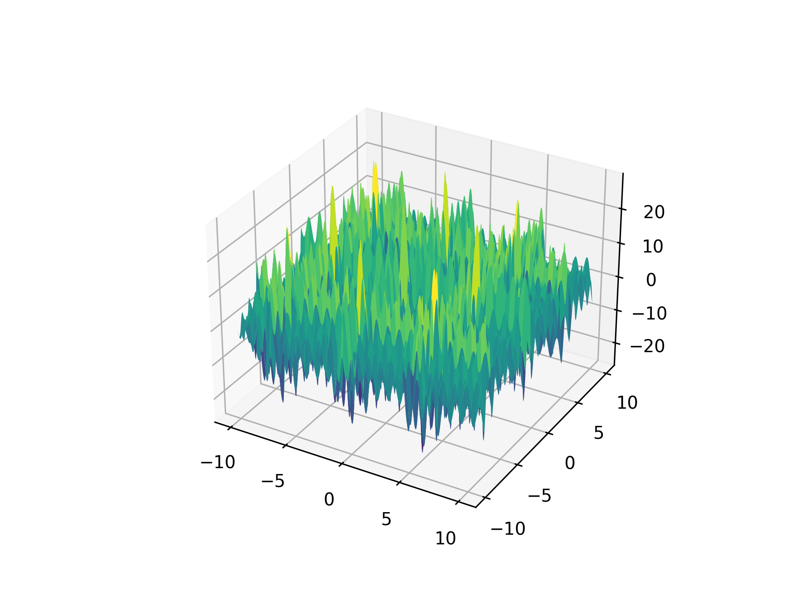 |

## Cosine Mixture Function

<!-- prettier-ignore -->
::: umf.functions.optimization.many_local_minima.CosineMixtureFunction
    options:
        show_bases: false
        show_source: true
        show_inherited_members: false
        allow_inspection: false
        inheritance_graph: false
        heading_level: 0

|                                                                           |
| :-----------------------------------------------------------------------: |
| 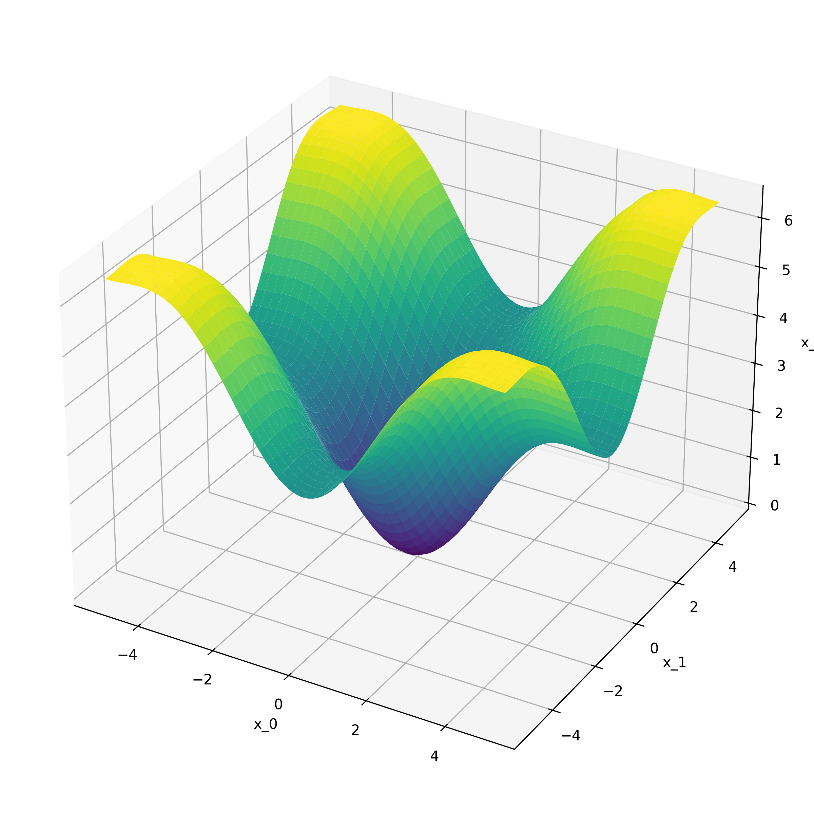 |

## Cosine Product Sphere Function

<!-- prettier-ignore -->
::: umf.functions.optimization.many_local_minima.CosineProductSphereFunction
    options:
        show_bases: false
        show_source: true
        show_inherited_members: false
        allow_inspection: false
        inheritance_graph: false
        heading_level: 0

|                                                                                       |
| :-----------------------------------------------------------------------------------: |
| 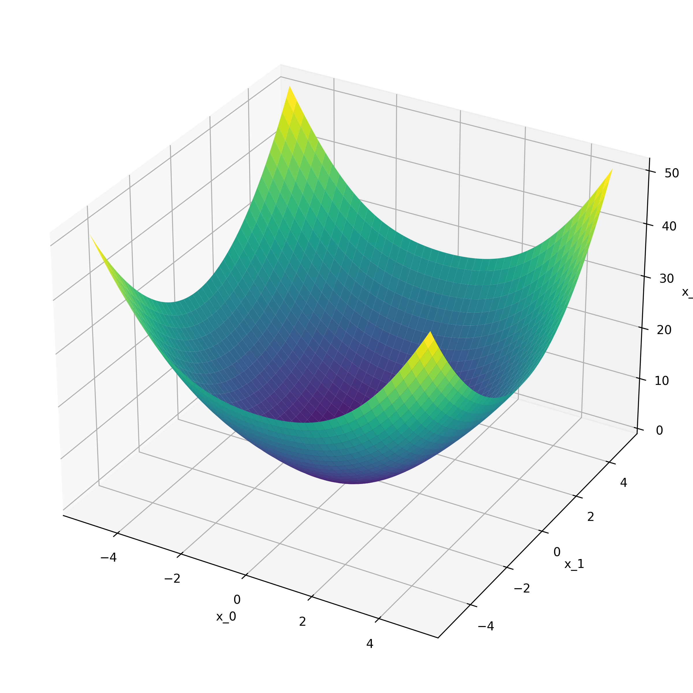 |
