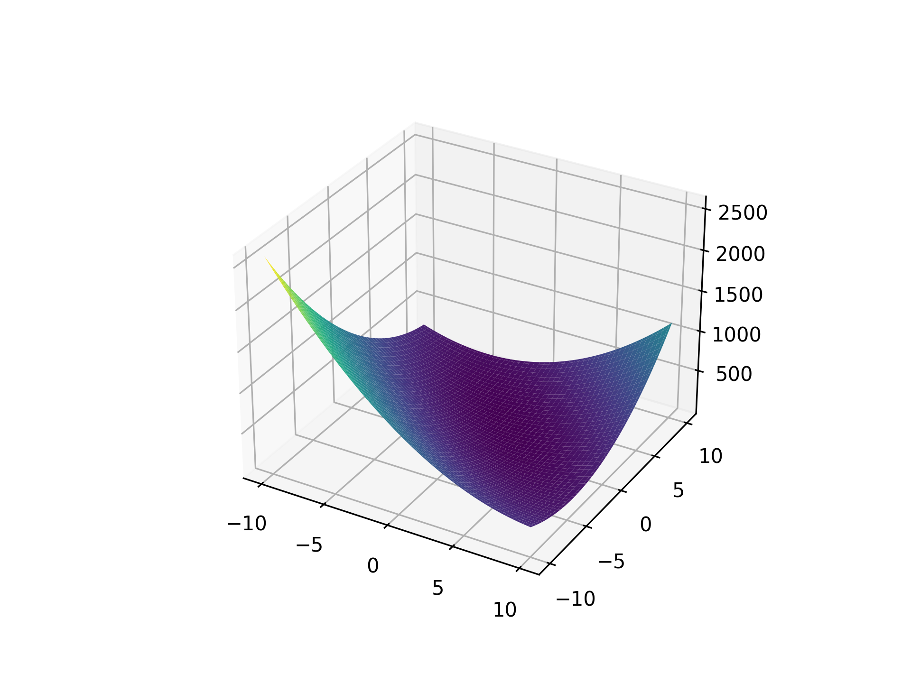
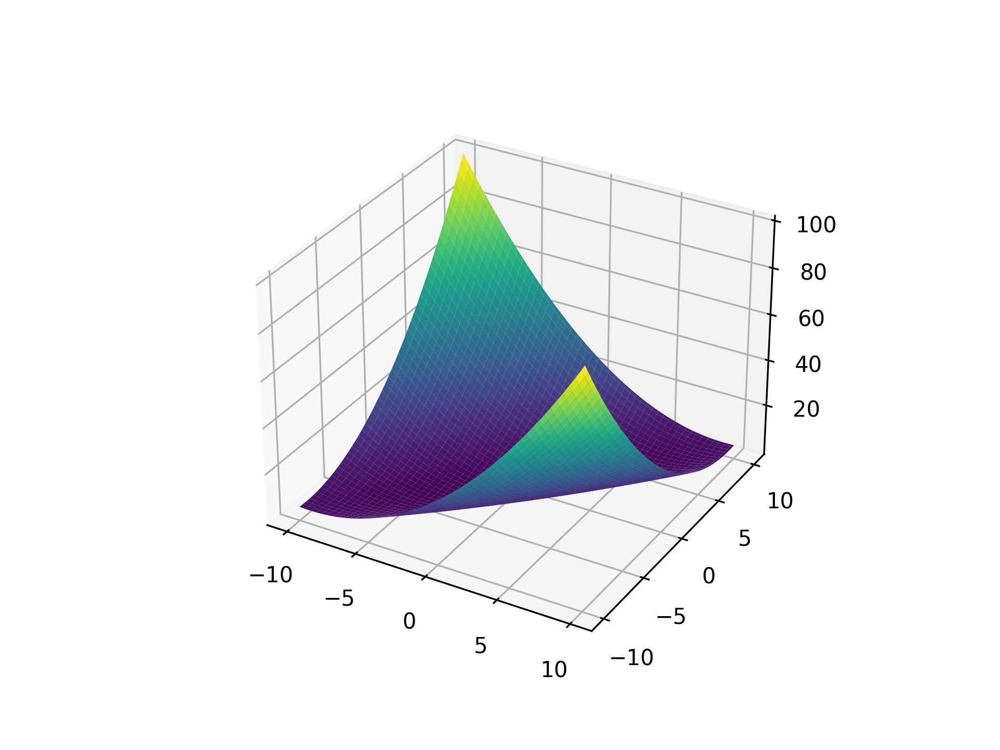
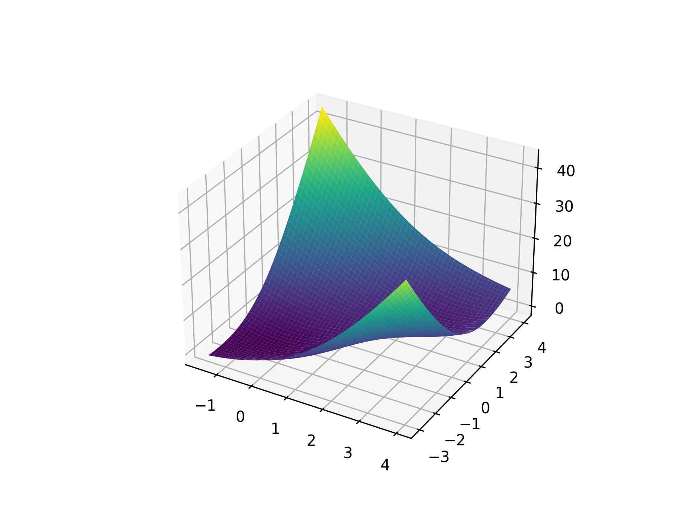
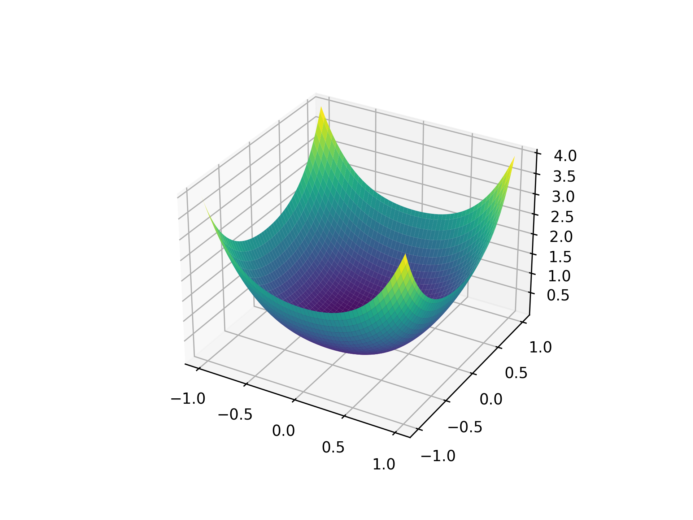
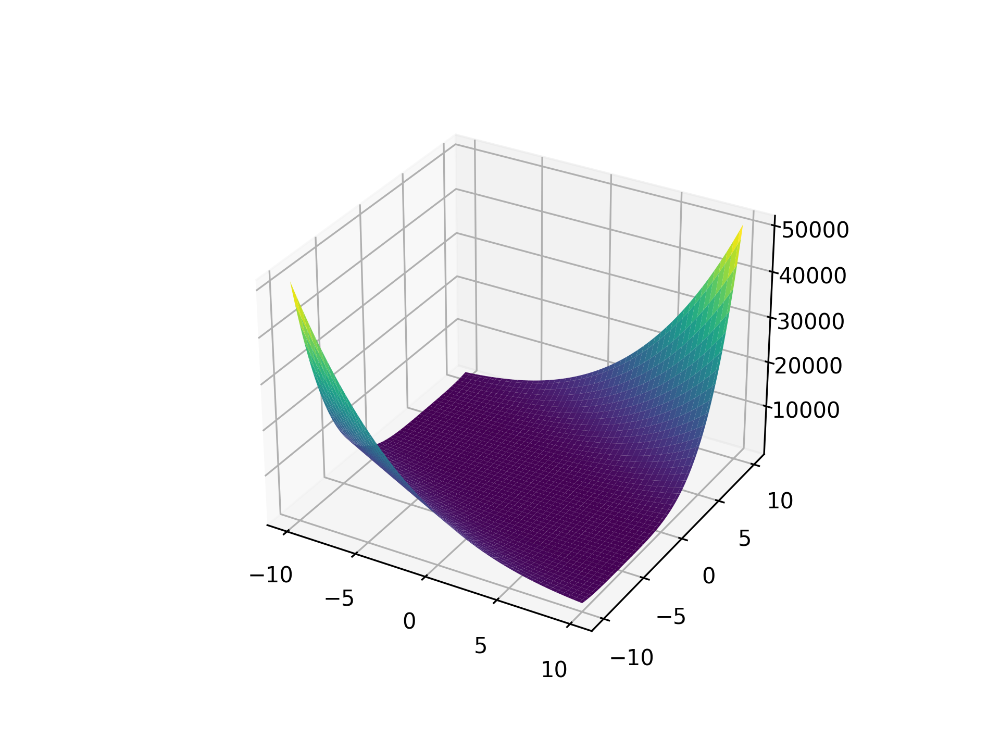
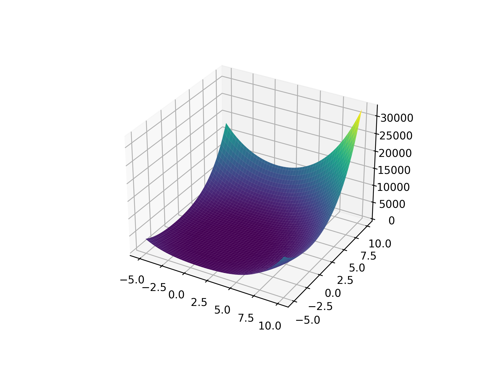

## Booth Function

<!-- prettier-ignore -->
::: umf.functions.optimization.plate_shaped.BoothFunction
    options:
        show_bases: false
        show_source: true
        show_inherited_members: false
        allow_inspection: false
        inheritance_graph: false
        heading_level: 0
        members: None

|                                                           |
| :-------------------------------------------------------: |
|  |

## Matyas Function

<!-- prettier-ignore -->
::: umf.functions.optimization.plate_shaped.MatyasFunction
    options:
        show_bases: false
        show_source: true
        show_inherited_members: false
        allow_inspection: false
        inheritance_graph: false
        heading_level: 0
        members: None

|                                                             |
| :---------------------------------------------------------: |
|  |

## McCormick Function

<!-- prettier-ignore -->
::: umf.functions.optimization.plate_shaped.McCormickFunction
    options:
        show_bases: false
        show_source: true
        show_inherited_members: false
        allow_inspection: false
        inheritance_graph: false
        heading_level: 0
        members: None

|                                                                   |
| :---------------------------------------------------------------: |
|  |

## Power Sum Function

<!-- prettier-ignore -->
::: umf.functions.optimization.plate_shaped.PowerSumFunction
    options:
        show_bases: false
        show_source: true
        show_inherited_members: false
        allow_inspection: false
        inheritance_graph: false
        heading_level: 0
        members: None

|                                                                 |
| :-------------------------------------------------------------: |
|  |

## Zakharov Function

<!-- prettier-ignore -->
::: umf.functions.optimization.plate_shaped.ZakharovFunction
    options:
        show_bases: false
        show_source: true
        show_inherited_members: false
        allow_inspection: false
        inheritance_graph: false
        heading_level: 0
        members: None

|                                                                 |
| :-------------------------------------------------------------: |
|  |

## Zettl Function

<!-- prettier-ignore -->
::: umf.functions.optimization.plate_shaped.ZettlFunction
    options:
        show_bases: false
        show_source: true
        show_inherited_members: false
        allow_inspection: false
        inheritance_graph: false
        heading_level: 0
        members: None

|                                                           |
| :-------------------------------------------------------: |
|  |
