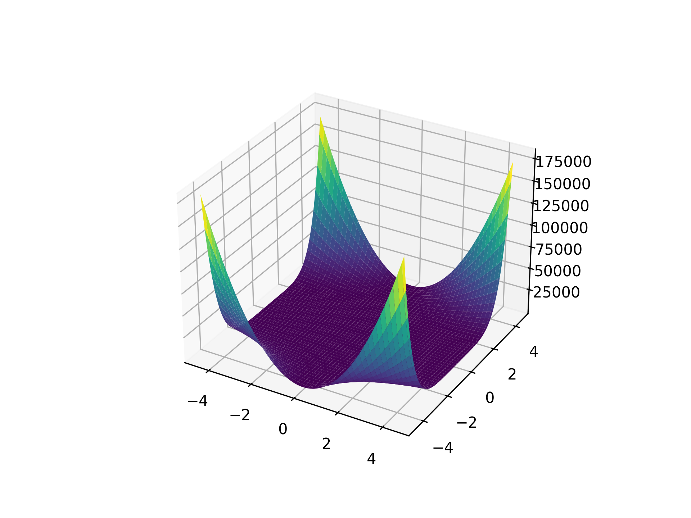
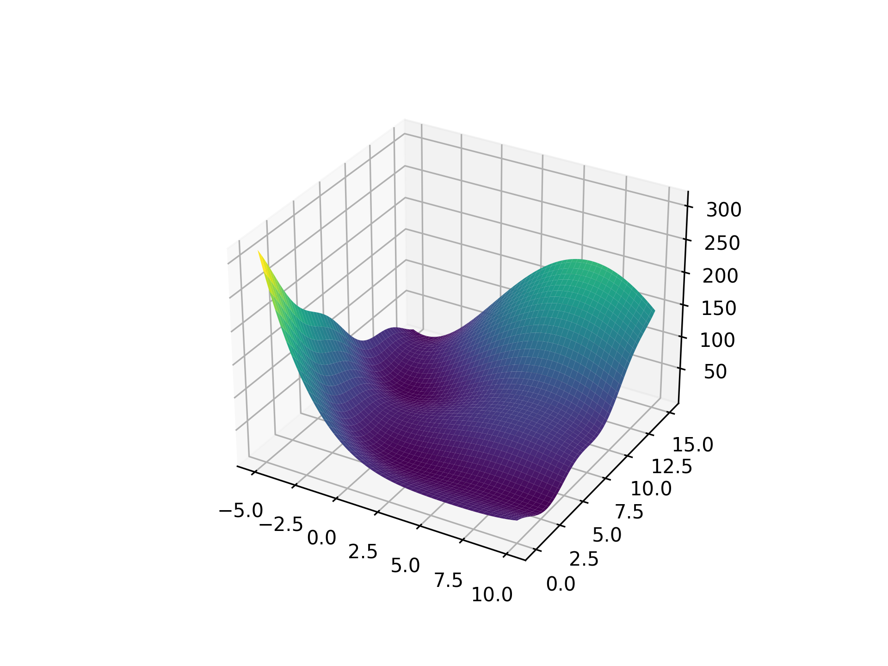
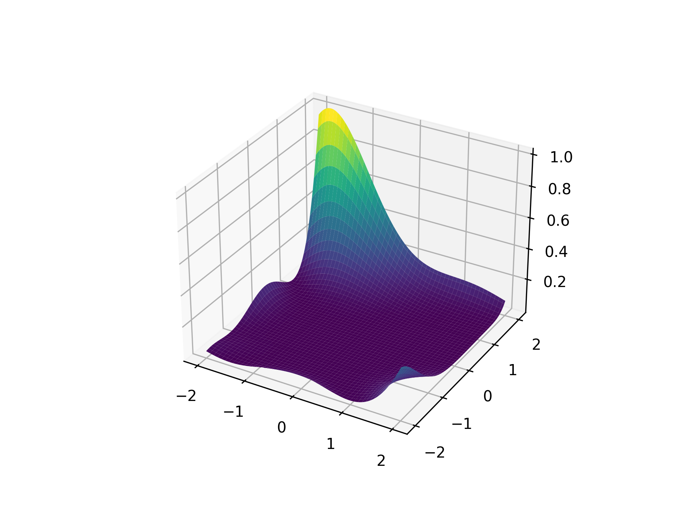
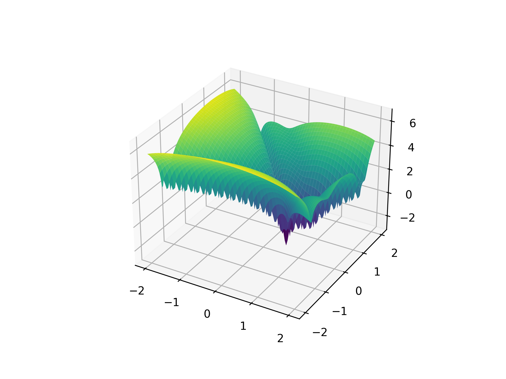
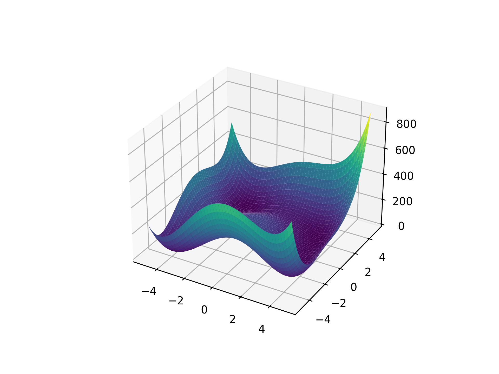
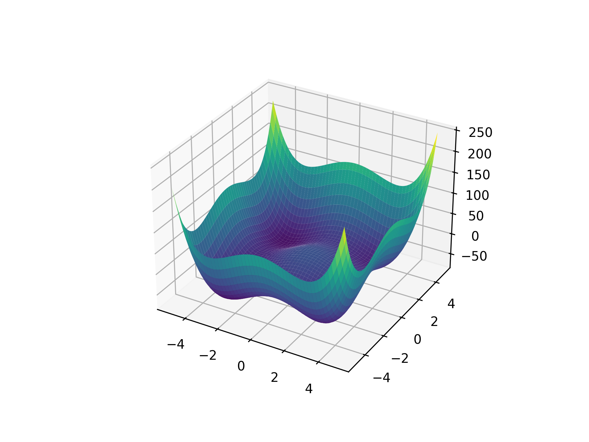

## Beale Function

<!-- prettier-ignore -->
::: umf.functions.optimization.special.BealeFunction
    options:
        show_bases: false
        show_source: true
        show_inherited_members: false
        allow_inspection: false
        inheritance_graph: false
        heading_level: 0

|                                                           |
| :-------------------------------------------------------: |
|  |

## Branin Function

<!-- prettier-ignore -->
::: umf.functions.optimization.special.BraninFunction
    options:
        show_bases: false
        show_source: true
        show_inherited_members: false
        allow_inspection: false
        inheritance_graph: false
        heading_level: 0

|                                                             |
| :---------------------------------------------------------: |
|  |

## Goldstein-Price Function

<!-- prettier-ignore -->
::: umf.functions.optimization.special.GoldsteinPriceFunction
    options:
        show_bases: false
        show_source: true
        show_inherited_members: false
        allow_inspection: false
        inheritance_graph: false
        heading_level: 0

|                                                                             |
| :-------------------------------------------------------------------------: |
|  |

## Goldstein-Price Log Function

<!-- prettier-ignore -->
::: umf.functions.optimization.special.GoldsteinPriceLogFunction
    options:
        show_bases: false
        show_source: true
        show_inherited_members: false
        allow_inspection: false
        inheritance_graph: false
        heading_level: 0

|                                                                                   |
| :-------------------------------------------------------------------------------: |
|  |

## Himmelblau Function

<!-- prettier-ignore -->
::: umf.functions.optimization.special.HimmelblauFunction
    options:
        show_bases: false
        show_source: true
        show_inherited_members: false
        allow_inspection: false
        inheritance_graph: false
        heading_level: 0

|                                                                     |
| :-----------------------------------------------------------------: |
|  |

## Styblinski-Tang Function

<!-- prettier-ignore -->
::: umf.functions.optimization.special.StyblinskiTangFunction
    options:
        show_bases: false
        show_source: true
        show_inherited_members: false
        allow_inspection: false
        inheritance_graph: false
        heading_level: 0

|                                                                             |
| :-------------------------------------------------------------------------: |
|  |
