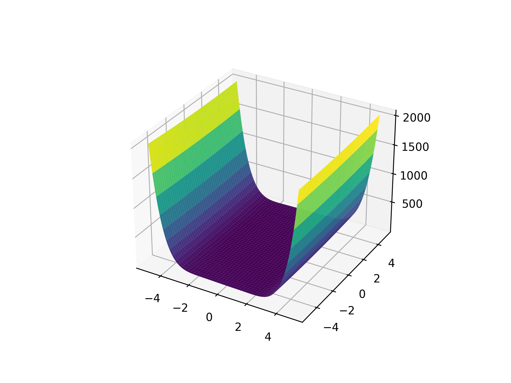
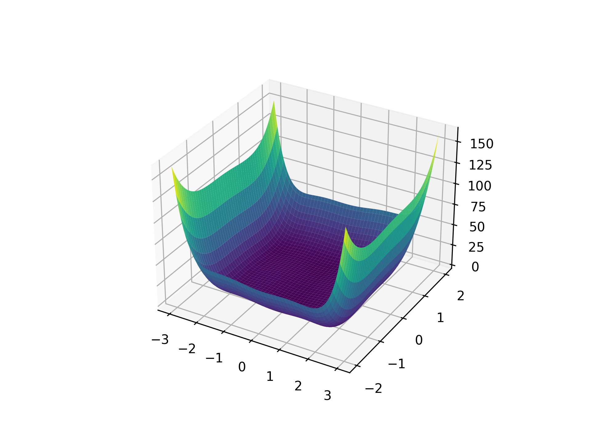
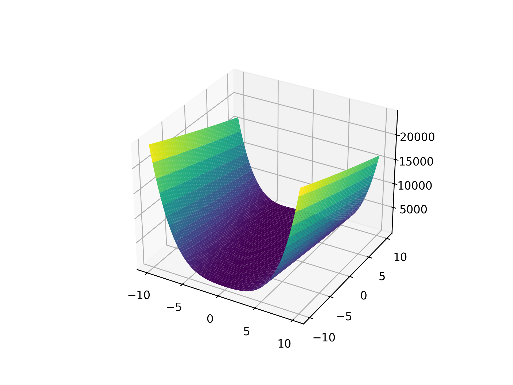
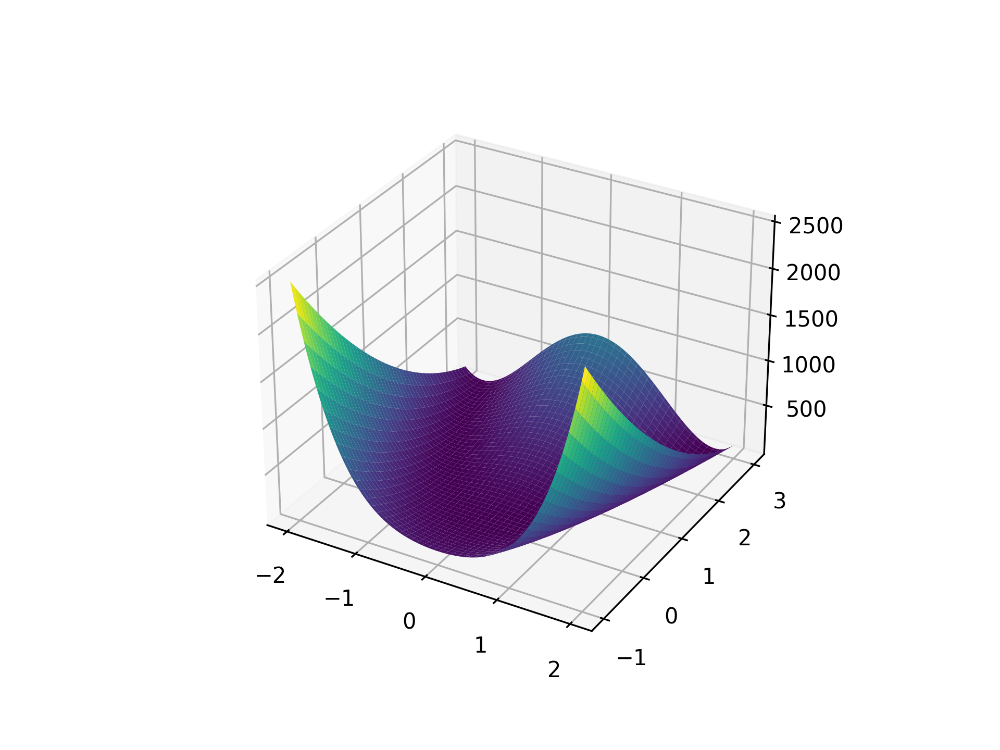
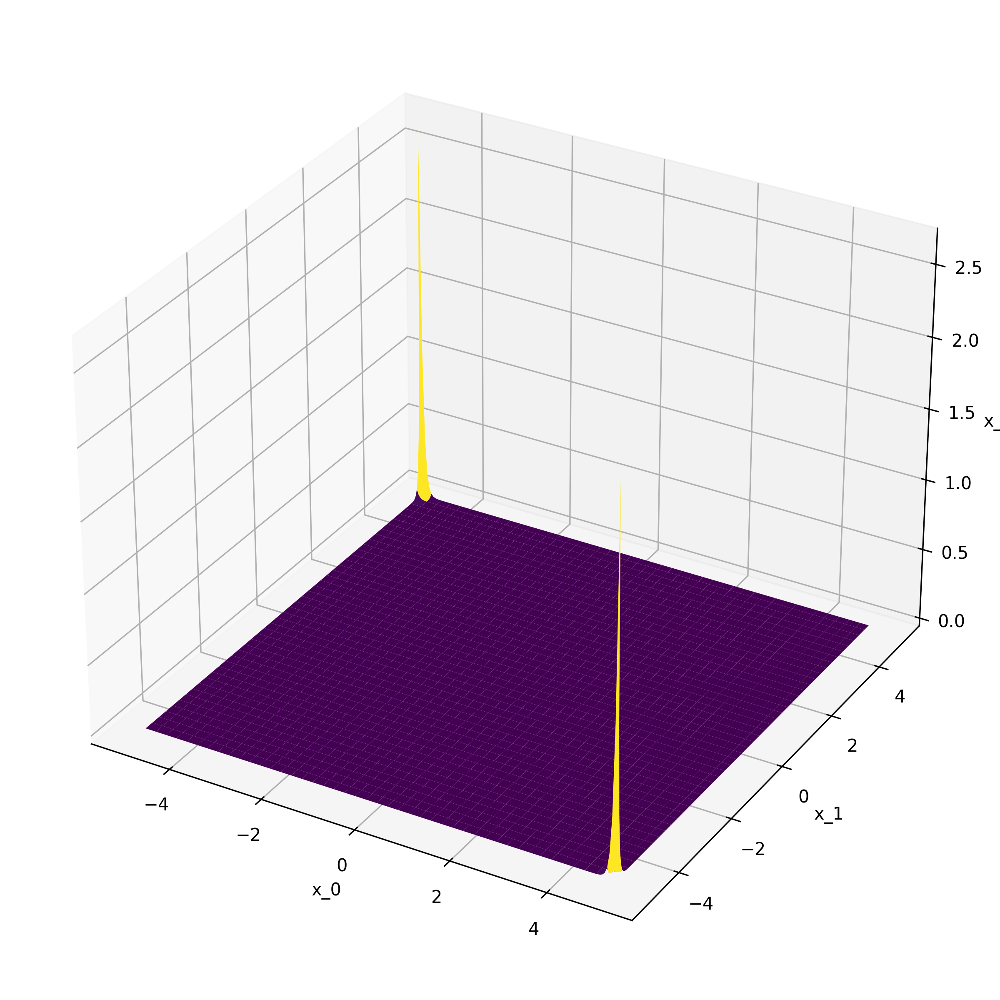
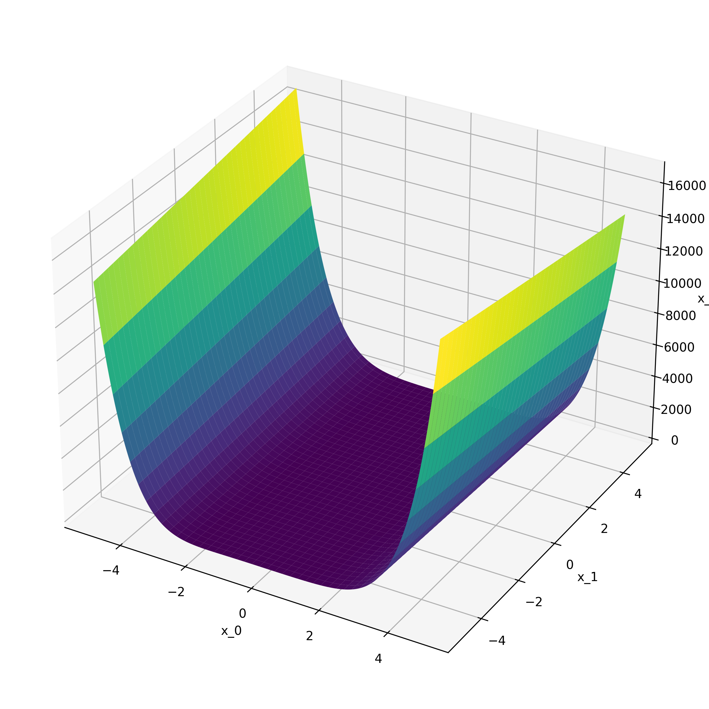
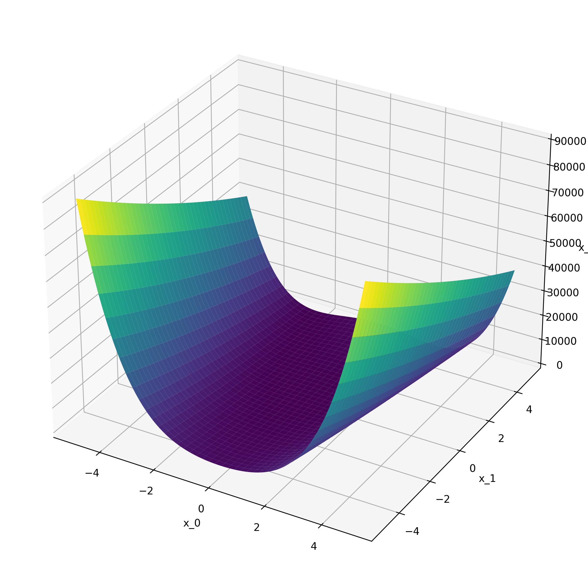

# Valley Shaped Functions

<!-- markdownlint-disable MD013 -->

## Three Hump Camel Function

<!-- prettier-ignore -->
::: umf.functions.optimization.valley_shaped.ThreeHumpCamelFunction
    options:
        show_bases: false
        show_source: true
        show_inherited_members: false
        allow_inspection: false
        inheritance_graph: false
        heading_level: 0

|                                                                             |
| :-------------------------------------------------------------------------: |
|  |

## Six Hump Camel Function

<!-- prettier-ignore -->
::: umf.functions.optimization.valley_shaped.SixHumpCamelFunction
    options:
        show_bases: false
        show_source: true
        show_inherited_members: false
        allow_inspection: false
        inheritance_graph: false
        heading_level: 0

|                                                                         |
| :---------------------------------------------------------------------: |
|  |

## Dixon-Price Function

<!-- prettier-ignore -->
::: umf.functions.optimization.valley_shaped.DixonPriceFunction
    options:
        show_bases: false
        show_source: true
        show_inherited_members: false
        allow_inspection: false
        inheritance_graph: false
        heading_level: 0

|                                                                     |
| :-----------------------------------------------------------------: |
|  |

## Rosenbrock Function

<!-- prettier-ignore -->
::: umf.functions.optimization.valley_shaped.RosenbrockFunction
    options:
        show_bases: false
        show_source: true
        show_inherited_members: false
        allow_inspection: false
        inheritance_graph: false
        heading_level: 0

|                                                                     |
| :-----------------------------------------------------------------: |
|  |

## Exponential Valley Function

<!-- prettier-ignore -->
::: umf.functions.optimization.valley_shaped.ExponentialValleyFunction
    options:
        show_bases: false
        show_source: true
        show_inherited_members: false
        allow_inspection: false
        inheritance_graph: false
        heading_level: 0

|                                                                                   |
| :-------------------------------------------------------------------------------: |
|  |

## Cubic Valley Function

<!-- prettier-ignore -->
::: umf.functions.optimization.valley_shaped.CubicValleyFunction
    options:
        show_bases: false
        show_source: true
        show_inherited_members: false
        allow_inspection: false
        inheritance_graph: false
        heading_level: 0

|                                                                       |
| :-------------------------------------------------------------------: |
|  |

## Sinusoidal Rosenbrock Function

<!-- prettier-ignore -->
::: umf.functions.optimization.valley_shaped.SinusoidalRosenbrockFunction
    options:
        show_bases: false
        show_source: true
        show_inherited_members: false
        allow_inspection: false
        inheritance_graph: false
        heading_level: 0

|                                                                                         |
| :-------------------------------------------------------------------------------------: |
|  |
