# Simple Functions

<!-- markdownlint-disable MD013 MD060 -->

The `umf.functions.simple` package contains 100 lightweight one-dimensional
functions intended for quick experimentation, baseline curve testing, and
simple plot generation.

## Polynomial Growth

### Square Simple Function

<!-- prettier-ignore -->
::: umf.functions.simple.elementary
    options:
        members:
            - SquareSimpleFunction
        show_root_heading: false
        show_root_full_path: false
        show_bases: false
        show_source: true
        show_inherited_members: false
        allow_inspection: false
        inheritance_graph: false
        heading_level: 0

|                                                                         |
| :---------------------------------------------------------------------: |
| 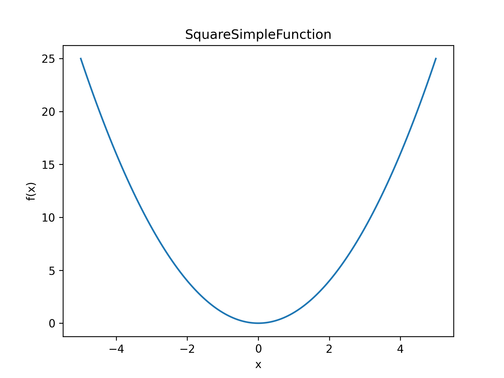 |

### Cubic Absolute Simple Function

<!-- prettier-ignore -->
::: umf.functions.simple.elementary
    options:
        members:
            - CubicAbsoluteSimpleFunction
        show_root_heading: false
        show_root_full_path: false
        show_bases: false
        show_source: true
        show_inherited_members: false
        allow_inspection: false
        inheritance_graph: false
        heading_level: 0

|                                                                                       |
| :-----------------------------------------------------------------------------------: |
| 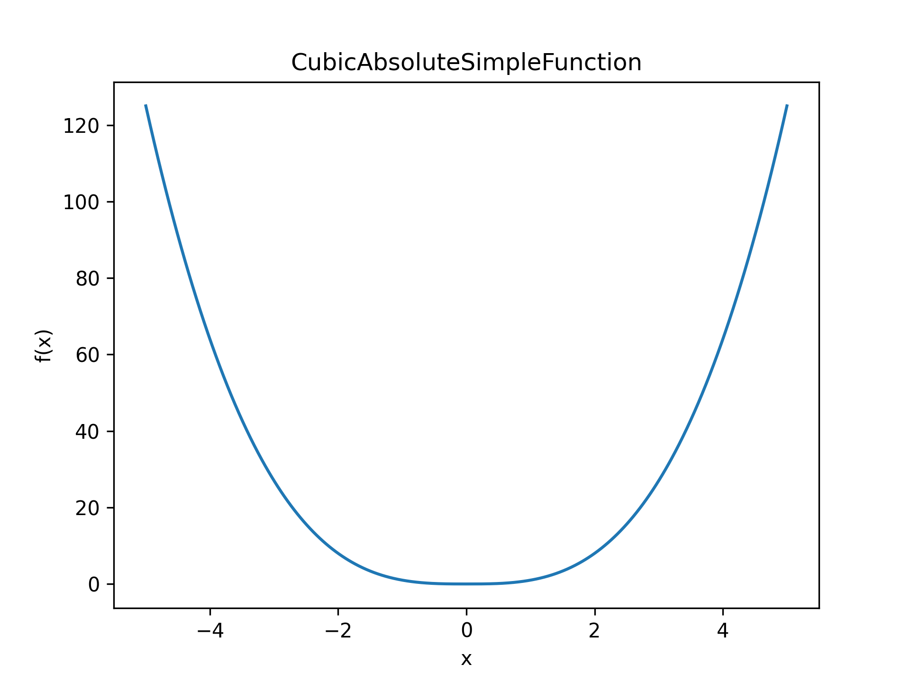 |

### Quartic Simple Function

<!-- prettier-ignore -->
::: umf.functions.simple.elementary
    options:
        members:
            - QuarticSimpleFunction
        show_root_heading: false
        show_root_full_path: false
        show_bases: false
        show_source: true
        show_inherited_members: false
        allow_inspection: false
        inheritance_graph: false
        heading_level: 0

|                                                                           |
| :-----------------------------------------------------------------------: |
| 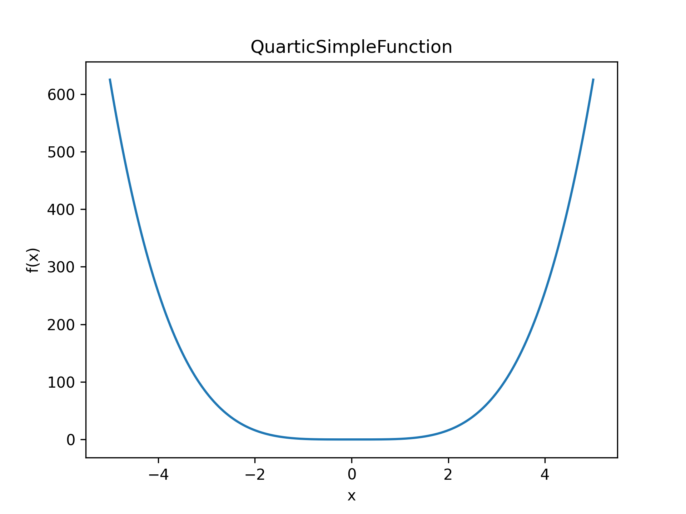 |

### Quintic Absolute Simple Function

<!-- prettier-ignore -->
::: umf.functions.simple.elementary
    options:
        members:
            - QuinticAbsoluteSimpleFunction
        show_root_heading: false
        show_root_full_path: false
        show_bases: false
        show_source: true
        show_inherited_members: false
        allow_inspection: false
        inheritance_graph: false
        heading_level: 0

|                                                                                           |
| :---------------------------------------------------------------------------------------: |
| 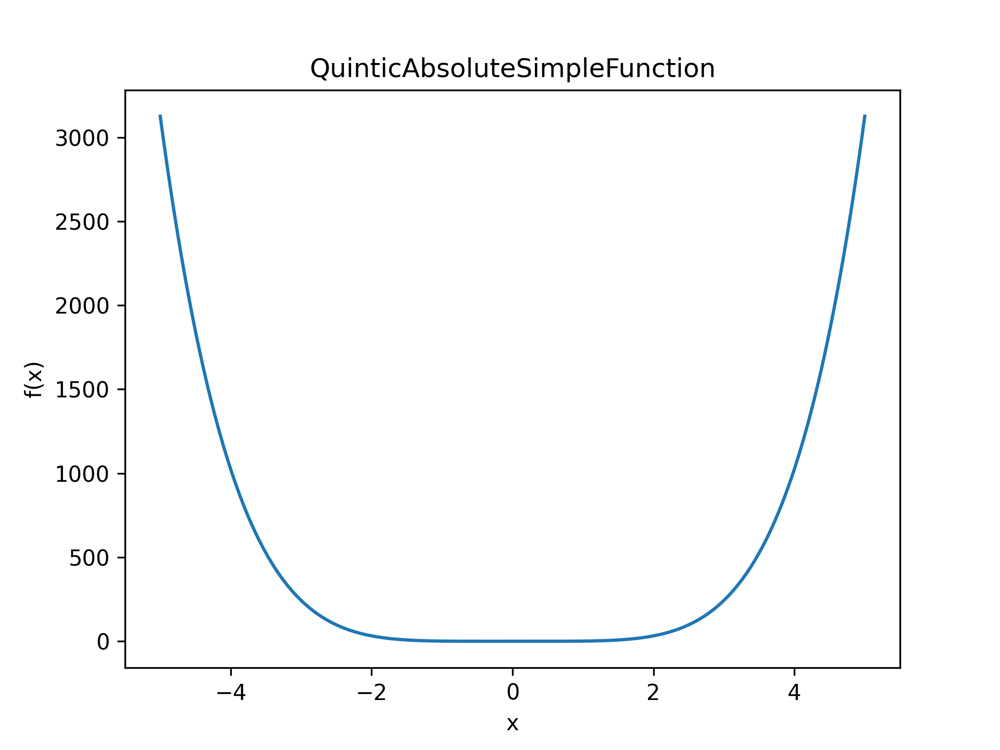 |

### Sextic Simple Function

<!-- prettier-ignore -->
::: umf.functions.simple.elementary
    options:
        members:
            - SexticSimpleFunction
        show_root_heading: false
        show_root_full_path: false
        show_bases: false
        show_source: true
        show_inherited_members: false
        allow_inspection: false
        inheritance_graph: false
        heading_level: 0

|                                                                         |
| :---------------------------------------------------------------------: |
| 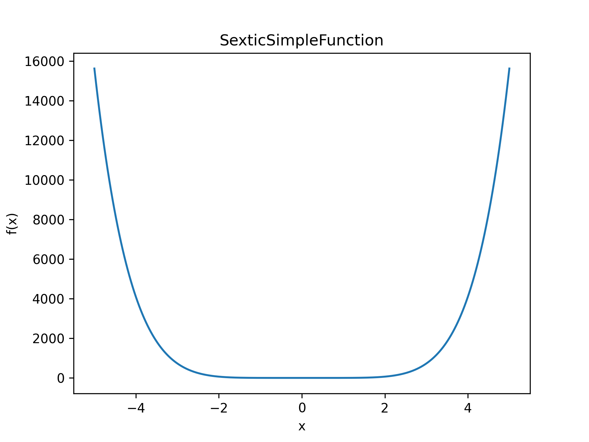 |

### Septic Absolute Simple Function

<!-- prettier-ignore -->
::: umf.functions.simple.elementary
    options:
        members:
            - SepticAbsoluteSimpleFunction
        show_root_heading: false
        show_root_full_path: false
        show_bases: false
        show_source: true
        show_inherited_members: false
        allow_inspection: false
        inheritance_graph: false
        heading_level: 0

|                                                                                         |
| :-------------------------------------------------------------------------------------: |
| 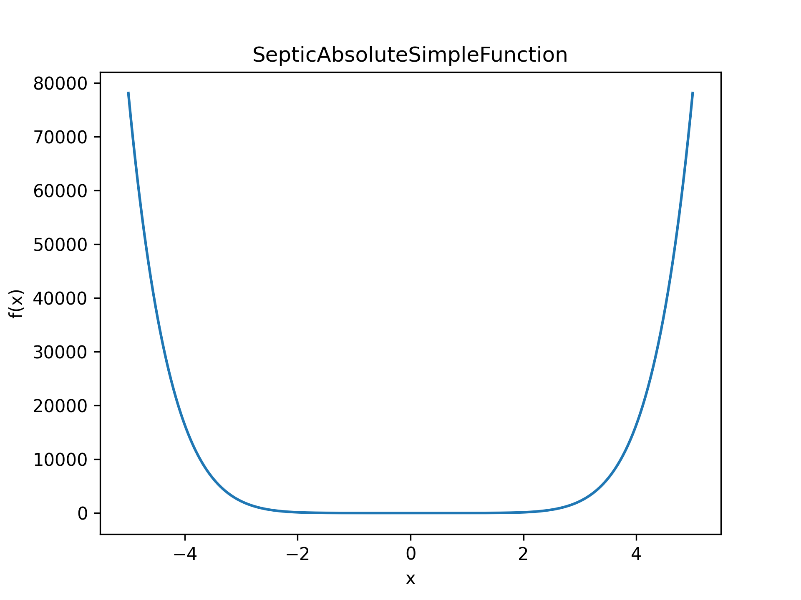 |

### Octic Simple Function

<!-- prettier-ignore -->
::: umf.functions.simple.elementary
    options:
        members:
            - OcticSimpleFunction
        show_root_heading: false
        show_root_full_path: false
        show_bases: false
        show_source: true
        show_inherited_members: false
        allow_inspection: false
        inheritance_graph: false
        heading_level: 0

|                                                                       |
| :-------------------------------------------------------------------: |
| 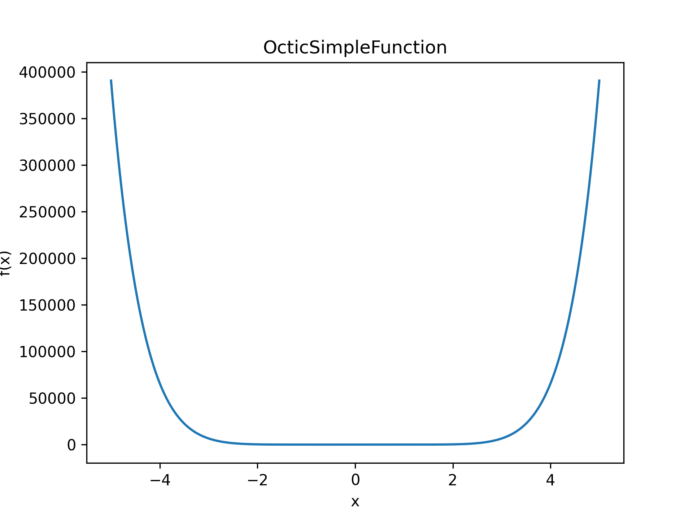 |

### Nonic Absolute Simple Function

<!-- prettier-ignore -->
::: umf.functions.simple.elementary
    options:
        members:
            - NonicAbsoluteSimpleFunction
        show_root_heading: false
        show_root_full_path: false
        show_bases: false
        show_source: true
        show_inherited_members: false
        allow_inspection: false
        inheritance_graph: false
        heading_level: 0

|                                                                                       |
| :-----------------------------------------------------------------------------------: |
| 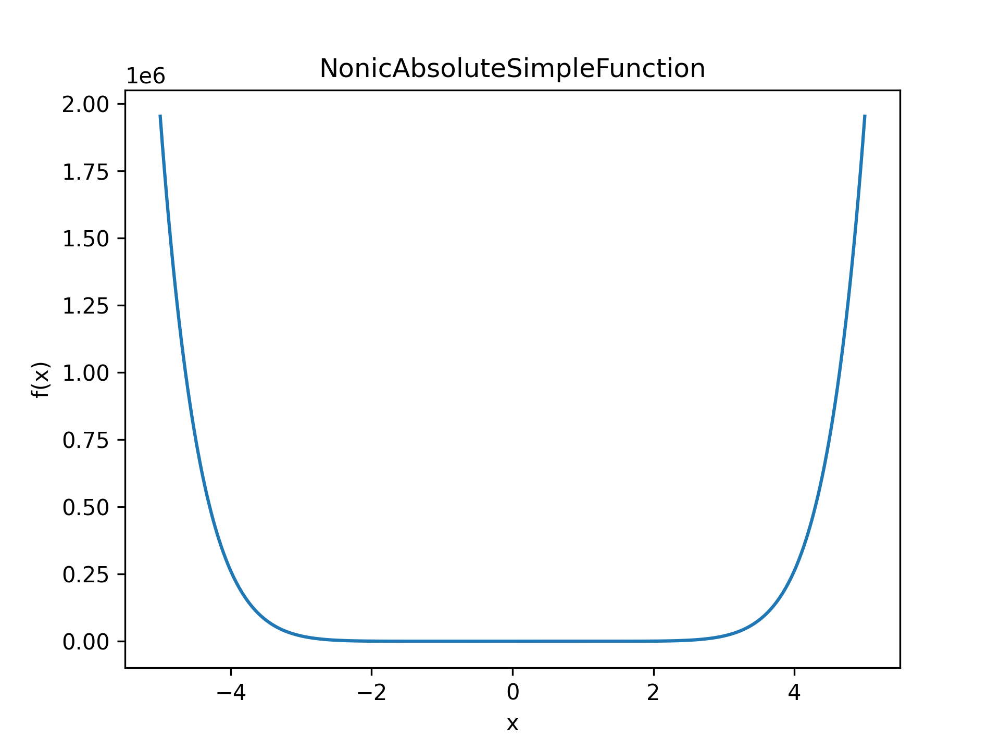 |

### Decic Simple Function

<!-- prettier-ignore -->
::: umf.functions.simple.elementary
    options:
        members:
            - DecicSimpleFunction
        show_root_heading: false
        show_root_full_path: false
        show_bases: false
        show_source: true
        show_inherited_members: false
        allow_inspection: false
        inheritance_graph: false
        heading_level: 0

|                                                                       |
| :-------------------------------------------------------------------: |
| 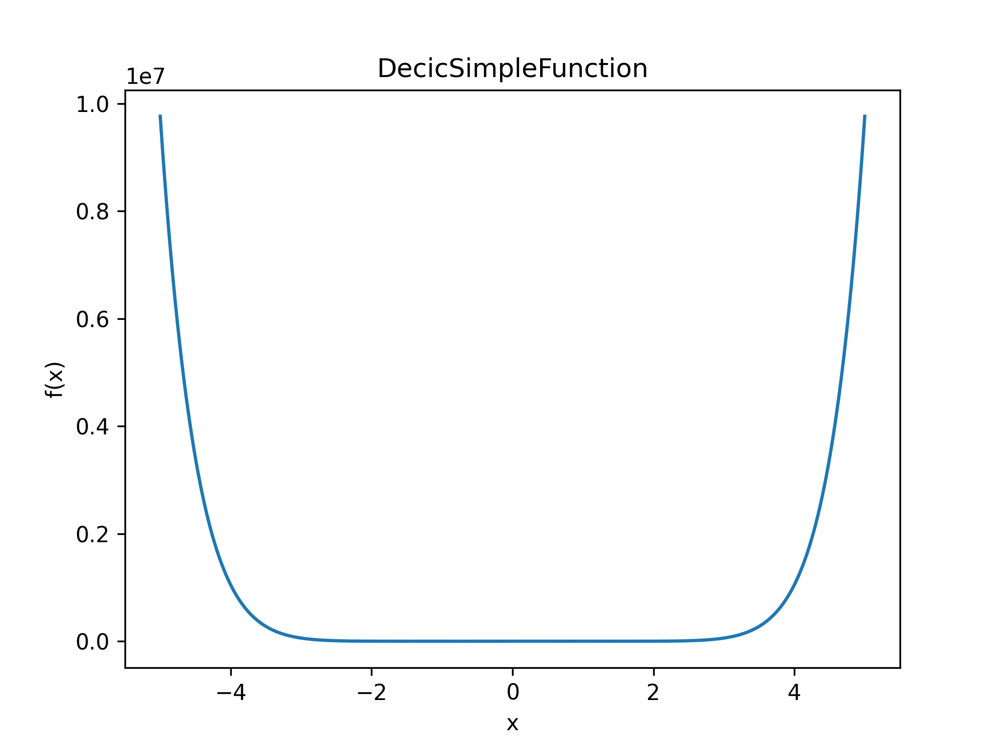 |

### Twelfth Power Simple Function

<!-- prettier-ignore -->
::: umf.functions.simple.elementary
    options:
        members:
            - TwelfthPowerSimpleFunction
        show_root_heading: false
        show_root_full_path: false
        show_bases: false
        show_source: true
        show_inherited_members: false
        allow_inspection: false
        inheritance_graph: false
        heading_level: 0

|                                                                                     |
| :---------------------------------------------------------------------------------: |
| 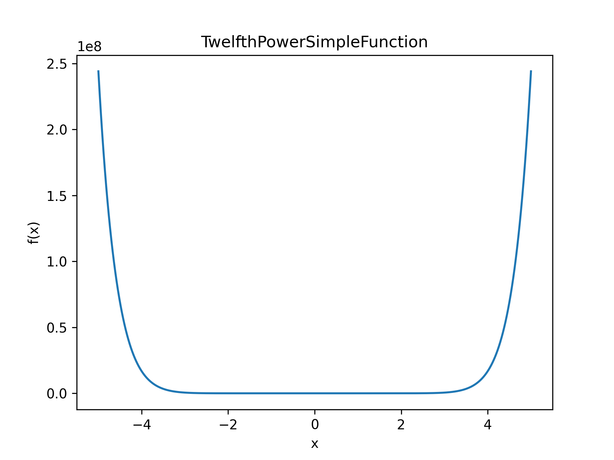 |

## Fractional And Smooth Powers

### Root Absolute Simple Function

<!-- prettier-ignore -->
::: umf.functions.simple.elementary
    options:
        members:
            - RootAbsoluteSimpleFunction
        show_root_heading: false
        show_root_full_path: false
        show_bases: false
        show_source: true
        show_inherited_members: false
        allow_inspection: false
        inheritance_graph: false
        heading_level: 0

|                                                                                     |
| :---------------------------------------------------------------------------------: |
| 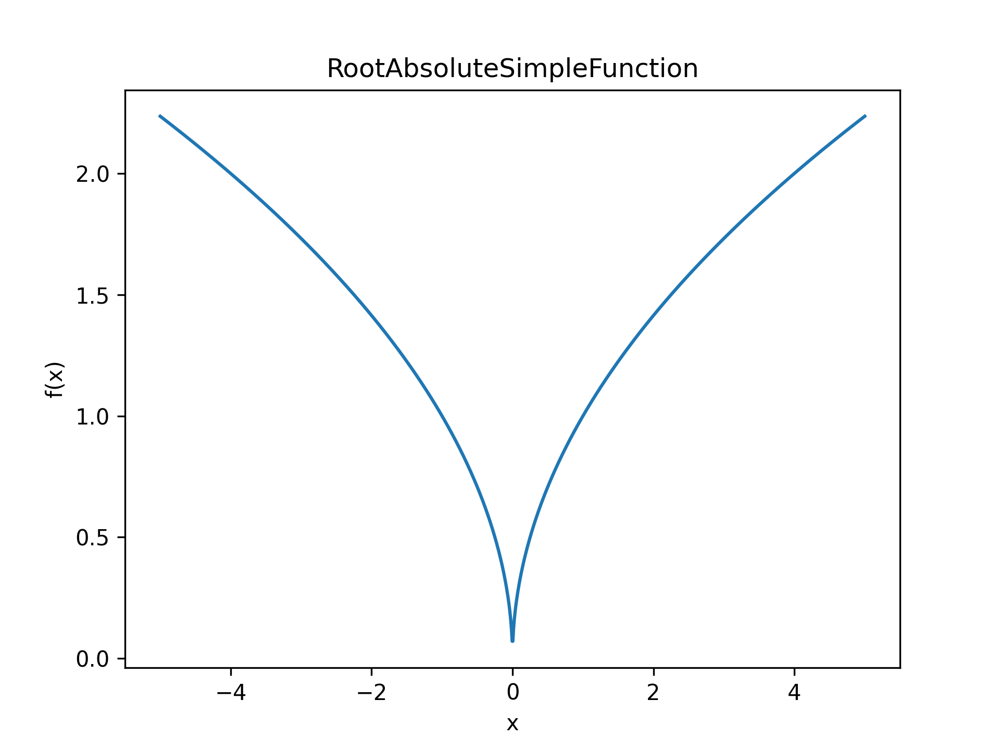 |

### Three Halves Absolute Simple Function

<!-- prettier-ignore -->
::: umf.functions.simple.elementary
    options:
        members:
            - ThreeHalvesAbsoluteSimpleFunction
        show_root_heading: false
        show_root_full_path: false
        show_bases: false
        show_source: true
        show_inherited_members: false
        allow_inspection: false
        inheritance_graph: false
        heading_level: 0

|                                                                                                   |
| :-----------------------------------------------------------------------------------------------: |
| 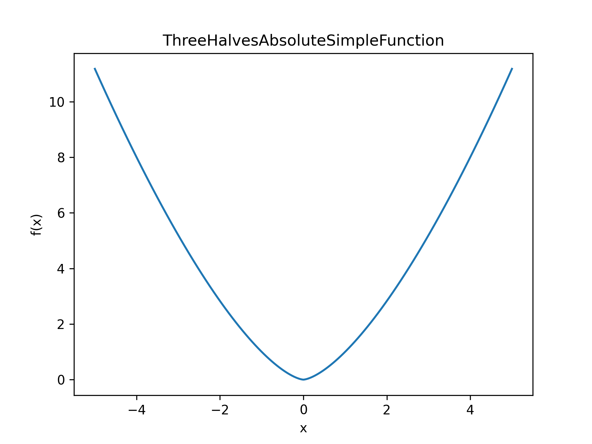 |

### Five Halves Absolute Simple Function

<!-- prettier-ignore -->
::: umf.functions.simple.elementary
    options:
        members:
            - FiveHalvesAbsoluteSimpleFunction
        show_root_heading: false
        show_root_full_path: false
        show_bases: false
        show_source: true
        show_inherited_members: false
        allow_inspection: false
        inheritance_graph: false
        heading_level: 0

|                                                                                                 |
| :---------------------------------------------------------------------------------------------: |
| 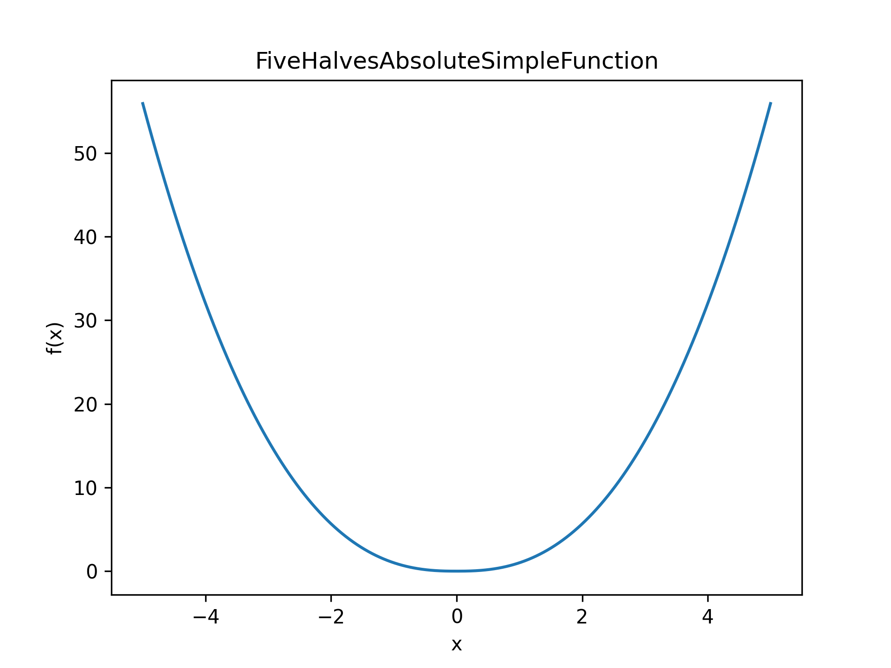 |

### Seven Halves Absolute Simple Function

<!-- prettier-ignore -->
::: umf.functions.simple.elementary
    options:
        members:
            - SevenHalvesAbsoluteSimpleFunction
        show_root_heading: false
        show_root_full_path: false
        show_bases: false
        show_source: true
        show_inherited_members: false
        allow_inspection: false
        inheritance_graph: false
        heading_level: 0

|                                                                                                   |
| :-----------------------------------------------------------------------------------------------: |
| 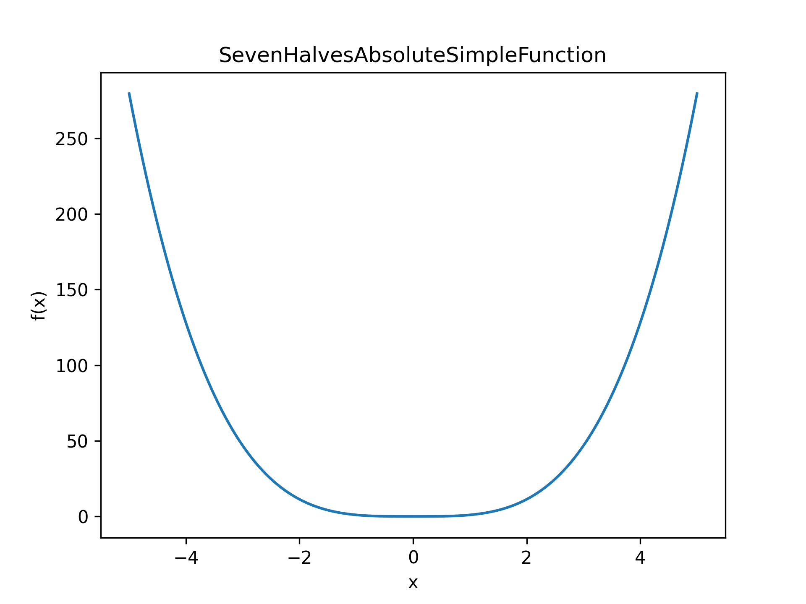 |

### Pseudo Huber Simple Function

<!-- prettier-ignore -->
::: umf.functions.simple.elementary
    options:
        members:
            - PseudoHuberSimpleFunction
        show_root_heading: false
        show_root_full_path: false
        show_bases: false
        show_source: true
        show_inherited_members: false
        allow_inspection: false
        inheritance_graph: false
        heading_level: 0

|                                                                                   |
| :-------------------------------------------------------------------------------: |
| 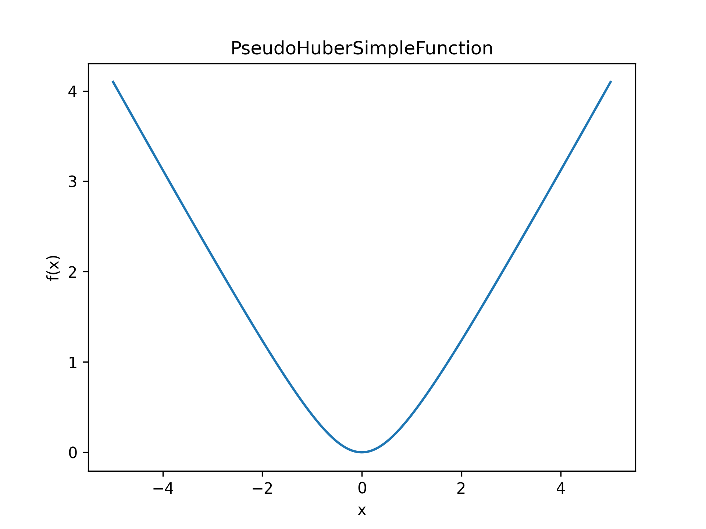 |

## Logarithmic Families

### Log Quadratic Simple Function

<!-- prettier-ignore -->
::: umf.functions.simple.elementary
    options:
        members:
            - LogQuadraticSimpleFunction
        show_root_heading: false
        show_root_full_path: false
        show_bases: false
        show_source: true
        show_inherited_members: false
        allow_inspection: false
        inheritance_graph: false
        heading_level: 0

|                                                                                     |
| :---------------------------------------------------------------------------------: |
| 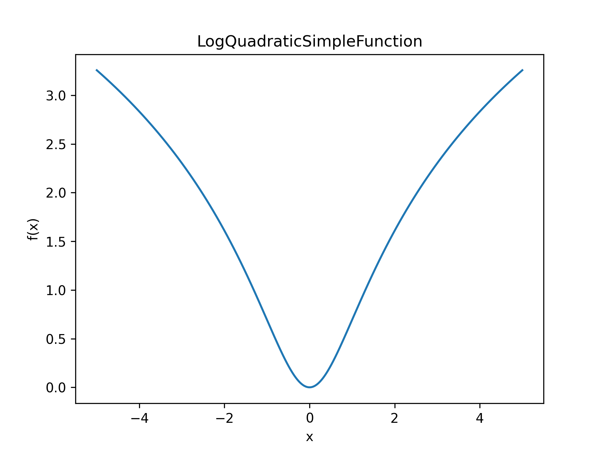 |

### Log Quartic Simple Function

<!-- prettier-ignore -->
::: umf.functions.simple.elementary
    options:
        members:
            - LogQuarticSimpleFunction
        show_root_heading: false
        show_root_full_path: false
        show_bases: false
        show_source: true
        show_inherited_members: false
        allow_inspection: false
        inheritance_graph: false
        heading_level: 0

|                                                                                 |
| :-----------------------------------------------------------------------------: |
| 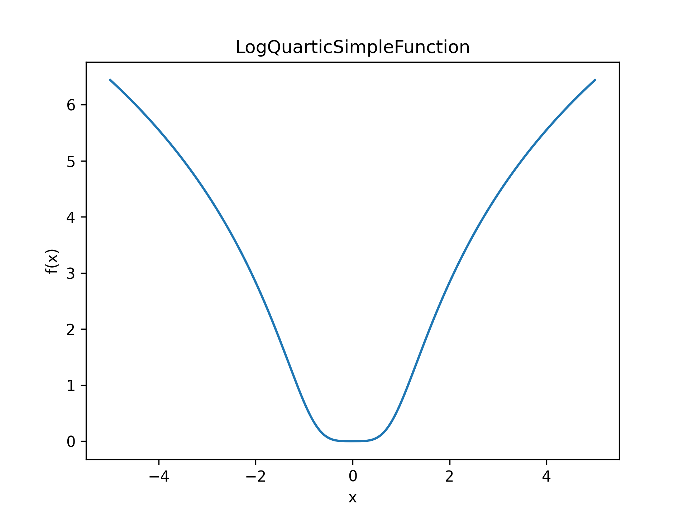 |

### Log Sextic Simple Function

<!-- prettier-ignore -->
::: umf.functions.simple.elementary
    options:
        members:
            - LogSexticSimpleFunction
        show_root_heading: false
        show_root_full_path: false
        show_bases: false
        show_source: true
        show_inherited_members: false
        allow_inspection: false
        inheritance_graph: false
        heading_level: 0

|                                                                               |
| :---------------------------------------------------------------------------: |
| 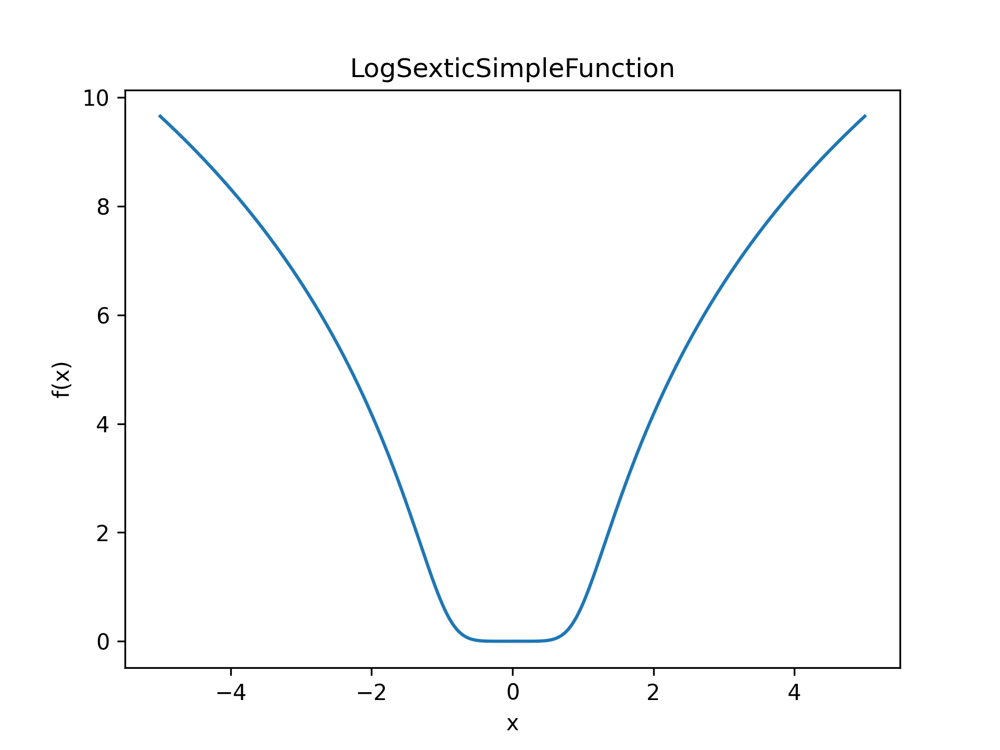 |

### Log1p Absolute Simple Function

<!-- prettier-ignore -->
::: umf.functions.simple.elementary
    options:
        members:
            - Log1pAbsoluteSimpleFunction
        show_root_heading: false
        show_root_full_path: false
        show_bases: false
        show_source: true
        show_inherited_members: false
        allow_inspection: false
        inheritance_graph: false
        heading_level: 0

|                                                                                       |
| :-----------------------------------------------------------------------------------: |
| 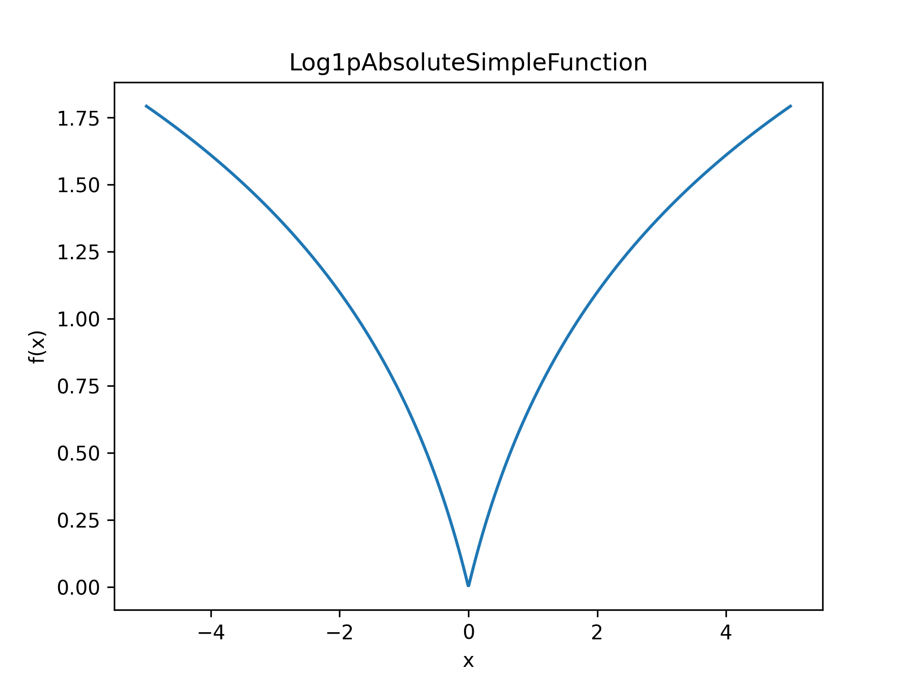 |

### Log1p Root Absolute Simple Function

<!-- prettier-ignore -->
::: umf.functions.simple.elementary
    options:
        members:
            - Log1pRootAbsoluteSimpleFunction
        show_root_heading: false
        show_root_full_path: false
        show_bases: false
        show_source: true
        show_inherited_members: false
        allow_inspection: false
        inheritance_graph: false
        heading_level: 0

|                                                                                               |
| :-------------------------------------------------------------------------------------------: |
| 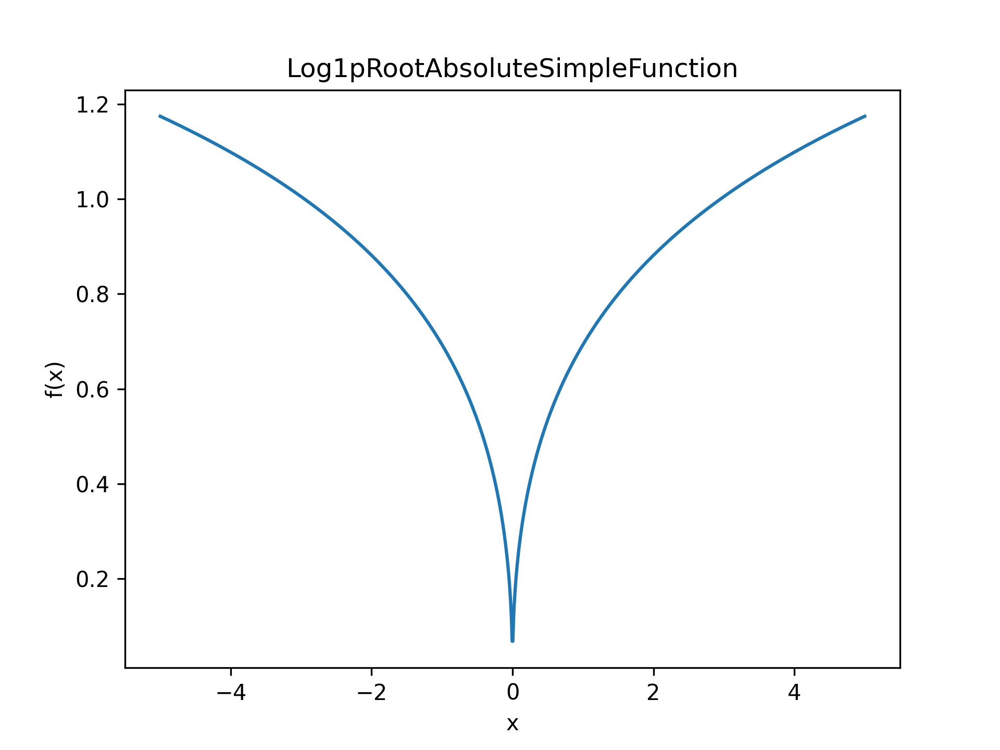 |

### Log1p Sinh Squared Simple Function

<!-- prettier-ignore -->
::: umf.functions.simple.elementary
    options:
        members:
            - Log1pSinhSquaredSimpleFunction
        show_root_heading: false
        show_root_full_path: false
        show_bases: false
        show_source: true
        show_inherited_members: false
        allow_inspection: false
        inheritance_graph: false
        heading_level: 0

|                                                                                             |
| :-----------------------------------------------------------------------------------------: |
| 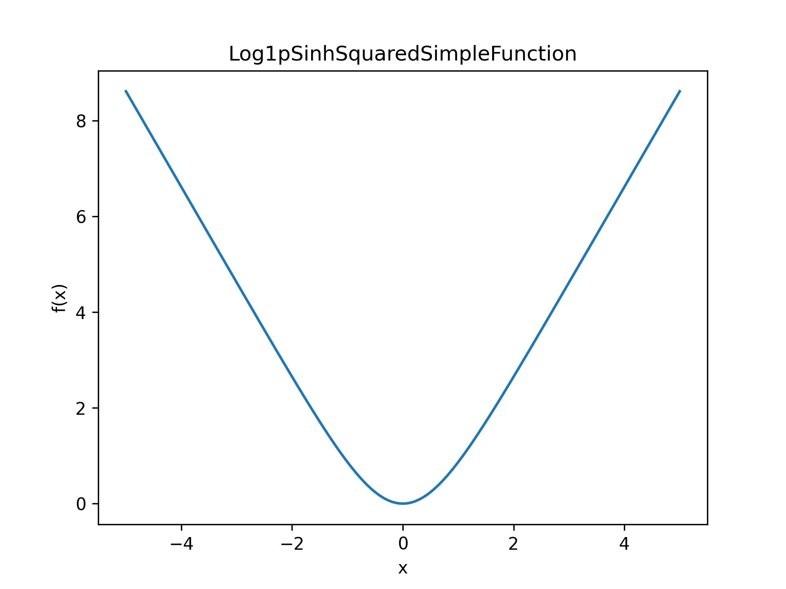 |

### Log Plus Sine Squared Simple Function

<!-- prettier-ignore -->
::: umf.functions.simple.elementary
    options:
        members:
            - LogPlusSineSquaredSimpleFunction
        show_root_heading: false
        show_root_full_path: false
        show_bases: false
        show_source: true
        show_inherited_members: false
        allow_inspection: false
        inheritance_graph: false
        heading_level: 0

|                                                                                                 |
| :---------------------------------------------------------------------------------------------: |
| 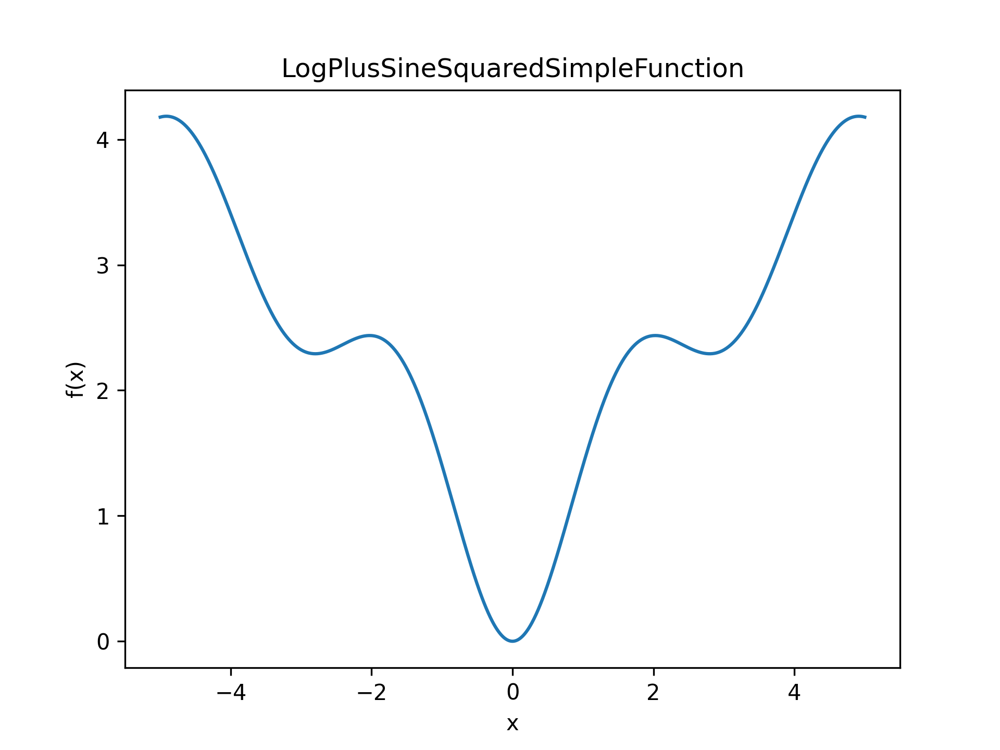 |

### Log Plus Cosine Simple Function

<!-- prettier-ignore -->
::: umf.functions.simple.elementary
    options:
        members:
            - LogPlusCosineSimpleFunction
        show_root_heading: false
        show_root_full_path: false
        show_bases: false
        show_source: true
        show_inherited_members: false
        allow_inspection: false
        inheritance_graph: false
        heading_level: 0

|                                                                                       |
| :-----------------------------------------------------------------------------------: |
| 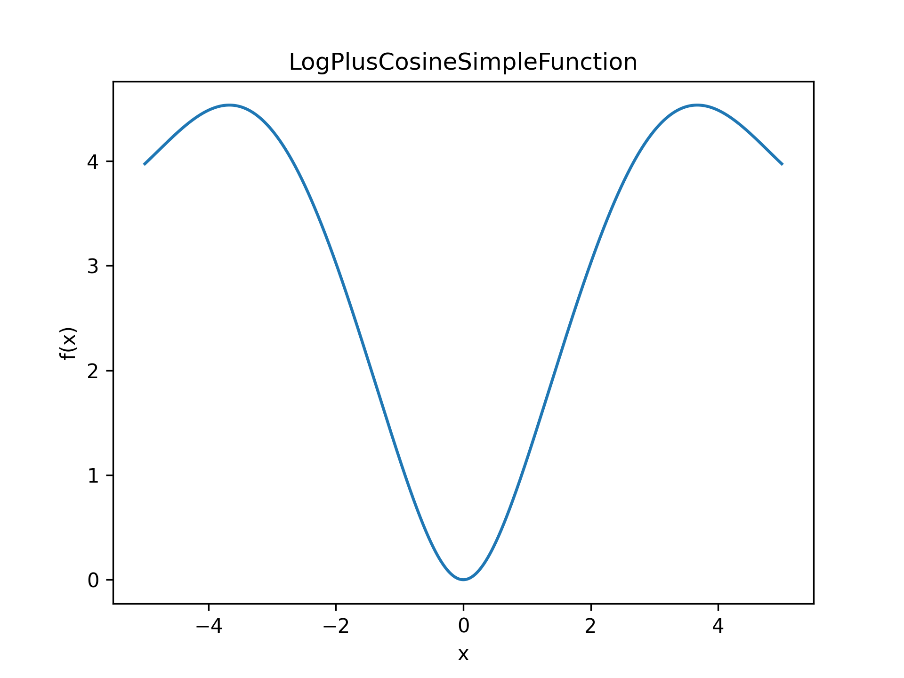 |

## Rational Families

### Rational Quadratic Simple Function

<!-- prettier-ignore -->
::: umf.functions.simple.elementary
    options:
        members:
            - RationalQuadraticSimpleFunction
        show_root_heading: false
        show_root_full_path: false
        show_bases: false
        show_source: true
        show_inherited_members: false
        allow_inspection: false
        inheritance_graph: false
        heading_level: 0

|                                                                                               |
| :-------------------------------------------------------------------------------------------: |
| 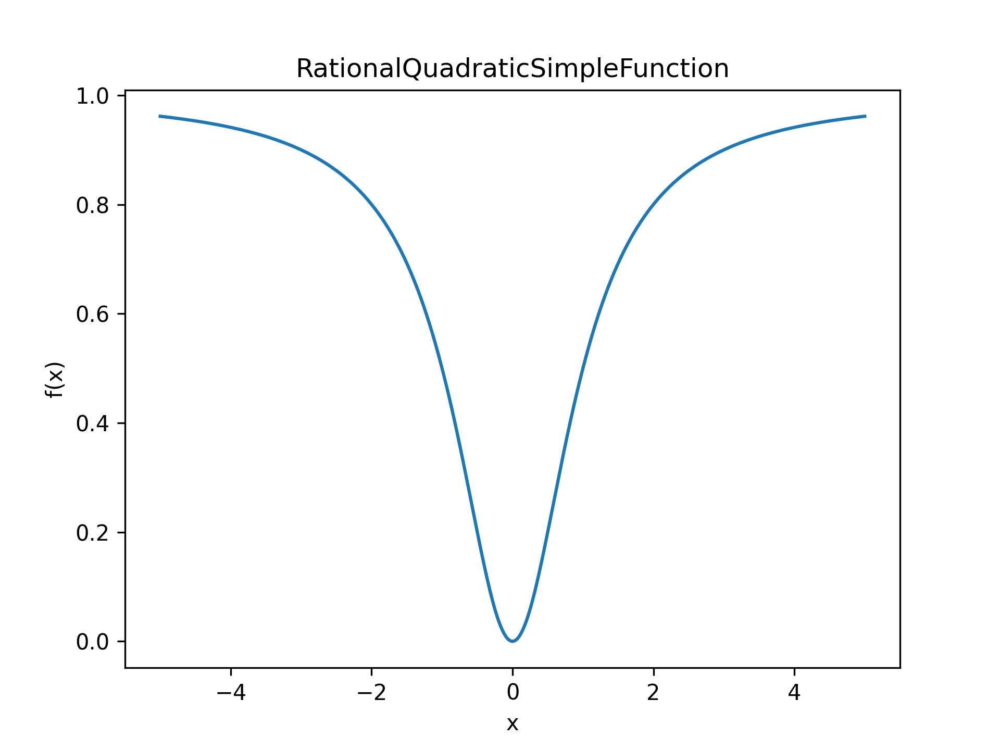 |

### Rational Quartic Simple Function

<!-- prettier-ignore -->
::: umf.functions.simple.elementary
    options:
        members:
            - RationalQuarticSimpleFunction
        show_root_heading: false
        show_root_full_path: false
        show_bases: false
        show_source: true
        show_inherited_members: false
        allow_inspection: false
        inheritance_graph: false
        heading_level: 0

|                                                                                           |
| :---------------------------------------------------------------------------------------: |
| 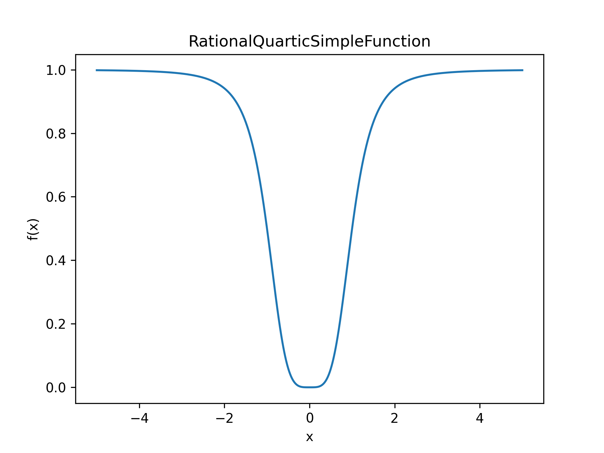 |

### Rational Sextic Simple Function

<!-- prettier-ignore -->
::: umf.functions.simple.elementary
    options:
        members:
            - RationalSexticSimpleFunction
        show_root_heading: false
        show_root_full_path: false
        show_bases: false
        show_source: true
        show_inherited_members: false
        allow_inspection: false
        inheritance_graph: false
        heading_level: 0

|                                                                                         |
| :-------------------------------------------------------------------------------------: |
| 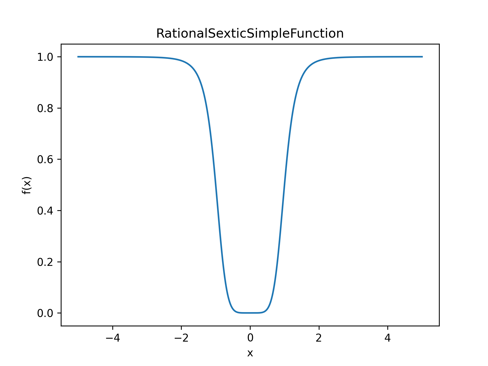 |

### Rational Absolute Simple Function

<!-- prettier-ignore -->
::: umf.functions.simple.elementary
    options:
        members:
            - RationalAbsoluteSimpleFunction
        show_root_heading: false
        show_root_full_path: false
        show_bases: false
        show_source: true
        show_inherited_members: false
        allow_inspection: false
        inheritance_graph: false
        heading_level: 0

|                                                                                             |
| :-----------------------------------------------------------------------------------------: |
| 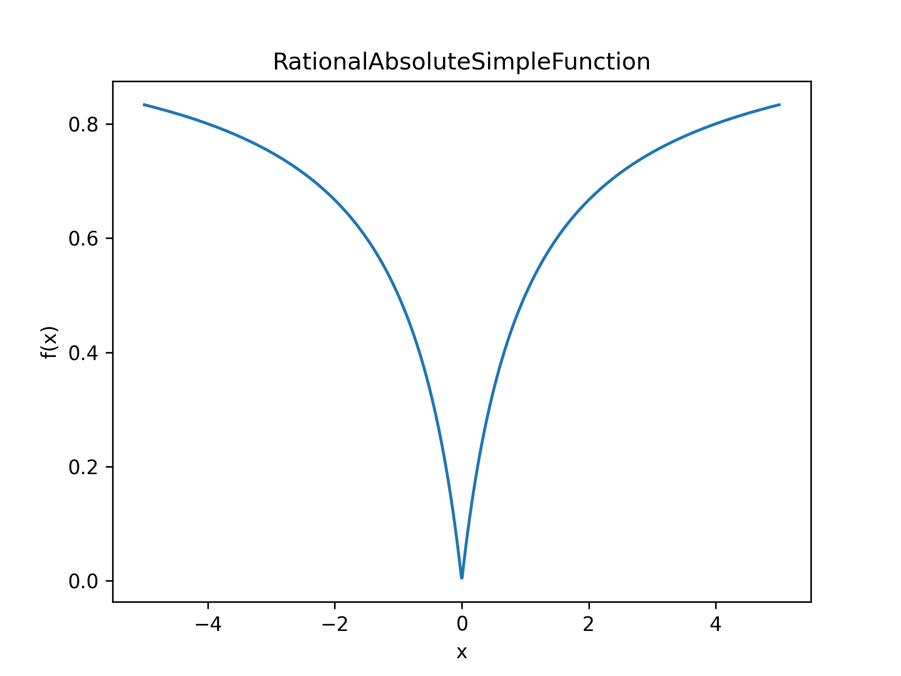 |

### Rational Cubic Absolute Simple Function

<!-- prettier-ignore -->
::: umf.functions.simple.elementary
    options:
        members:
            - RationalCubicAbsoluteSimpleFunction
        show_root_heading: false
        show_root_full_path: false
        show_bases: false
        show_source: true
        show_inherited_members: false
        allow_inspection: false
        inheritance_graph: false
        heading_level: 0

|                                                                                                       |
| :---------------------------------------------------------------------------------------------------: |
| 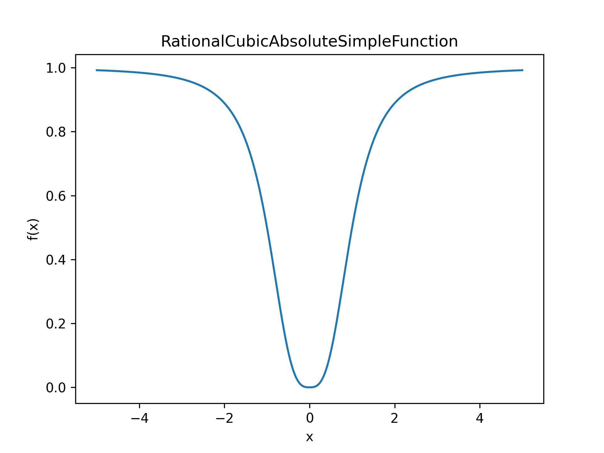 |

### Rational Quintic Absolute Simple Function

<!-- prettier-ignore -->
::: umf.functions.simple.elementary
    options:
        members:
            - RationalQuinticAbsoluteSimpleFunction
        show_root_heading: false
        show_root_full_path: false
        show_bases: false
        show_source: true
        show_inherited_members: false
        allow_inspection: false
        inheritance_graph: false
        heading_level: 0

|                                                                                                           |
| :-------------------------------------------------------------------------------------------------------: |
| 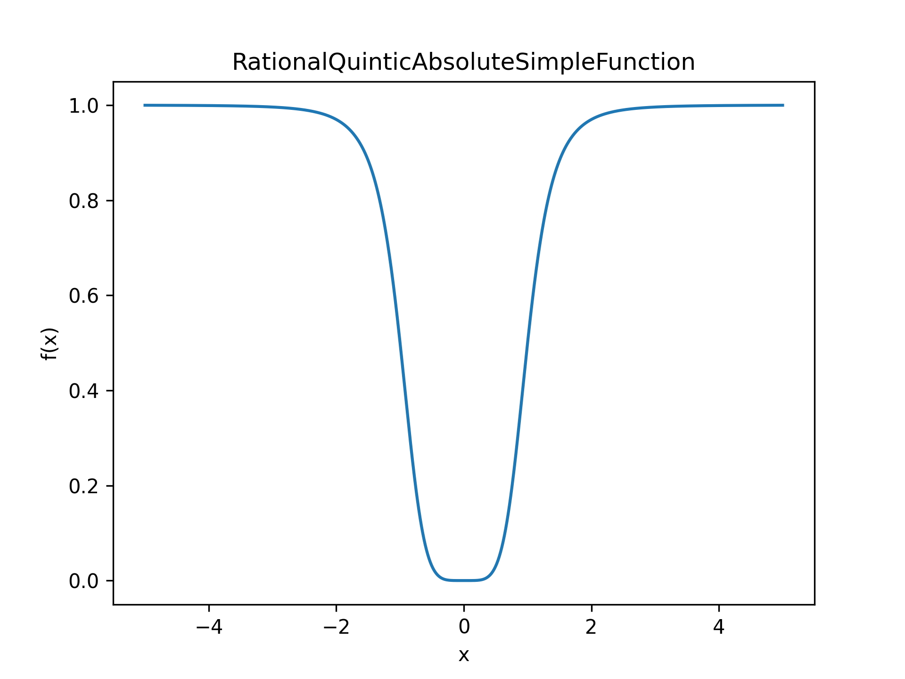 |

### Rational Root Simple Function

<!-- prettier-ignore -->
::: umf.functions.simple.elementary
    options:
        members:
            - RationalRootSimpleFunction
        show_root_heading: false
        show_root_full_path: false
        show_bases: false
        show_source: true
        show_inherited_members: false
        allow_inspection: false
        inheritance_graph: false
        heading_level: 0

|                                                                                     |
| :---------------------------------------------------------------------------------: |
| 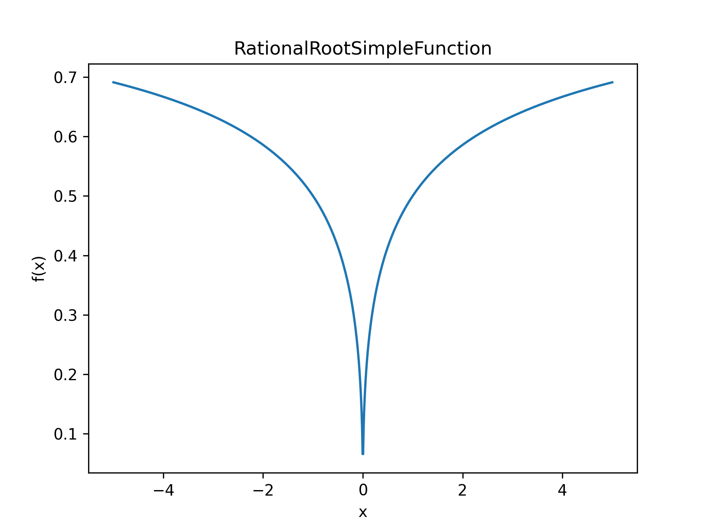 |

### Inverse Bell Complement Simple Function

<!-- prettier-ignore -->
::: umf.functions.simple.elementary
    options:
        members:
            - InverseBellComplementSimpleFunction
        show_root_heading: false
        show_root_full_path: false
        show_bases: false
        show_source: true
        show_inherited_members: false
        allow_inspection: false
        inheritance_graph: false
        heading_level: 0

|                                                                                                       |
| :---------------------------------------------------------------------------------------------------: |
| 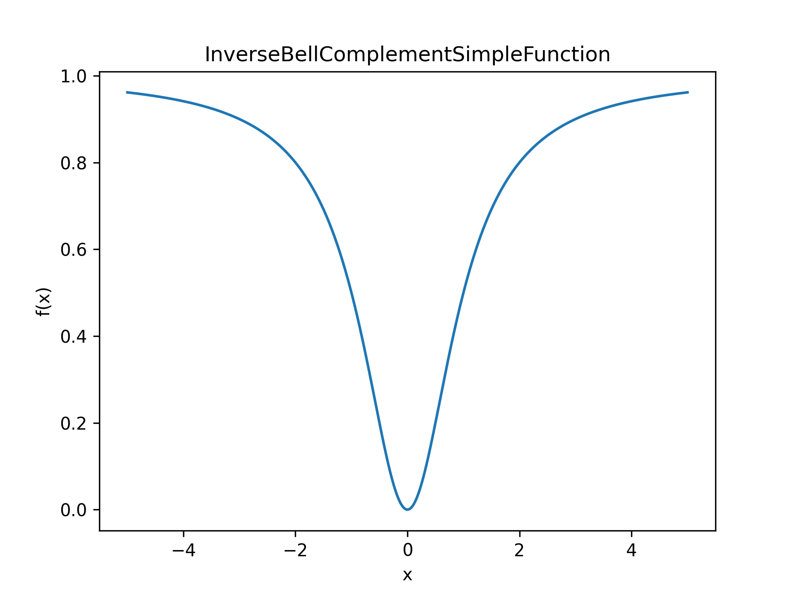 |

### Inverse Quartic Bell Complement Simple Function

<!-- prettier-ignore -->
::: umf.functions.simple.elementary
    options:
        members:
            - InverseQuarticBellComplementSimpleFunction
        show_root_heading: false
        show_root_full_path: false
        show_bases: false
        show_source: true
        show_inherited_members: false
        allow_inspection: false
        inheritance_graph: false
        heading_level: 0

|                                                                                                                     |
| :-----------------------------------------------------------------------------------------------------------------: |
| 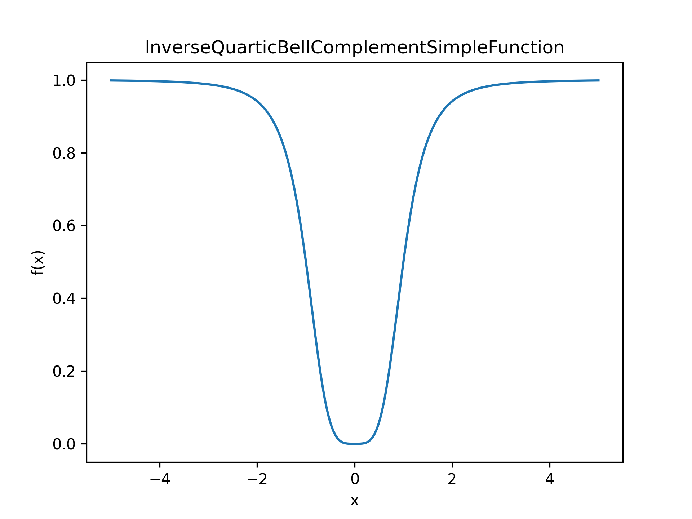 |

### Inverse Sextic Bell Complement Simple Function

<!-- prettier-ignore -->
::: umf.functions.simple.elementary
    options:
        members:
            - InverseSexticBellComplementSimpleFunction
        show_root_heading: false
        show_root_full_path: false
        show_bases: false
        show_source: true
        show_inherited_members: false
        allow_inspection: false
        inheritance_graph: false
        heading_level: 0

|                                                                                                                   |
| :---------------------------------------------------------------------------------------------------------------: |
| 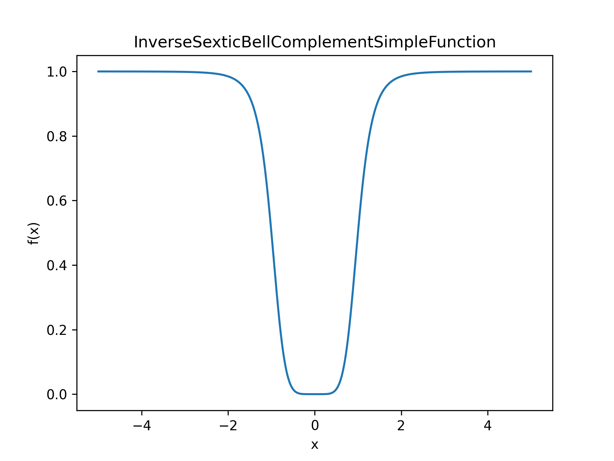 |

### Rational Plus Quadratic Simple Function

<!-- prettier-ignore -->
::: umf.functions.simple.elementary
    options:
        members:
            - RationalPlusQuadraticSimpleFunction
        show_root_heading: false
        show_root_full_path: false
        show_bases: false
        show_source: true
        show_inherited_members: false
        allow_inspection: false
        inheritance_graph: false
        heading_level: 0

|                                                                                                       |
| :---------------------------------------------------------------------------------------------------: |
| 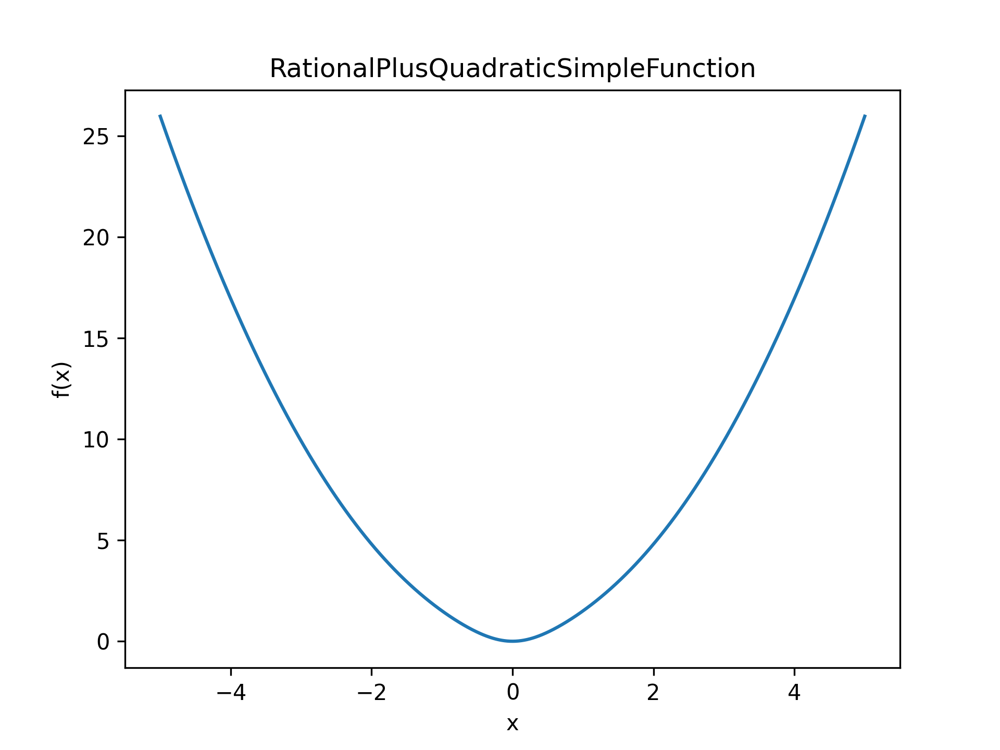 |

### Rational Plus Absolute Simple Function

<!-- prettier-ignore -->
::: umf.functions.simple.elementary
    options:
        members:
            - RationalPlusAbsoluteSimpleFunction
        show_root_heading: false
        show_root_full_path: false
        show_bases: false
        show_source: true
        show_inherited_members: false
        allow_inspection: false
        inheritance_graph: false
        heading_level: 0

|                                                                                                     |
| :-------------------------------------------------------------------------------------------------: |
| 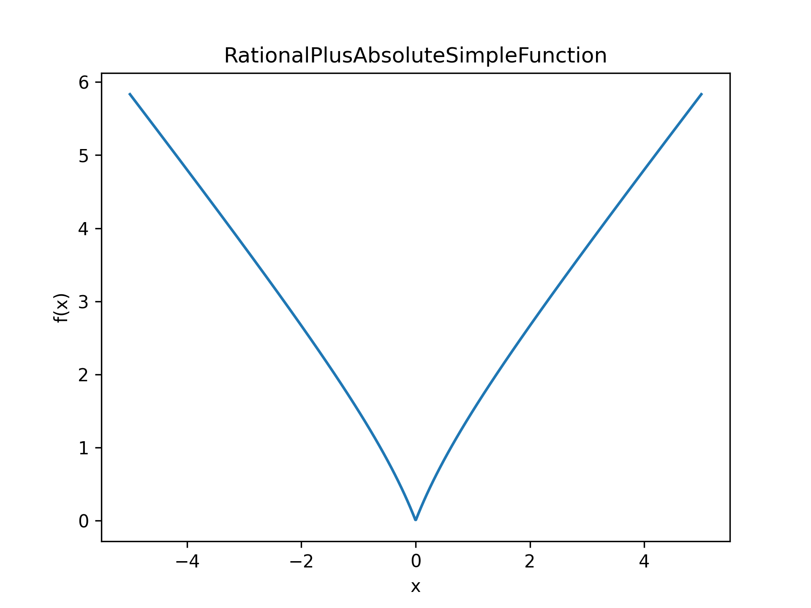 |

### Rational Plus Cosine Simple Function

<!-- prettier-ignore -->
::: umf.functions.simple.elementary
    options:
        members:
            - RationalPlusCosineSimpleFunction
        show_root_heading: false
        show_root_full_path: false
        show_bases: false
        show_source: true
        show_inherited_members: false
        allow_inspection: false
        inheritance_graph: false
        heading_level: 0

|                                                                                                 |
| :---------------------------------------------------------------------------------------------: |
| 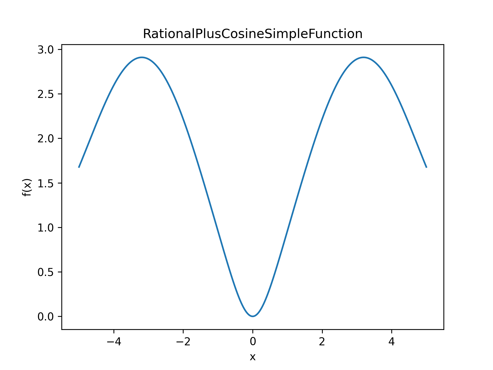 |

### Softsign Squared Simple Function

<!-- prettier-ignore -->
::: umf.functions.simple.elementary
    options:
        members:
            - SoftsignSquaredSimpleFunction
        show_root_heading: false
        show_root_full_path: false
        show_bases: false
        show_source: true
        show_inherited_members: false
        allow_inspection: false
        inheritance_graph: false
        heading_level: 0

|                                                                                           |
| :---------------------------------------------------------------------------------------: |
| 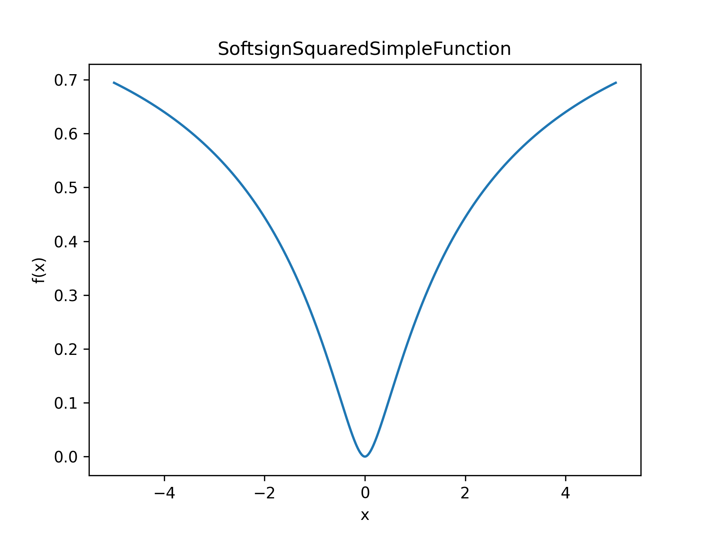 |

## Exponential And Gaussian Families

### Inverse Gaussian Complement Simple Function

<!-- prettier-ignore -->
::: umf.functions.simple.elementary
    options:
        members:
            - InverseGaussianComplementSimpleFunction
        show_root_heading: false
        show_root_full_path: false
        show_bases: false
        show_source: true
        show_inherited_members: false
        allow_inspection: false
        inheritance_graph: false
        heading_level: 0

|                                                                                                               |
| :-----------------------------------------------------------------------------------------------------------: |
| 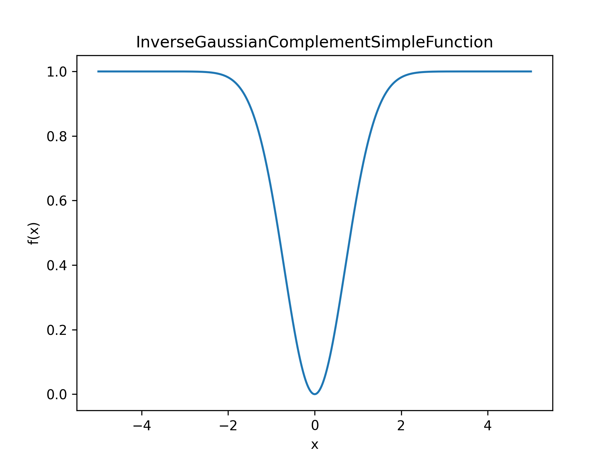 |

### Inverse Super Gaussian Complement Simple Function

<!-- prettier-ignore -->
::: umf.functions.simple.elementary
    options:
        members:
            - InverseSuperGaussianComplementSimpleFunction
        show_root_heading: false
        show_root_full_path: false
        show_bases: false
        show_source: true
        show_inherited_members: false
        allow_inspection: false
        inheritance_graph: false
        heading_level: 0

|                                                                                                                         |
| :---------------------------------------------------------------------------------------------------------------------: |
| 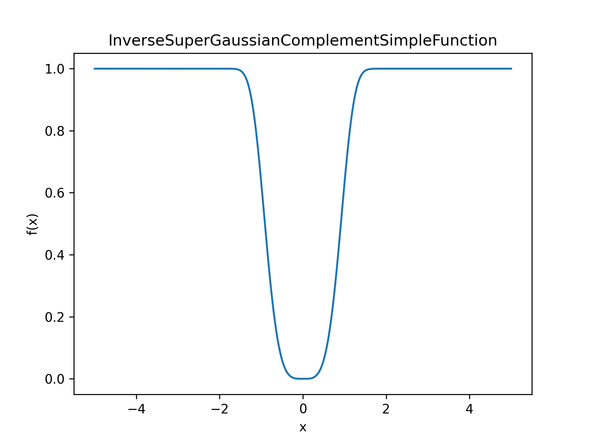 |

### Exponential Square Simple Function

<!-- prettier-ignore -->
::: umf.functions.simple.elementary
    options:
        members:
            - ExponentialSquareSimpleFunction
        show_root_heading: false
        show_root_full_path: false
        show_bases: false
        show_source: true
        show_inherited_members: false
        allow_inspection: false
        inheritance_graph: false
        heading_level: 0

|                                                                                               |
| :-------------------------------------------------------------------------------------------: |
| 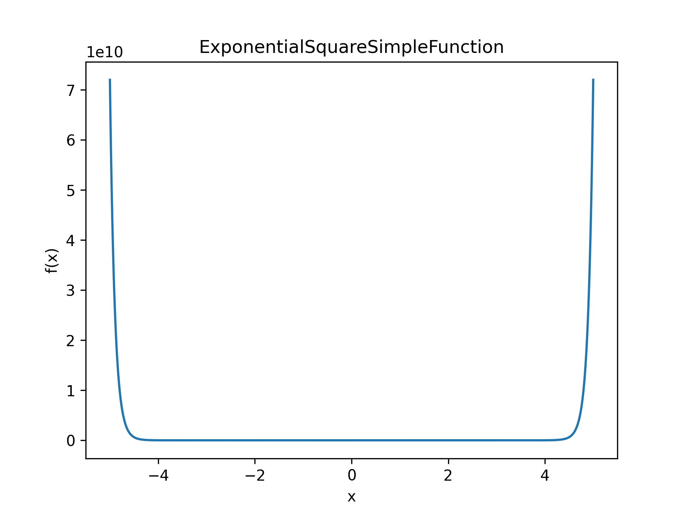 |

### Exponential Quartic Simple Function

<!-- prettier-ignore -->
::: umf.functions.simple.elementary
    options:
        members:
            - ExponentialQuarticSimpleFunction
        show_root_heading: false
        show_root_full_path: false
        show_bases: false
        show_source: true
        show_inherited_members: false
        allow_inspection: false
        inheritance_graph: false
        heading_level: 0

|                                                                                                 |
| :---------------------------------------------------------------------------------------------: |
| 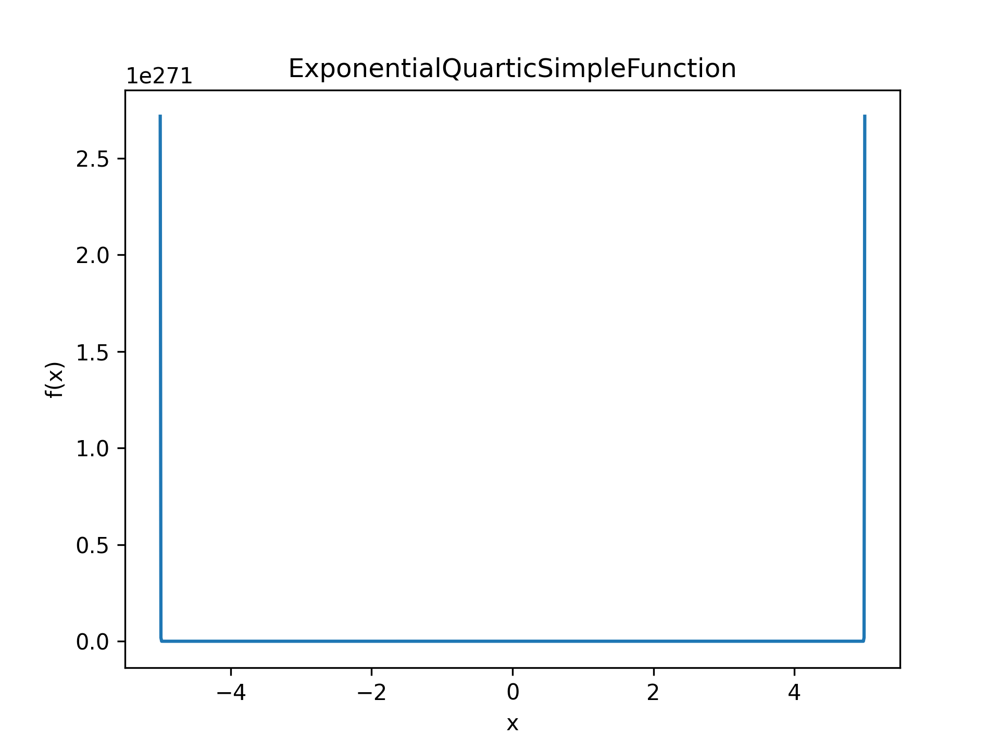 |

### Exponential Absolute Simple Function

<!-- prettier-ignore -->
::: umf.functions.simple.elementary
    options:
        members:
            - ExponentialAbsoluteSimpleFunction
        show_root_heading: false
        show_root_full_path: false
        show_bases: false
        show_source: true
        show_inherited_members: false
        allow_inspection: false
        inheritance_graph: false
        heading_level: 0

|                                                                                                   |
| :-----------------------------------------------------------------------------------------------: |
| 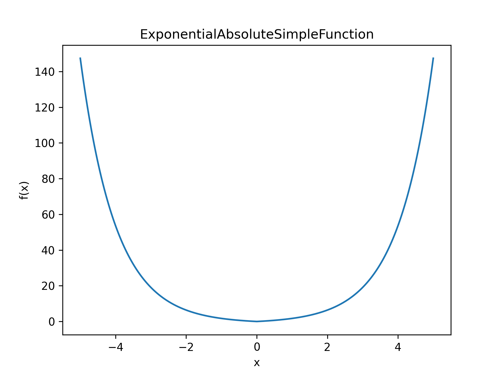 |

### Exponential Cubic Absolute Simple Function

<!-- prettier-ignore -->
::: umf.functions.simple.elementary
    options:
        members:
            - ExponentialCubicAbsoluteSimpleFunction
        show_root_heading: false
        show_root_full_path: false
        show_bases: false
        show_source: true
        show_inherited_members: false
        allow_inspection: false
        inheritance_graph: false
        heading_level: 0

|                                                                                                             |
| :---------------------------------------------------------------------------------------------------------: |
| 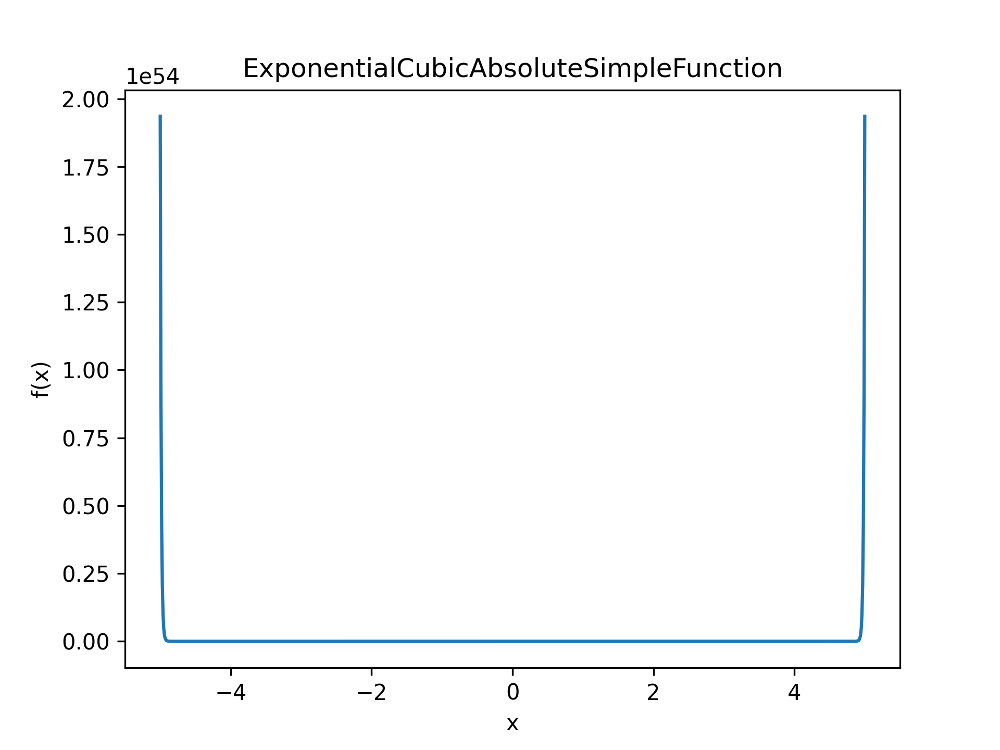 |

### Damped Square Simple Function

<!-- prettier-ignore -->
::: umf.functions.simple.elementary
    options:
        members:
            - DampedSquareSimpleFunction
        show_root_heading: false
        show_root_full_path: false
        show_bases: false
        show_source: true
        show_inherited_members: false
        allow_inspection: false
        inheritance_graph: false
        heading_level: 0

|                                                                                     |
| :---------------------------------------------------------------------------------: |
| 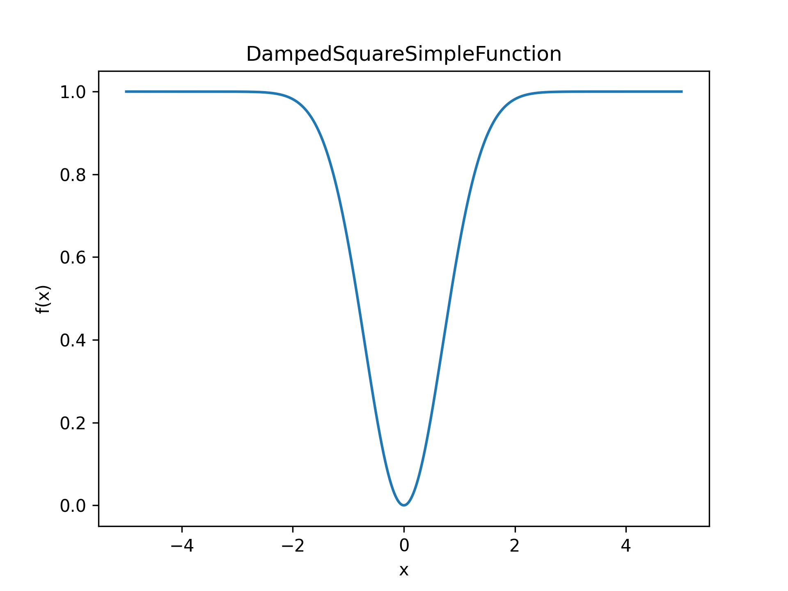 |

### Damped Quartic Simple Function

<!-- prettier-ignore -->
::: umf.functions.simple.elementary
    options:
        members:
            - DampedQuarticSimpleFunction
        show_root_heading: false
        show_root_full_path: false
        show_bases: false
        show_source: true
        show_inherited_members: false
        allow_inspection: false
        inheritance_graph: false
        heading_level: 0

|                                                                                       |
| :-----------------------------------------------------------------------------------: |
| 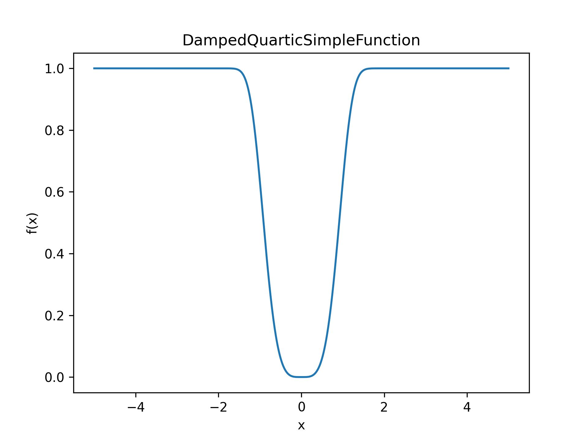 |

### Damped Absolute Simple Function

<!-- prettier-ignore -->
::: umf.functions.simple.elementary
    options:
        members:
            - DampedAbsoluteSimpleFunction
        show_root_heading: false
        show_root_full_path: false
        show_bases: false
        show_source: true
        show_inherited_members: false
        allow_inspection: false
        inheritance_graph: false
        heading_level: 0

|                                                                                         |
| :-------------------------------------------------------------------------------------: |
| 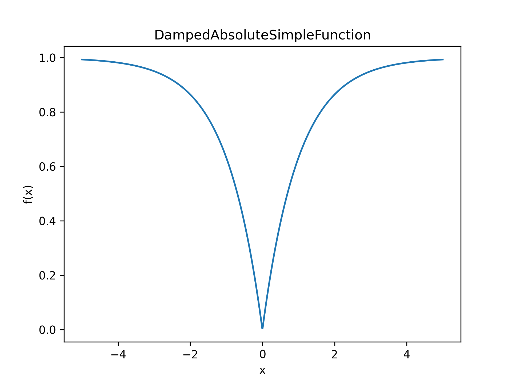 |

### Damped Cubic Absolute Simple Function

<!-- prettier-ignore -->
::: umf.functions.simple.elementary
    options:
        members:
            - DampedCubicAbsoluteSimpleFunction
        show_root_heading: false
        show_root_full_path: false
        show_bases: false
        show_source: true
        show_inherited_members: false
        allow_inspection: false
        inheritance_graph: false
        heading_level: 0

|                                                                                                   |
| :-----------------------------------------------------------------------------------------------: |
| 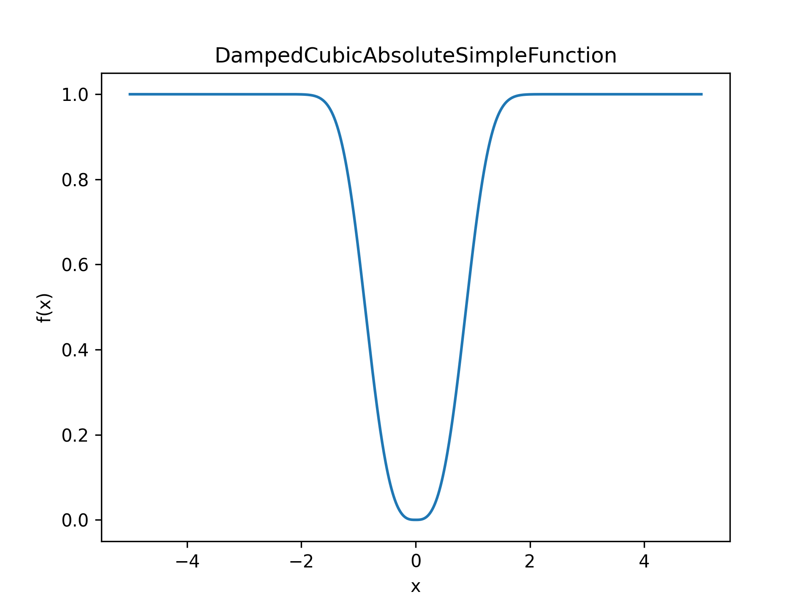 |

### Gaussian Valley Simple Function

<!-- prettier-ignore -->
::: umf.functions.simple.elementary
    options:
        members:
            - GaussianValleySimpleFunction
        show_root_heading: false
        show_root_full_path: false
        show_bases: false
        show_source: true
        show_inherited_members: false
        allow_inspection: false
        inheritance_graph: false
        heading_level: 0

|                                                                                         |
| :-------------------------------------------------------------------------------------: |
| 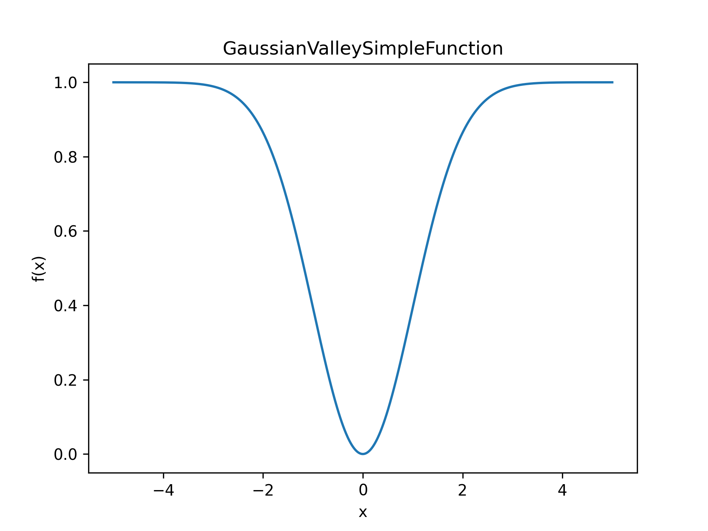 |

### Narrow Gaussian Valley Simple Function

<!-- prettier-ignore -->
::: umf.functions.simple.elementary
    options:
        members:
            - NarrowGaussianValleySimpleFunction
        show_root_heading: false
        show_root_full_path: false
        show_bases: false
        show_source: true
        show_inherited_members: false
        allow_inspection: false
        inheritance_graph: false
        heading_level: 0

|                                                                                                     |
| :-------------------------------------------------------------------------------------------------: |
| 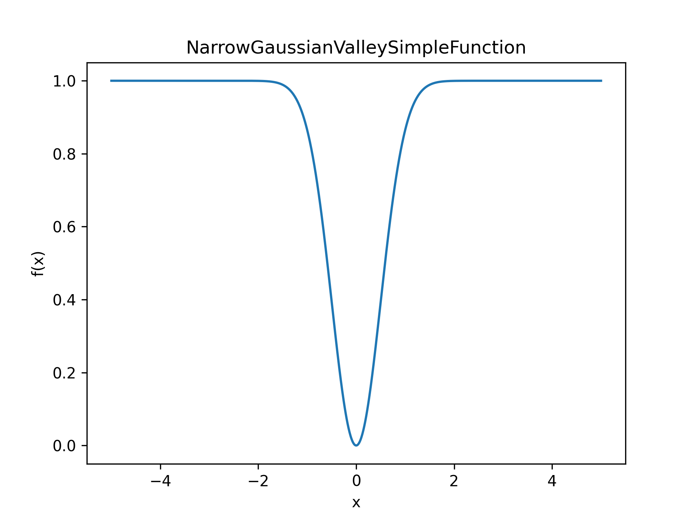 |

### Wide Gaussian Valley Simple Function

<!-- prettier-ignore -->
::: umf.functions.simple.elementary
    options:
        members:
            - WideGaussianValleySimpleFunction
        show_root_heading: false
        show_root_full_path: false
        show_bases: false
        show_source: true
        show_inherited_members: false
        allow_inspection: false
        inheritance_graph: false
        heading_level: 0

|                                                                                                 |
| :---------------------------------------------------------------------------------------------: |
| 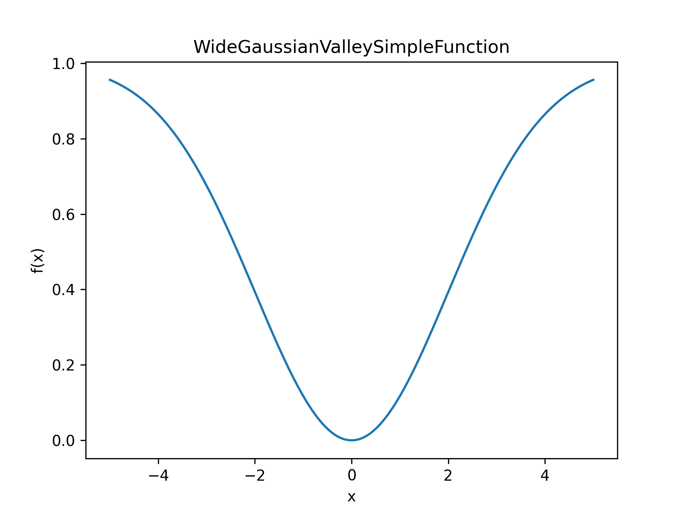 |

### Super Gaussian Valley Simple Function

<!-- prettier-ignore -->
::: umf.functions.simple.elementary
    options:
        members:
            - SuperGaussianValleySimpleFunction
        show_root_heading: false
        show_root_full_path: false
        show_bases: false
        show_source: true
        show_inherited_members: false
        allow_inspection: false
        inheritance_graph: false
        heading_level: 0

|                                                                                                   |
| :-----------------------------------------------------------------------------------------------: |
| 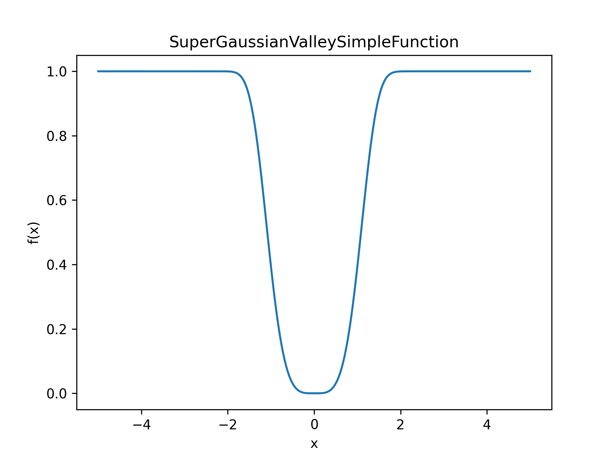 |

### Gaussian Plus Quadratic Simple Function

<!-- prettier-ignore -->
::: umf.functions.simple.elementary
    options:
        members:
            - GaussianPlusQuadraticSimpleFunction
        show_root_heading: false
        show_root_full_path: false
        show_bases: false
        show_source: true
        show_inherited_members: false
        allow_inspection: false
        inheritance_graph: false
        heading_level: 0

|                                                                                                       |
| :---------------------------------------------------------------------------------------------------: |
|  |

### Gaussian Plus Absolute Simple Function

<!-- prettier-ignore -->
::: umf.functions.simple.elementary
    options:
        members:
            - GaussianPlusAbsoluteSimpleFunction
        show_root_heading: false
        show_root_full_path: false
        show_bases: false
        show_source: true
        show_inherited_members: false
        allow_inspection: false
        inheritance_graph: false
        heading_level: 0

|                                                                                                     |
| :-------------------------------------------------------------------------------------------------: |
| 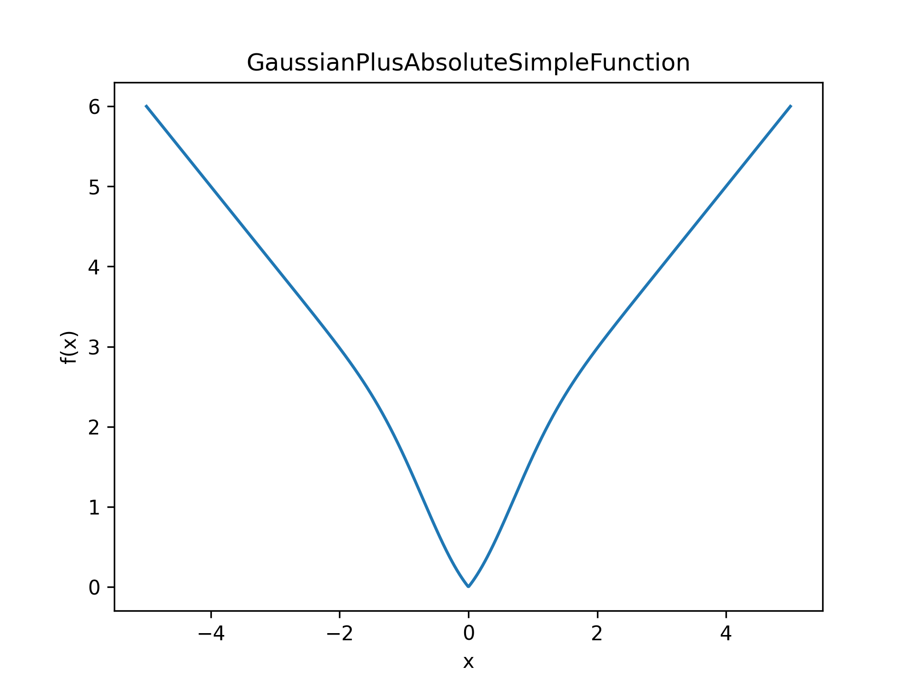 |

### Exponential Plus Quadratic Simple Function

<!-- prettier-ignore -->
::: umf.functions.simple.elementary
    options:
        members:
            - ExponentialPlusQuadraticSimpleFunction
        show_root_heading: false
        show_root_full_path: false
        show_bases: false
        show_source: true
        show_inherited_members: false
        allow_inspection: false
        inheritance_graph: false
        heading_level: 0

|                                                                                                             |
| :---------------------------------------------------------------------------------------------------------: |
| 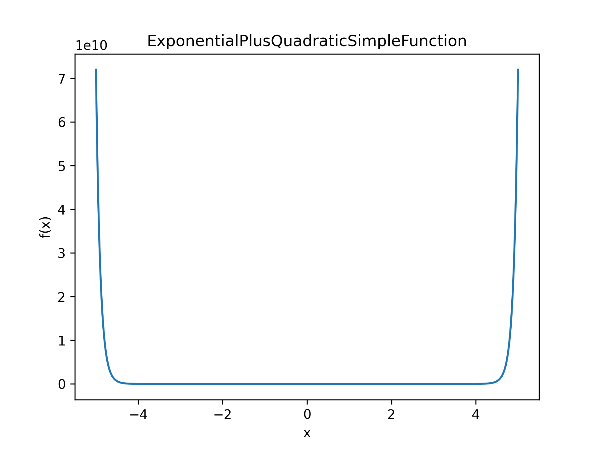 |

### Exponential Plus Absolute Simple Function

<!-- prettier-ignore -->
::: umf.functions.simple.elementary
    options:
        members:
            - ExponentialPlusAbsoluteSimpleFunction
        show_root_heading: false
        show_root_full_path: false
        show_bases: false
        show_source: true
        show_inherited_members: false
        allow_inspection: false
        inheritance_graph: false
        heading_level: 0

|                                                                                                           |
| :-------------------------------------------------------------------------------------------------------: |
| 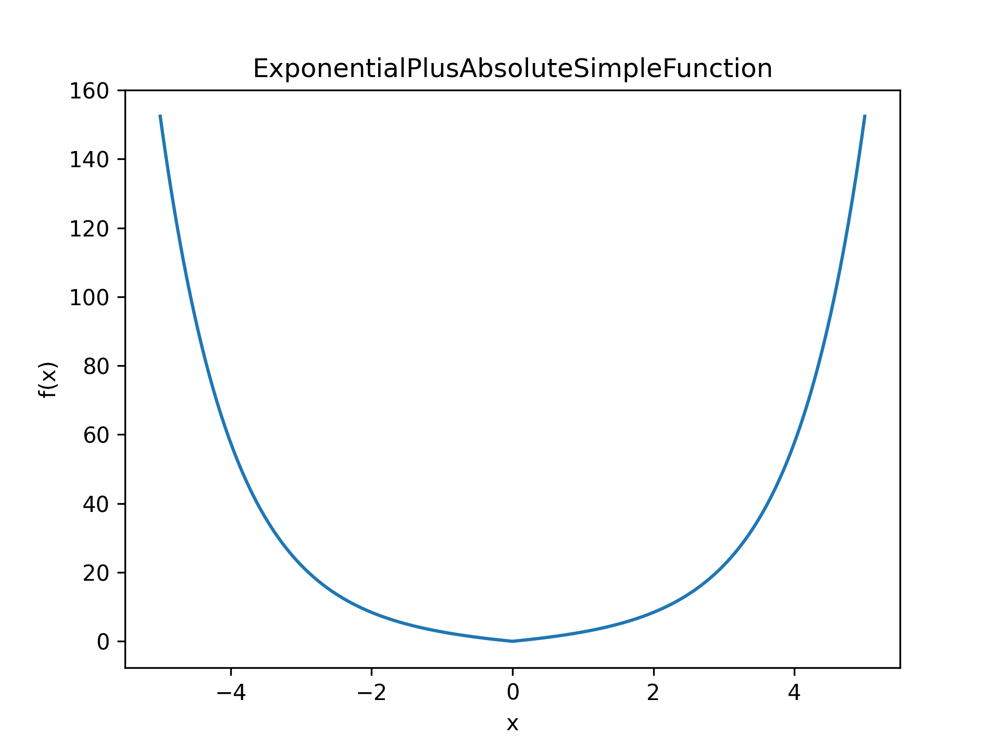 |

## Trigonometric Bowls

### Cosine Bowl Simple Function

<!-- prettier-ignore -->
::: umf.functions.simple.elementary
    options:
        members:
            - CosineBowlSimpleFunction
        show_root_heading: false
        show_root_full_path: false
        show_bases: false
        show_source: true
        show_inherited_members: false
        allow_inspection: false
        inheritance_graph: false
        heading_level: 0

|                                                                                 |
| :-----------------------------------------------------------------------------: |
| 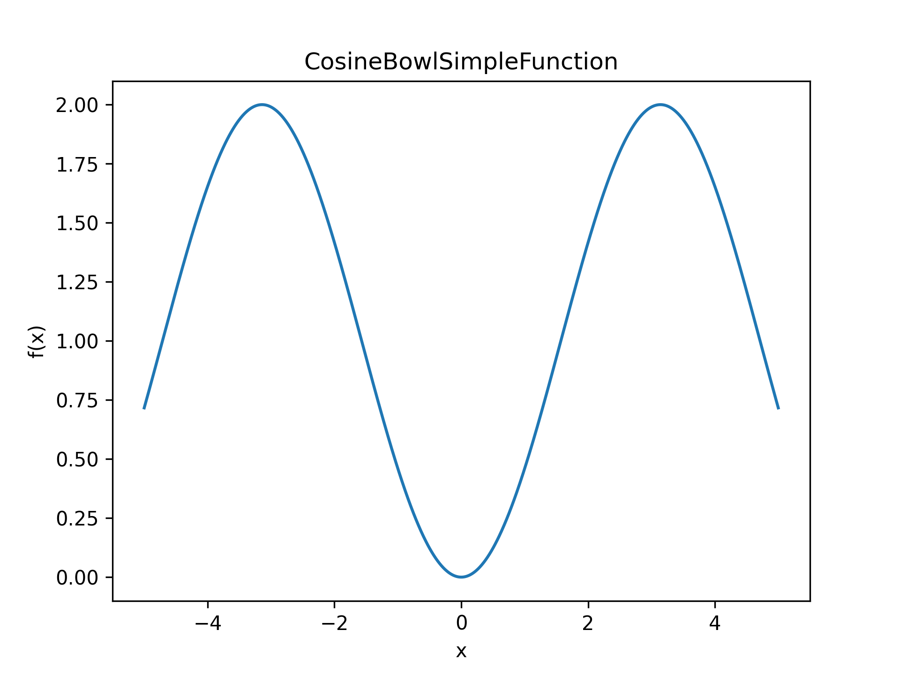 |

### Double Cosine Bowl Simple Function

<!-- prettier-ignore -->
::: umf.functions.simple.elementary
    options:
        members:
            - DoubleCosineBowlSimpleFunction
        show_root_heading: false
        show_root_full_path: false
        show_bases: false
        show_source: true
        show_inherited_members: false
        allow_inspection: false
        inheritance_graph: false
        heading_level: 0

|                                                                                             |
| :-----------------------------------------------------------------------------------------: |
| 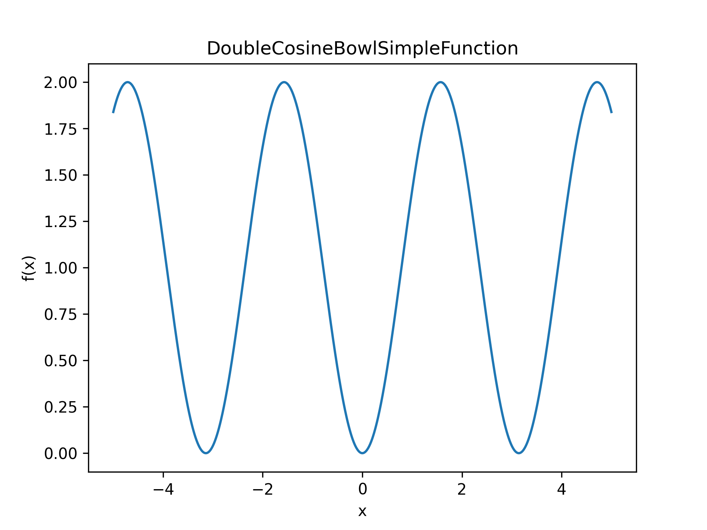 |

### Triple Cosine Bowl Simple Function

<!-- prettier-ignore -->
::: umf.functions.simple.elementary
    options:
        members:
            - TripleCosineBowlSimpleFunction
        show_root_heading: false
        show_root_full_path: false
        show_bases: false
        show_source: true
        show_inherited_members: false
        allow_inspection: false
        inheritance_graph: false
        heading_level: 0

|                                                                                             |
| :-----------------------------------------------------------------------------------------: |
| 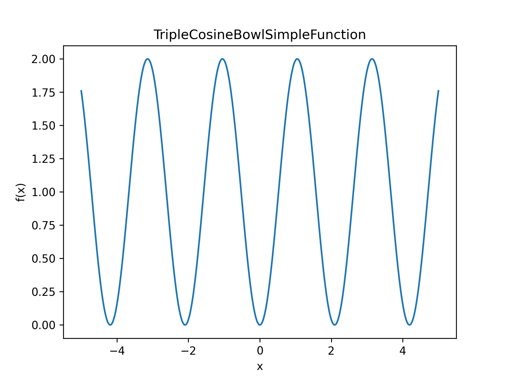 |

### Half Cosine Bowl Simple Function

<!-- prettier-ignore -->
::: umf.functions.simple.elementary
    options:
        members:
            - HalfCosineBowlSimpleFunction
        show_root_heading: false
        show_root_full_path: false
        show_bases: false
        show_source: true
        show_inherited_members: false
        allow_inspection: false
        inheritance_graph: false
        heading_level: 0

|                                                                                         |
| :-------------------------------------------------------------------------------------: |
| 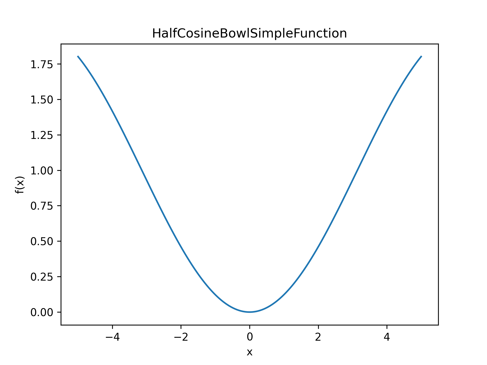 |

### Sine Squared Simple Function

<!-- prettier-ignore -->
::: umf.functions.simple.elementary
    options:
        members:
            - SineSquaredSimpleFunction
        show_root_heading: false
        show_root_full_path: false
        show_bases: false
        show_source: true
        show_inherited_members: false
        allow_inspection: false
        inheritance_graph: false
        heading_level: 0

|                                                                                   |
| :-------------------------------------------------------------------------------: |
| 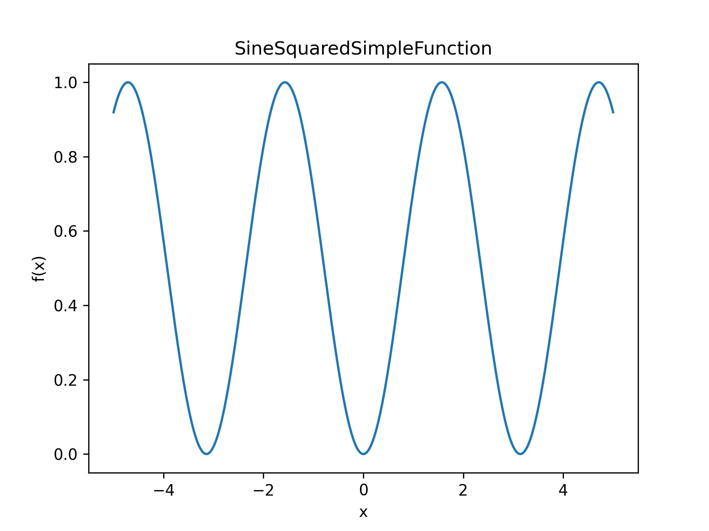 |

### Double Sine Squared Simple Function

<!-- prettier-ignore -->
::: umf.functions.simple.elementary
    options:
        members:
            - DoubleSineSquaredSimpleFunction
        show_root_heading: false
        show_root_full_path: false
        show_bases: false
        show_source: true
        show_inherited_members: false
        allow_inspection: false
        inheritance_graph: false
        heading_level: 0

|                                                                                               |
| :-------------------------------------------------------------------------------------------: |
| 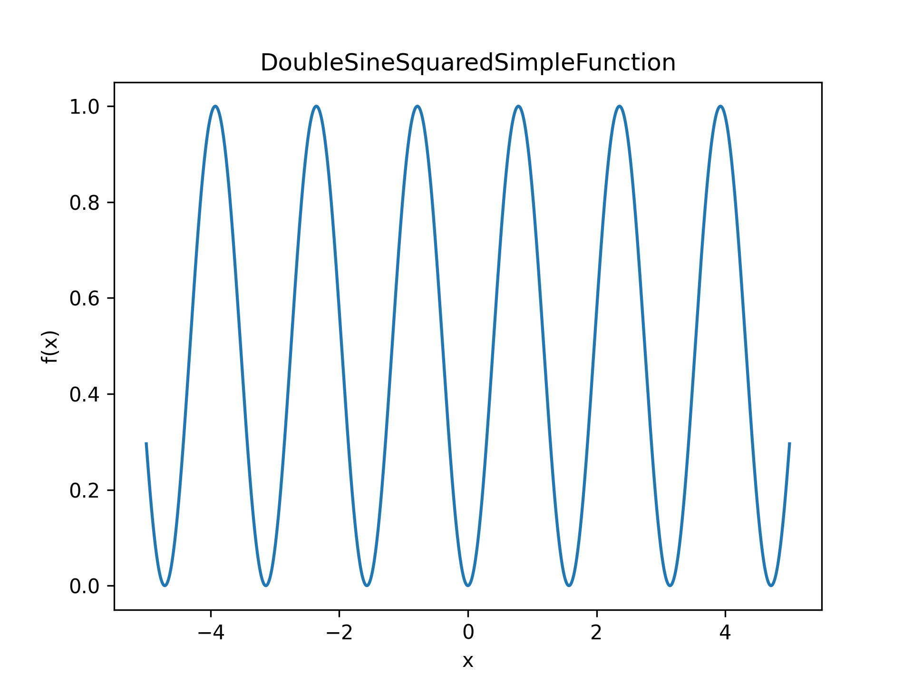 |

### Triple Sine Squared Simple Function

<!-- prettier-ignore -->
::: umf.functions.simple.elementary
    options:
        members:
            - TripleSineSquaredSimpleFunction
        show_root_heading: false
        show_root_full_path: false
        show_bases: false
        show_source: true
        show_inherited_members: false
        allow_inspection: false
        inheritance_graph: false
        heading_level: 0

|                                                                                               |
| :-------------------------------------------------------------------------------------------: |
| 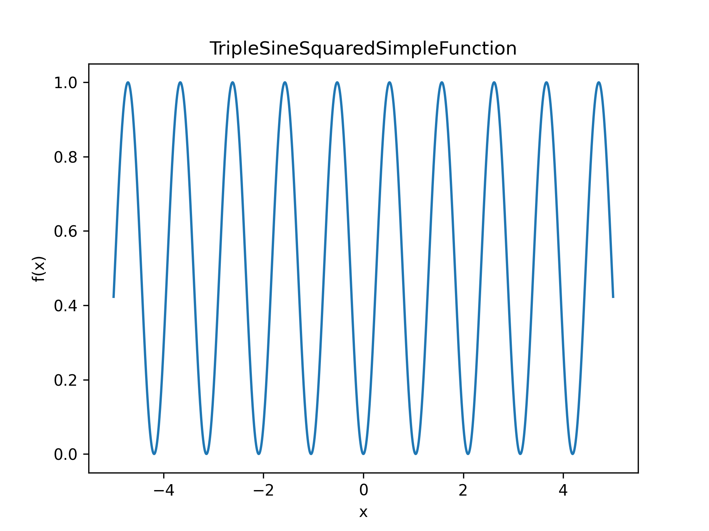 |

### Half Sine Squared Simple Function

<!-- prettier-ignore -->
::: umf.functions.simple.elementary
    options:
        members:
            - HalfSineSquaredSimpleFunction
        show_root_heading: false
        show_root_full_path: false
        show_bases: false
        show_source: true
        show_inherited_members: false
        allow_inspection: false
        inheritance_graph: false
        heading_level: 0

|                                                                                           |
| :---------------------------------------------------------------------------------------: |
| 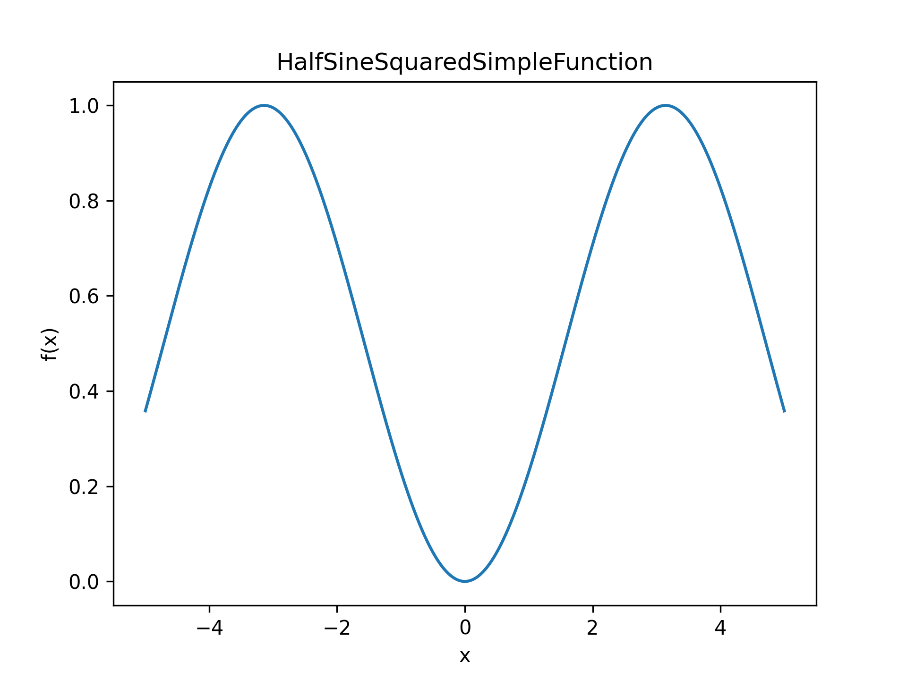 |

### Cosine Bowl Squared Simple Function

<!-- prettier-ignore -->
::: umf.functions.simple.elementary
    options:
        members:
            - CosineBowlSquaredSimpleFunction
        show_root_heading: false
        show_root_full_path: false
        show_bases: false
        show_source: true
        show_inherited_members: false
        allow_inspection: false
        inheritance_graph: false
        heading_level: 0

|                                                                                               |
| :-------------------------------------------------------------------------------------------: |
| 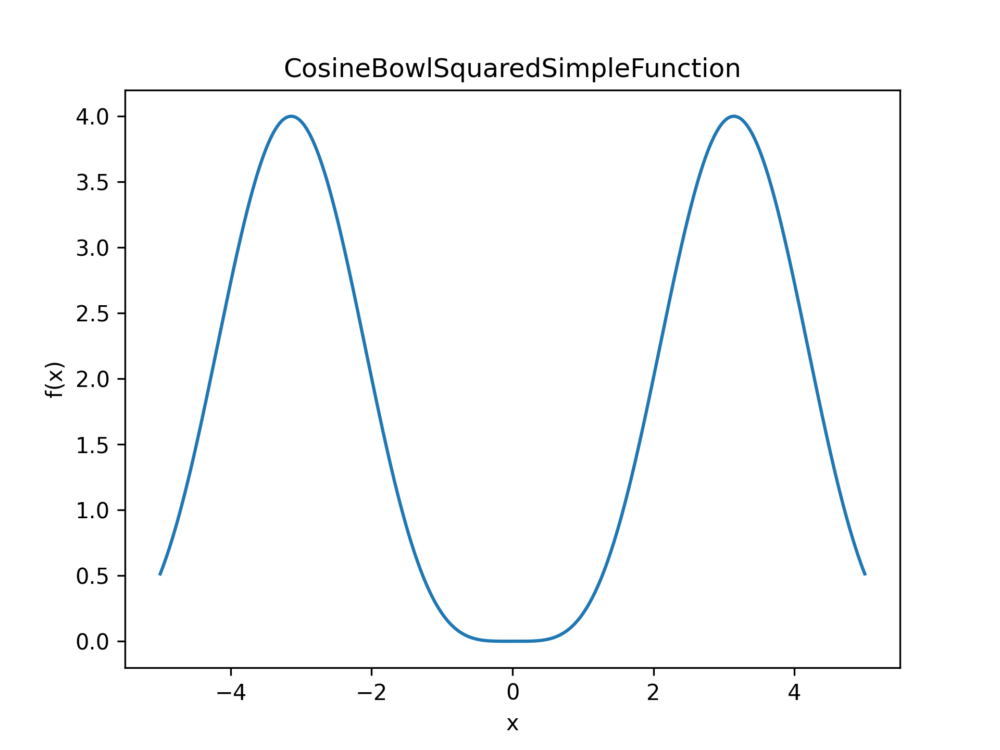 |

### Sine Fourth Simple Function

<!-- prettier-ignore -->
::: umf.functions.simple.elementary
    options:
        members:
            - SineFourthSimpleFunction
        show_root_heading: false
        show_root_full_path: false
        show_bases: false
        show_source: true
        show_inherited_members: false
        allow_inspection: false
        inheritance_graph: false
        heading_level: 0

|                                                                                 |
| :-----------------------------------------------------------------------------: |
| 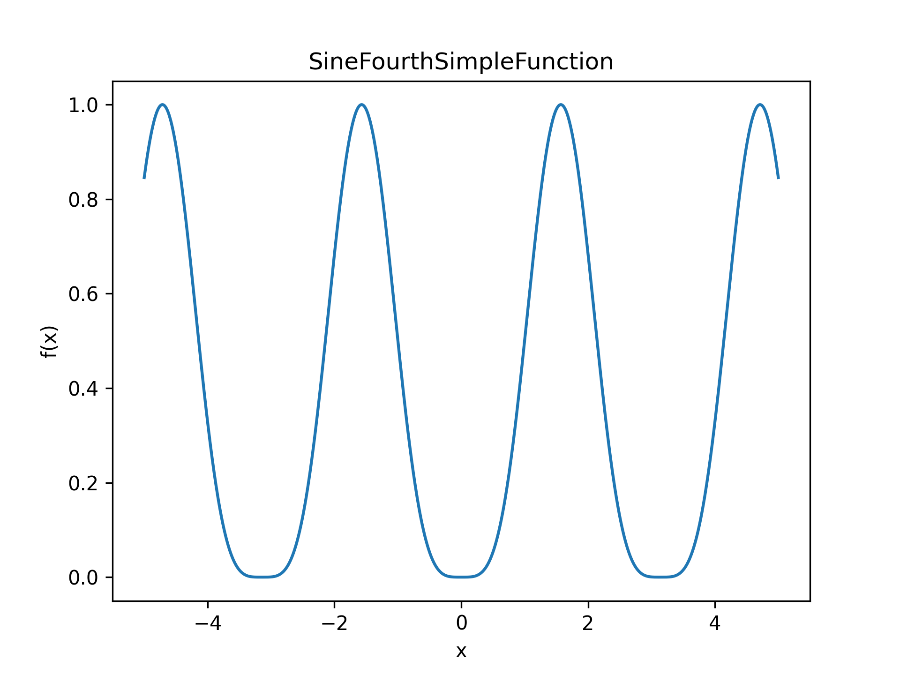 |

### Sine Sixth Simple Function

<!-- prettier-ignore -->
::: umf.functions.simple.elementary
    options:
        members:
            - SineSixthSimpleFunction
        show_root_heading: false
        show_root_full_path: false
        show_bases: false
        show_source: true
        show_inherited_members: false
        allow_inspection: false
        inheritance_graph: false
        heading_level: 0

|                                                                               |
| :---------------------------------------------------------------------------: |
| 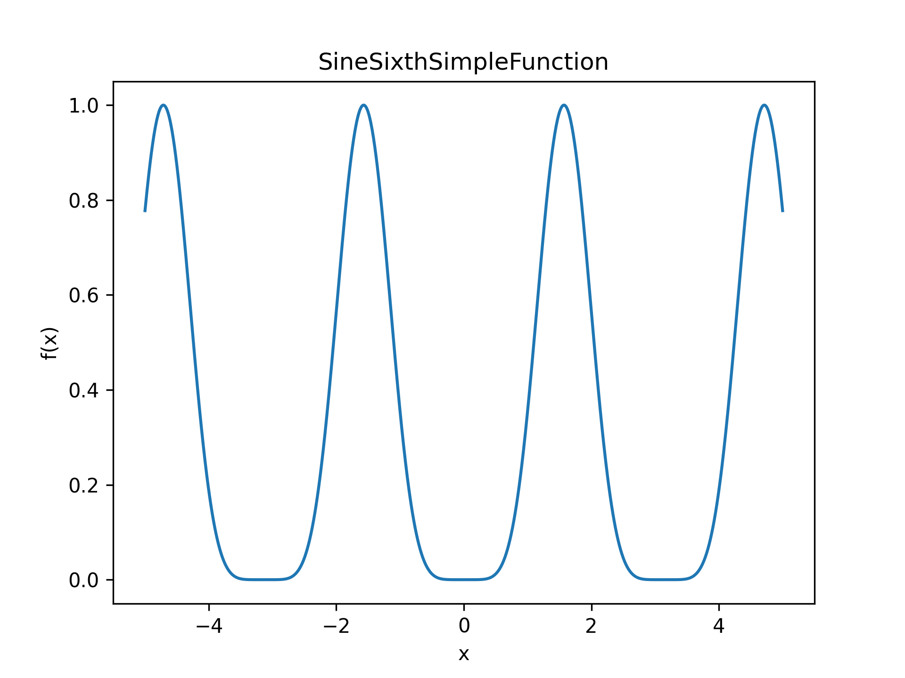 |

## Oscillatory And Rippled Forms

### Sinc Loss Simple Function

<!-- prettier-ignore -->
::: umf.functions.simple.elementary
    options:
        members:
            - SincLossSimpleFunction
        show_root_heading: false
        show_root_full_path: false
        show_bases: false
        show_source: true
        show_inherited_members: false
        allow_inspection: false
        inheritance_graph: false
        heading_level: 0

|                                                                             |
| :-------------------------------------------------------------------------: |
| 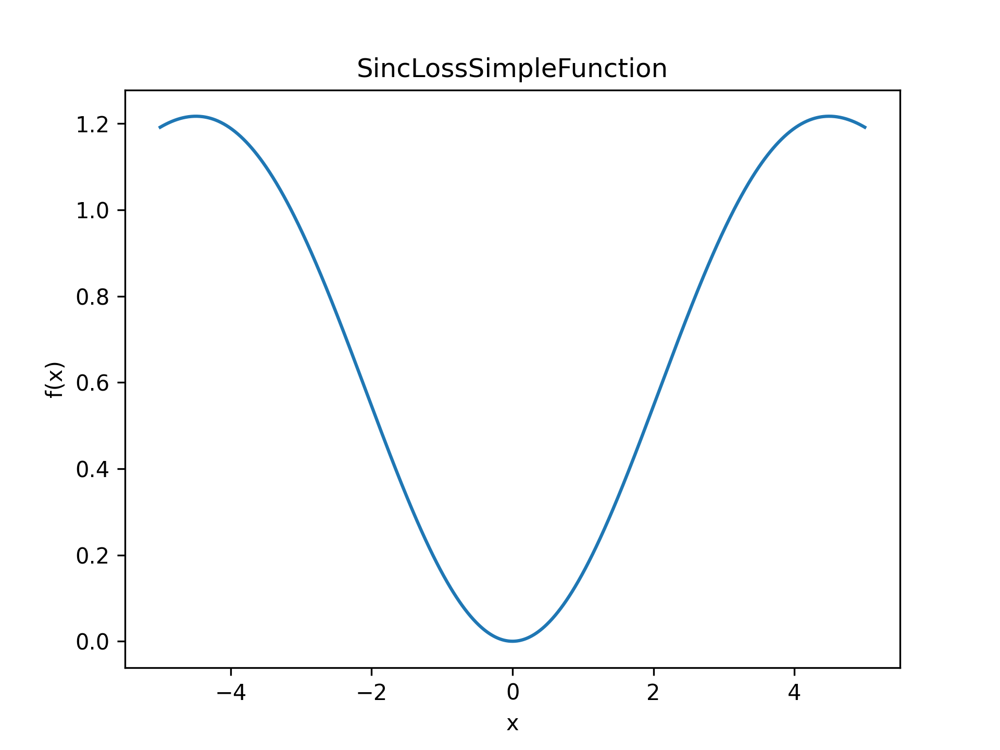 |

### Double Sinc Loss Simple Function

<!-- prettier-ignore -->
::: umf.functions.simple.elementary
    options:
        members:
            - DoubleSincLossSimpleFunction
        show_root_heading: false
        show_root_full_path: false
        show_bases: false
        show_source: true
        show_inherited_members: false
        allow_inspection: false
        inheritance_graph: false
        heading_level: 0

|                                                                                         |
| :-------------------------------------------------------------------------------------: |
| 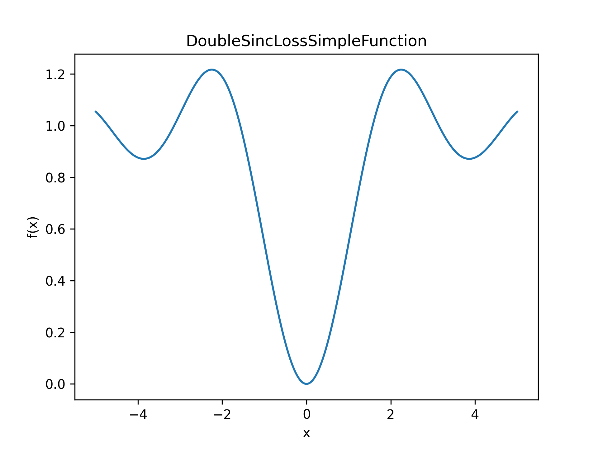 |

### Triple Sinc Loss Simple Function

<!-- prettier-ignore -->
::: umf.functions.simple.elementary
    options:
        members:
            - TripleSincLossSimpleFunction
        show_root_heading: false
        show_root_full_path: false
        show_bases: false
        show_source: true
        show_inherited_members: false
        allow_inspection: false
        inheritance_graph: false
        heading_level: 0

|                                                                                         |
| :-------------------------------------------------------------------------------------: |
| 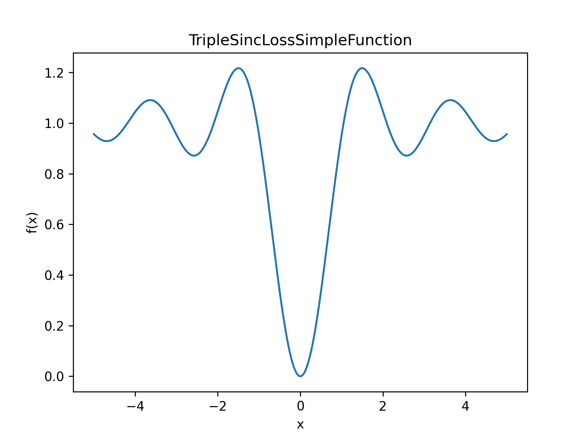 |

### Cosine Damped Square Simple Function

<!-- prettier-ignore -->
::: umf.functions.simple.elementary
    options:
        members:
            - CosineDampedSquareSimpleFunction
        show_root_heading: false
        show_root_full_path: false
        show_bases: false
        show_source: true
        show_inherited_members: false
        allow_inspection: false
        inheritance_graph: false
        heading_level: 0

|                                                                                                 |
| :---------------------------------------------------------------------------------------------: |
| 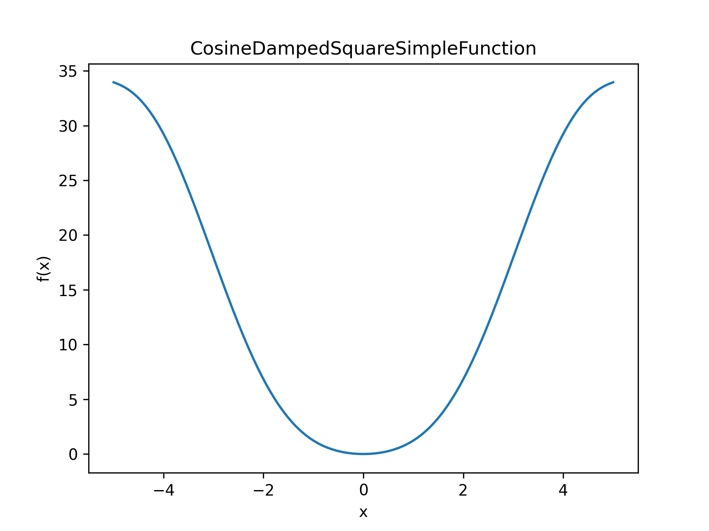 |

### Sine Damped Square Simple Function

<!-- prettier-ignore -->
::: umf.functions.simple.elementary
    options:
        members:
            - SineDampedSquareSimpleFunction
        show_root_heading: false
        show_root_full_path: false
        show_bases: false
        show_source: true
        show_inherited_members: false
        allow_inspection: false
        inheritance_graph: false
        heading_level: 0

|                                                                                             |
| :-----------------------------------------------------------------------------------------: |
| 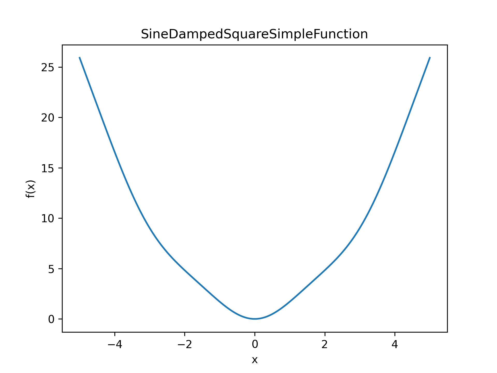 |

### Ripple Quartic Simple Function

<!-- prettier-ignore -->
::: umf.functions.simple.elementary
    options:
        members:
            - RippleQuarticSimpleFunction
        show_root_heading: false
        show_root_full_path: false
        show_bases: false
        show_source: true
        show_inherited_members: false
        allow_inspection: false
        inheritance_graph: false
        heading_level: 0

|                                                                                       |
| :-----------------------------------------------------------------------------------: |
| 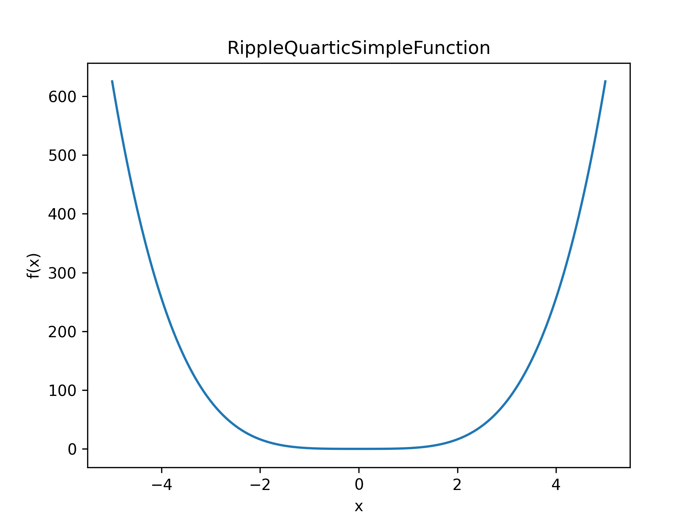 |

### Ripple Absolute Simple Function

<!-- prettier-ignore -->
::: umf.functions.simple.elementary
    options:
        members:
            - RippleAbsoluteSimpleFunction
        show_root_heading: false
        show_root_full_path: false
        show_bases: false
        show_source: true
        show_inherited_members: false
        allow_inspection: false
        inheritance_graph: false
        heading_level: 0

|                                                                                         |
| :-------------------------------------------------------------------------------------: |
| 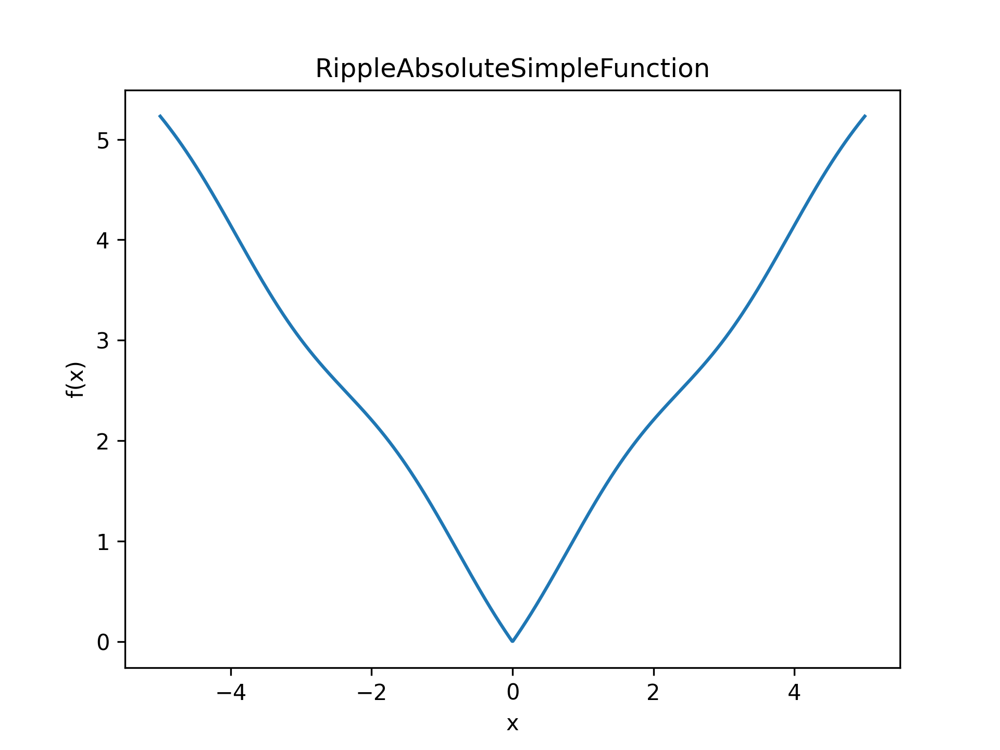 |

## Hyperbolic And Inverse Hyperbolic Families

### Hyperbolic Cosine Simple Function

<!-- prettier-ignore -->
::: umf.functions.simple.elementary
    options:
        members:
            - HyperbolicCosineSimpleFunction
        show_root_heading: false
        show_root_full_path: false
        show_bases: false
        show_source: true
        show_inherited_members: false
        allow_inspection: false
        inheritance_graph: false
        heading_level: 0

|                                                                                             |
| :-----------------------------------------------------------------------------------------: |
| 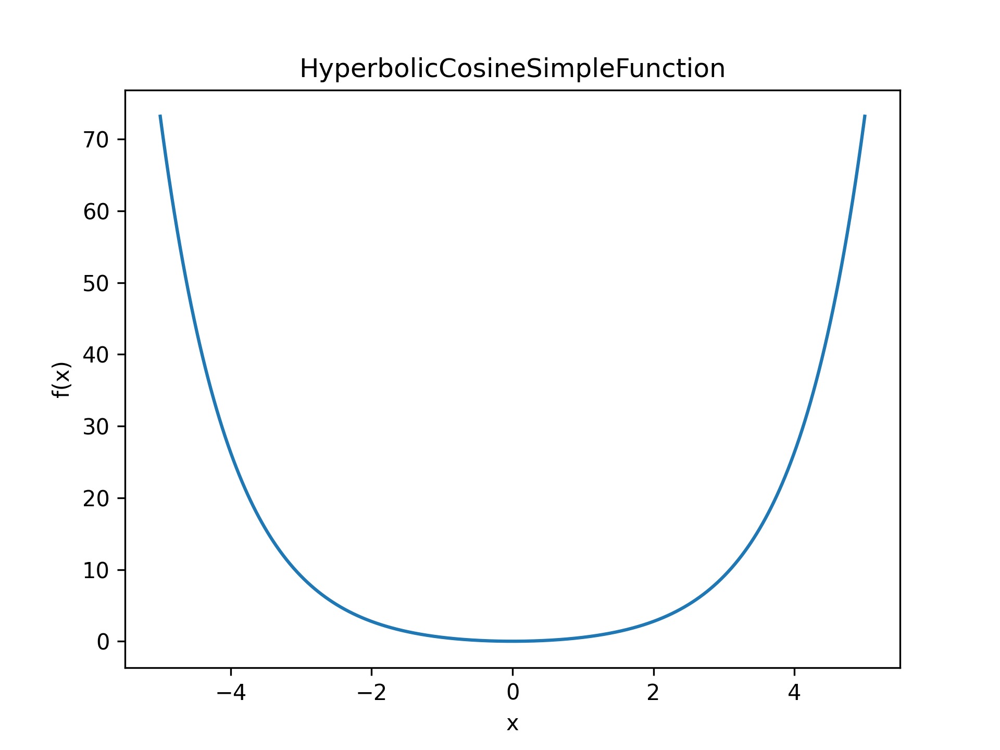 |

### Sech Bowl Simple Function

<!-- prettier-ignore -->
::: umf.functions.simple.elementary
    options:
        members:
            - SechBowlSimpleFunction
        show_root_heading: false
        show_root_full_path: false
        show_bases: false
        show_source: true
        show_inherited_members: false
        allow_inspection: false
        inheritance_graph: false
        heading_level: 0

|                                                                             |
| :-------------------------------------------------------------------------: |
| 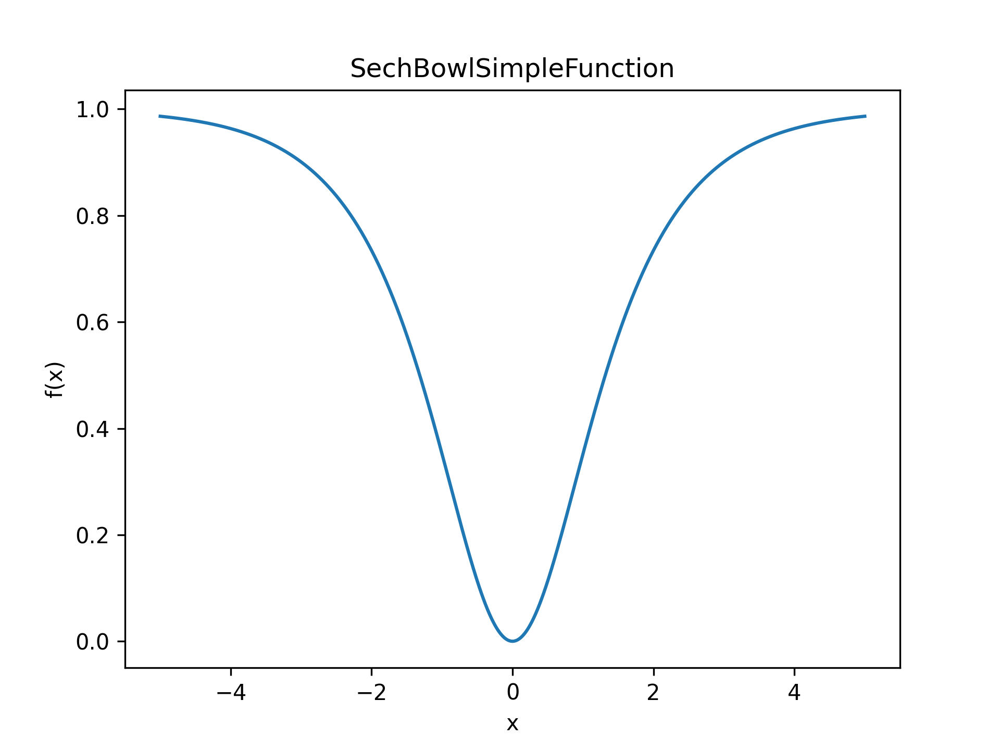 |

### Tanh Squared Simple Function

<!-- prettier-ignore -->
::: umf.functions.simple.elementary
    options:
        members:
            - TanhSquaredSimpleFunction
        show_root_heading: false
        show_root_full_path: false
        show_bases: false
        show_source: true
        show_inherited_members: false
        allow_inspection: false
        inheritance_graph: false
        heading_level: 0

|                                                                                   |
| :-------------------------------------------------------------------------------: |
| 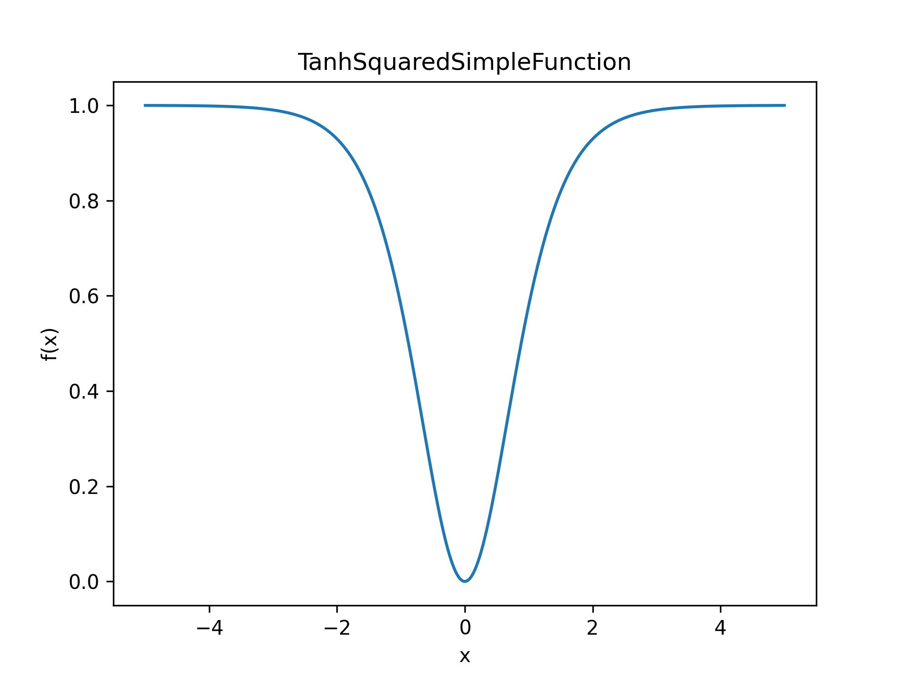 |

### Arctan Squared Simple Function

<!-- prettier-ignore -->
::: umf.functions.simple.elementary
    options:
        members:
            - ArctanSquaredSimpleFunction
        show_root_heading: false
        show_root_full_path: false
        show_bases: false
        show_source: true
        show_inherited_members: false
        allow_inspection: false
        inheritance_graph: false
        heading_level: 0

|                                                                                       |
| :-----------------------------------------------------------------------------------: |
| 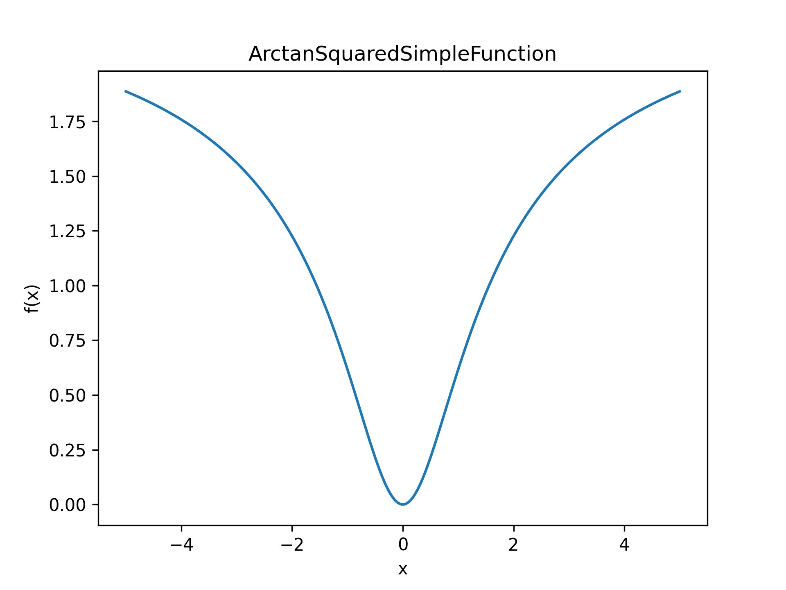 |

### Arcsinh Squared Simple Function

<!-- prettier-ignore -->
::: umf.functions.simple.elementary
    options:
        members:
            - ArcsinhSquaredSimpleFunction
        show_root_heading: false
        show_root_full_path: false
        show_bases: false
        show_source: true
        show_inherited_members: false
        allow_inspection: false
        inheritance_graph: false
        heading_level: 0

|                                                                                         |
| :-------------------------------------------------------------------------------------: |
| 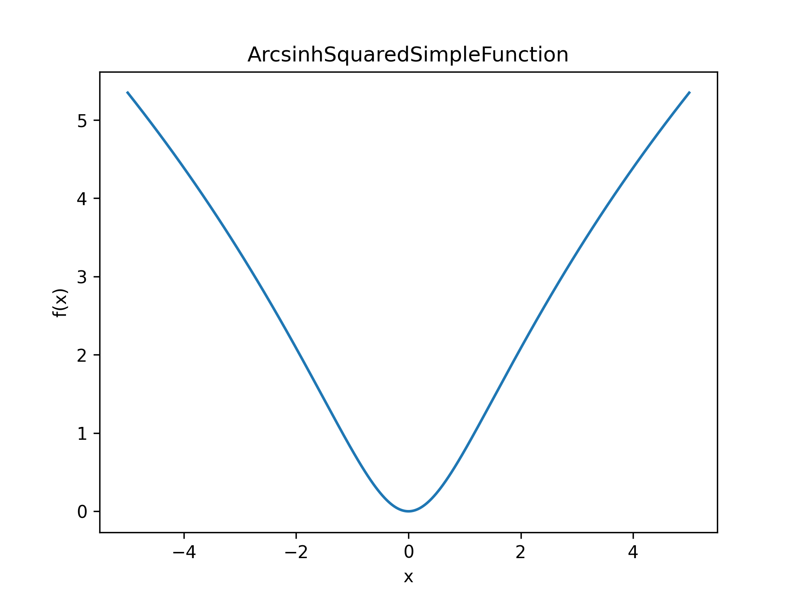 |

### Logistic Mirror Simple Function

<!-- prettier-ignore -->
::: umf.functions.simple.elementary
    options:
        members:
            - LogisticMirrorSimpleFunction
        show_root_heading: false
        show_root_full_path: false
        show_bases: false
        show_source: true
        show_inherited_members: false
        allow_inspection: false
        inheritance_graph: false
        heading_level: 0

|                                                                                         |
| :-------------------------------------------------------------------------------------: |
| 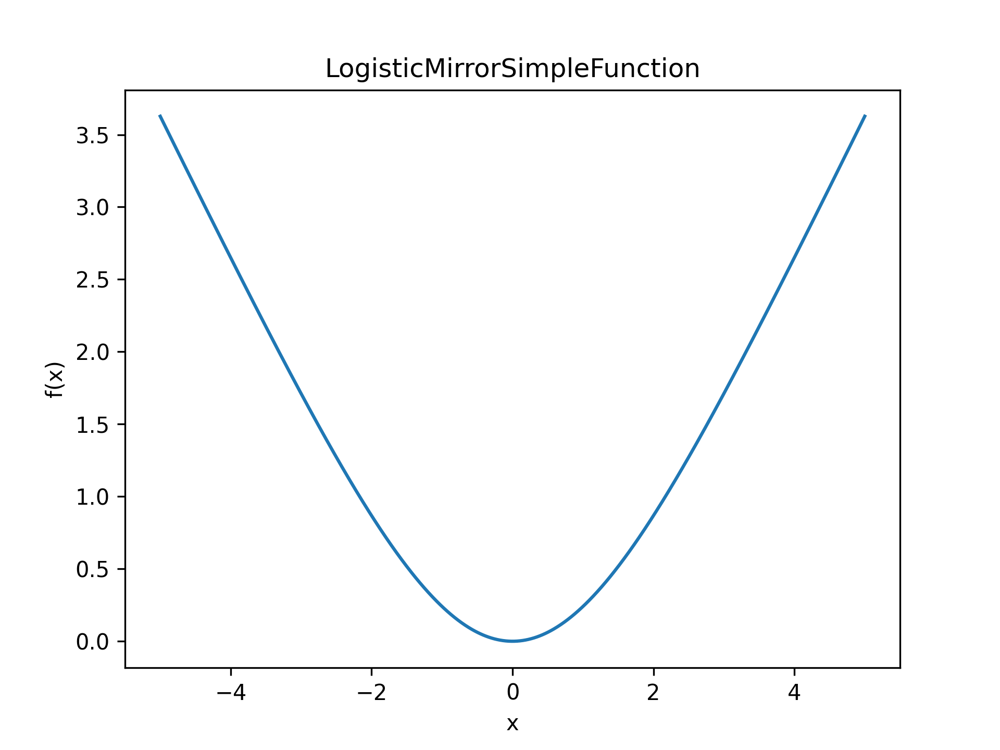 |

### Log Cosh Simple Function

<!-- prettier-ignore -->
::: umf.functions.simple.elementary
    options:
        members:
            - LogCoshSimpleFunction
        show_root_heading: false
        show_root_full_path: false
        show_bases: false
        show_source: true
        show_inherited_members: false
        allow_inspection: false
        inheritance_graph: false
        heading_level: 0

|                                                                           |
| :-----------------------------------------------------------------------: |
| 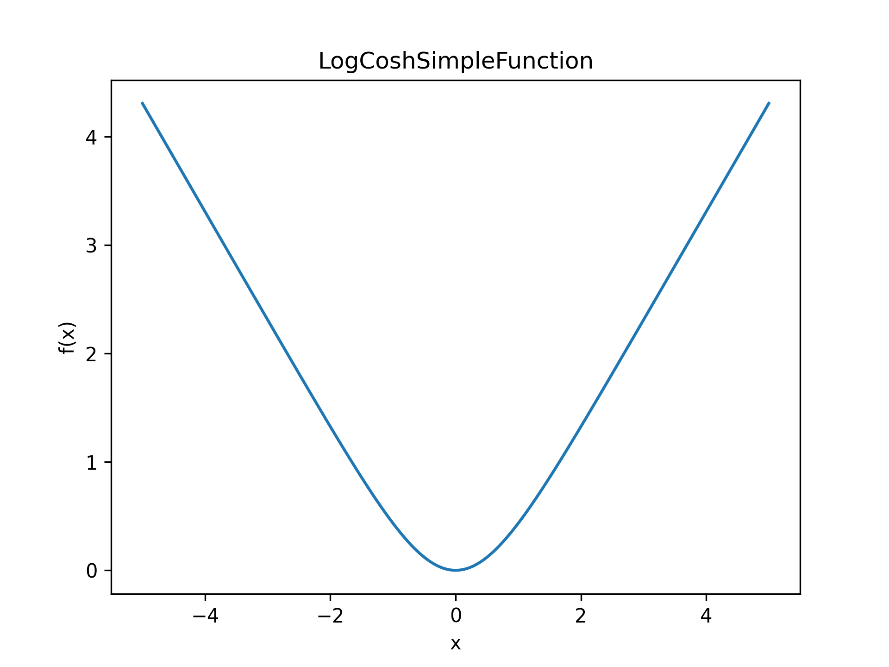 |

### Cosh Minus Sech Simple Function

<!-- prettier-ignore -->
::: umf.functions.simple.elementary
    options:
        members:
            - CoshMinusSechSimpleFunction
        show_root_heading: false
        show_root_full_path: false
        show_bases: false
        show_source: true
        show_inherited_members: false
        allow_inspection: false
        inheritance_graph: false
        heading_level: 0

|                                                                                       |
| :-----------------------------------------------------------------------------------: |
| 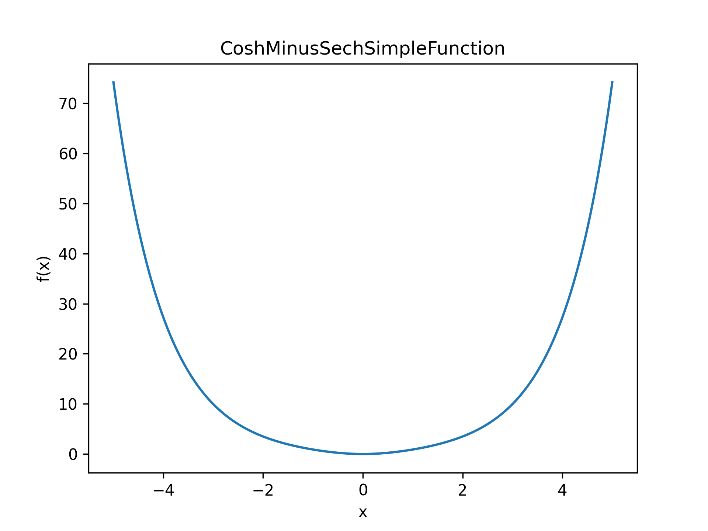 |

### Sinh Squared Simple Function

<!-- prettier-ignore -->
::: umf.functions.simple.elementary
    options:
        members:
            - SinhSquaredSimpleFunction
        show_root_heading: false
        show_root_full_path: false
        show_bases: false
        show_source: true
        show_inherited_members: false
        allow_inspection: false
        inheritance_graph: false
        heading_level: 0

|                                                                                   |
| :-------------------------------------------------------------------------------: |
| 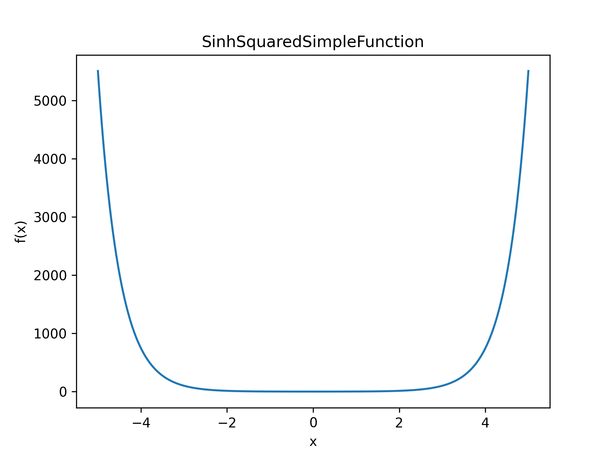 |

### Tanh Absolute Simple Function

<!-- prettier-ignore -->
::: umf.functions.simple.elementary
    options:
        members:
            - TanhAbsoluteSimpleFunction
        show_root_heading: false
        show_root_full_path: false
        show_bases: false
        show_source: true
        show_inherited_members: false
        allow_inspection: false
        inheritance_graph: false
        heading_level: 0

|                                                                                     |
| :---------------------------------------------------------------------------------: |
| 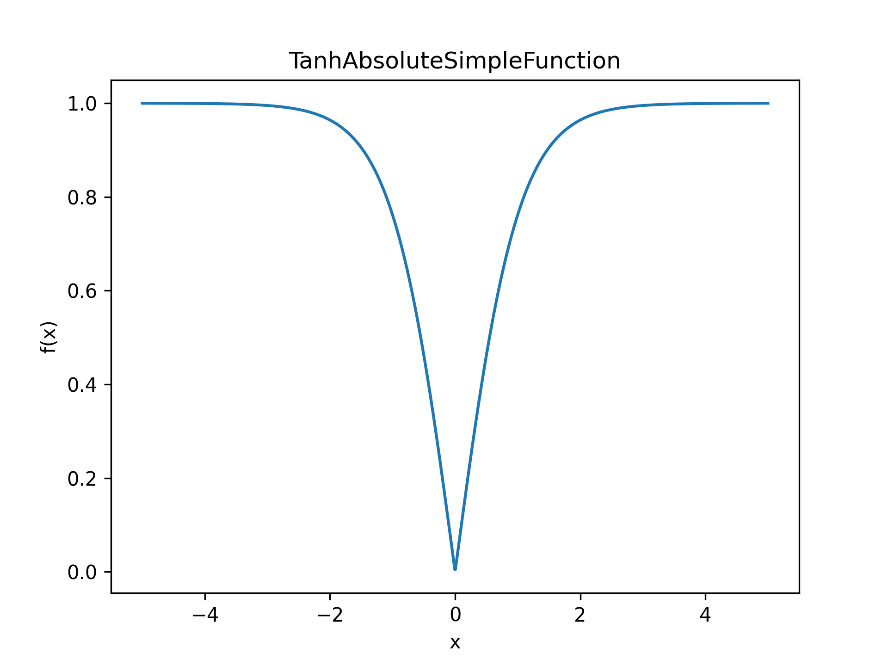 |

### Arcsinh Absolute Simple Function

<!-- prettier-ignore -->
::: umf.functions.simple.elementary
    options:
        members:
            - ArcsinhAbsoluteSimpleFunction
        show_root_heading: false
        show_root_full_path: false
        show_bases: false
        show_source: true
        show_inherited_members: false
        allow_inspection: false
        inheritance_graph: false
        heading_level: 0

|                                                                                           |
| :---------------------------------------------------------------------------------------: |
| 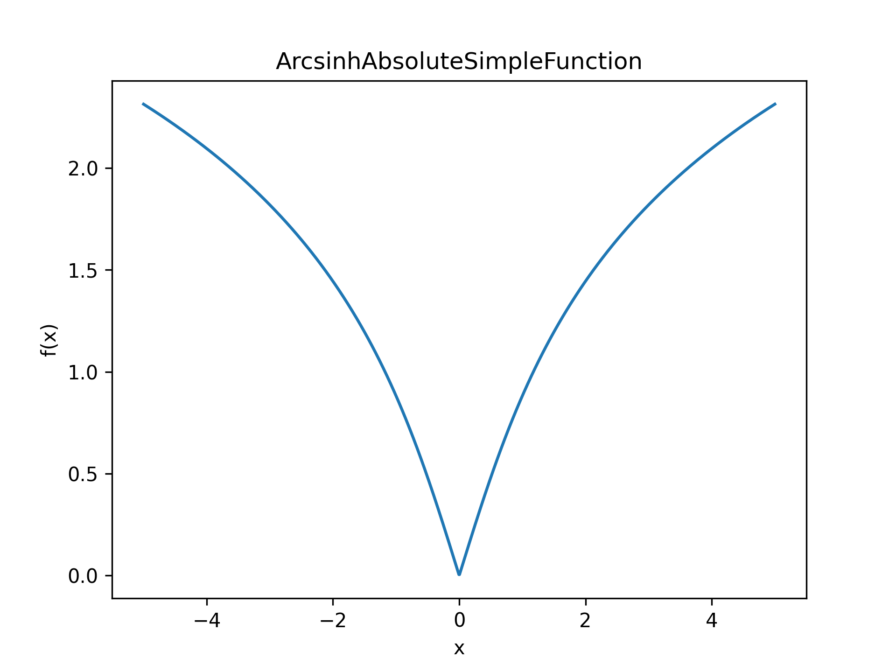 |

### Hyperbolic Plus Quadratic Simple Function

<!-- prettier-ignore -->
::: umf.functions.simple.elementary
    options:
        members:
            - HyperbolicPlusQuadraticSimpleFunction
        show_root_heading: false
        show_root_full_path: false
        show_bases: false
        show_source: true
        show_inherited_members: false
        allow_inspection: false
        inheritance_graph: false
        heading_level: 0

|                                                                                                           |
| :-------------------------------------------------------------------------------------------------------: |
| 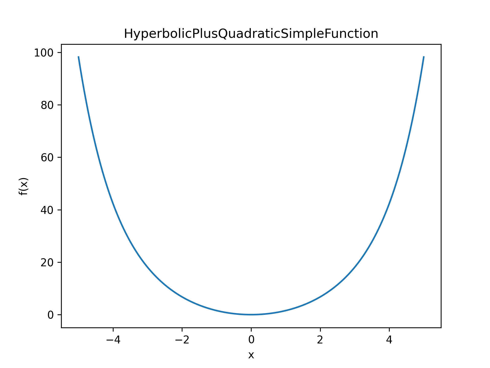 |

### Hyperbolic Plus Absolute Simple Function

<!-- prettier-ignore -->
::: umf.functions.simple.elementary
    options:
        members:
            - HyperbolicPlusAbsoluteSimpleFunction
        show_root_heading: false
        show_root_full_path: false
        show_bases: false
        show_source: true
        show_inherited_members: false
        allow_inspection: false
        inheritance_graph: false
        heading_level: 0

|                                                                                                         |
| :-----------------------------------------------------------------------------------------------------: |
| 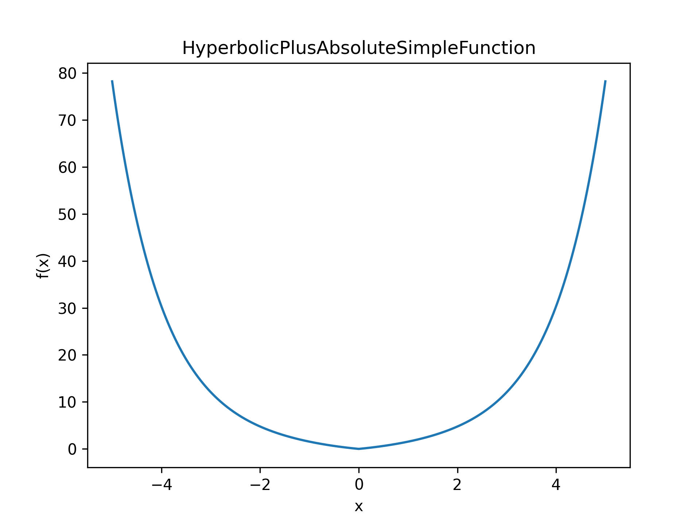 |

### Arctan Plus Quadratic Simple Function

<!-- prettier-ignore -->
::: umf.functions.simple.elementary
    options:
        members:
            - ArctanPlusQuadraticSimpleFunction
        show_root_heading: false
        show_root_full_path: false
        show_bases: false
        show_source: true
        show_inherited_members: false
        allow_inspection: false
        inheritance_graph: false
        heading_level: 0

|                                                                                                   |
| :-----------------------------------------------------------------------------------------------: |
| 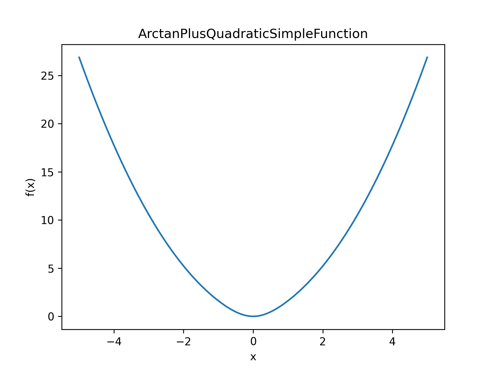 |

### Arcsinh Plus Quadratic Simple Function

<!-- prettier-ignore -->
::: umf.functions.simple.elementary
    options:
        members:
            - ArcsinhPlusQuadraticSimpleFunction
        show_root_heading: false
        show_root_full_path: false
        show_bases: false
        show_source: true
        show_inherited_members: false
        allow_inspection: false
        inheritance_graph: false
        heading_level: 0

|                                                                                                     |
| :-------------------------------------------------------------------------------------------------: |
| 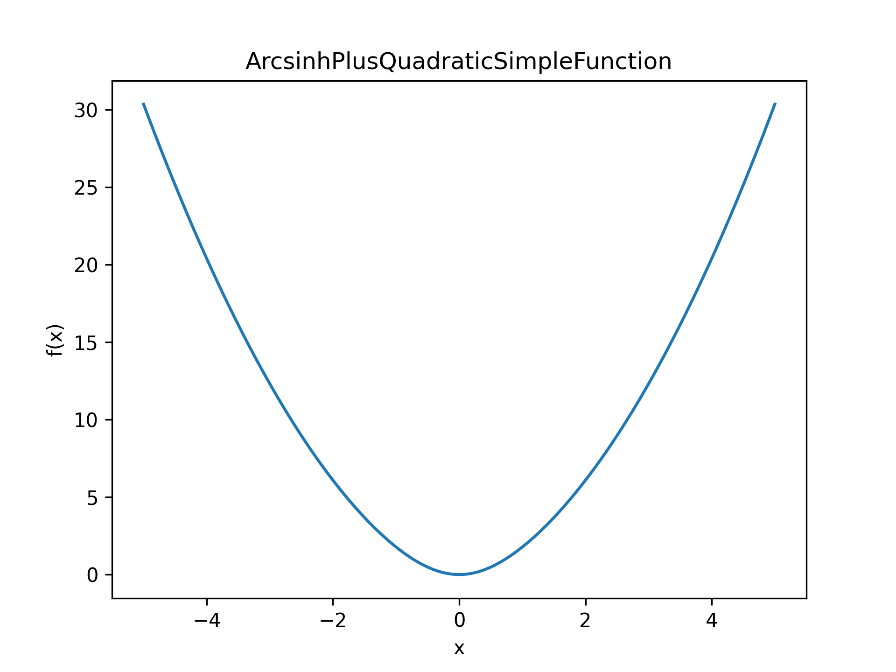 |

## Composite Penalties

### Quadratic Plus Absolute Simple Function

<!-- prettier-ignore -->
::: umf.functions.simple.elementary
    options:
        members:
            - QuadraticPlusAbsoluteSimpleFunction
        show_root_heading: false
        show_root_full_path: false
        show_bases: false
        show_source: true
        show_inherited_members: false
        allow_inspection: false
        inheritance_graph: false
        heading_level: 0

|                                                                                                       |
| :---------------------------------------------------------------------------------------------------: |
| 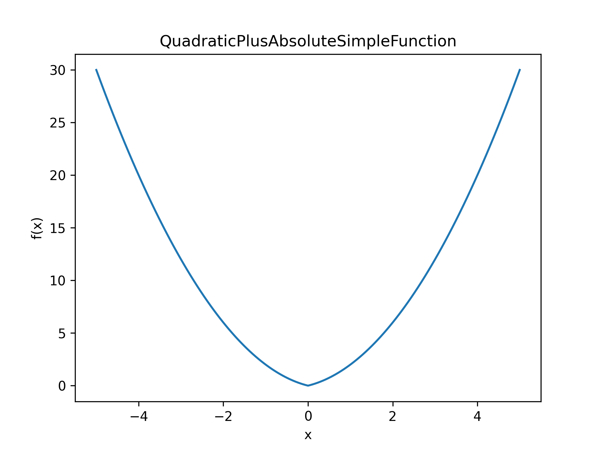 |

### Quadratic Plus Log Simple Function

<!-- prettier-ignore -->
::: umf.functions.simple.elementary
    options:
        members:
            - QuadraticPlusLogSimpleFunction
        show_root_heading: false
        show_root_full_path: false
        show_bases: false
        show_source: true
        show_inherited_members: false
        allow_inspection: false
        inheritance_graph: false
        heading_level: 0

|                                                                                             |
| :-----------------------------------------------------------------------------------------: |
| 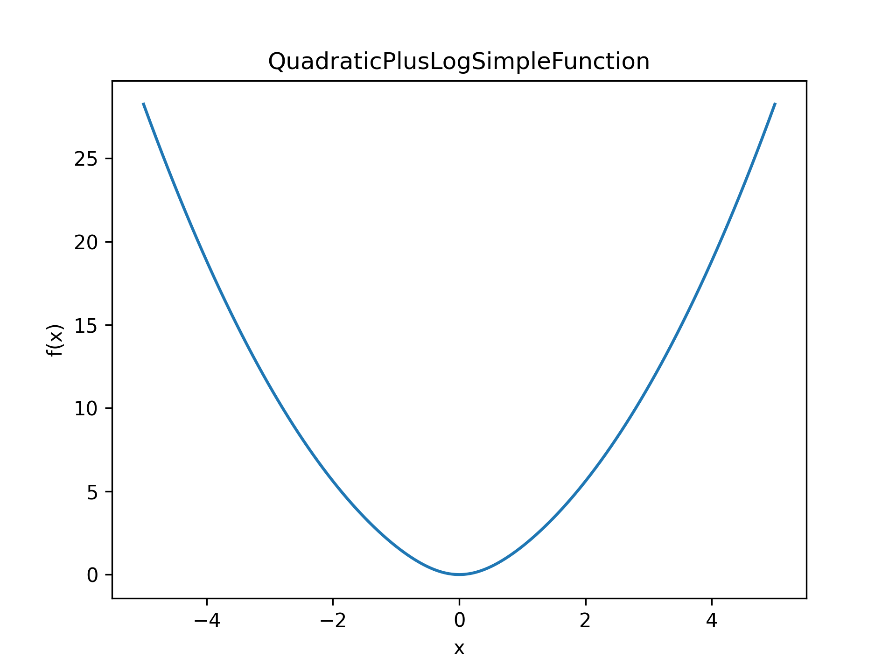 |

### Quadratic Plus Cosine Simple Function

<!-- prettier-ignore -->
::: umf.functions.simple.elementary
    options:
        members:
            - QuadraticPlusCosineSimpleFunction
        show_root_heading: false
        show_root_full_path: false
        show_bases: false
        show_source: true
        show_inherited_members: false
        allow_inspection: false
        inheritance_graph: false
        heading_level: 0

|                                                                                                   |
| :-----------------------------------------------------------------------------------------------: |
| 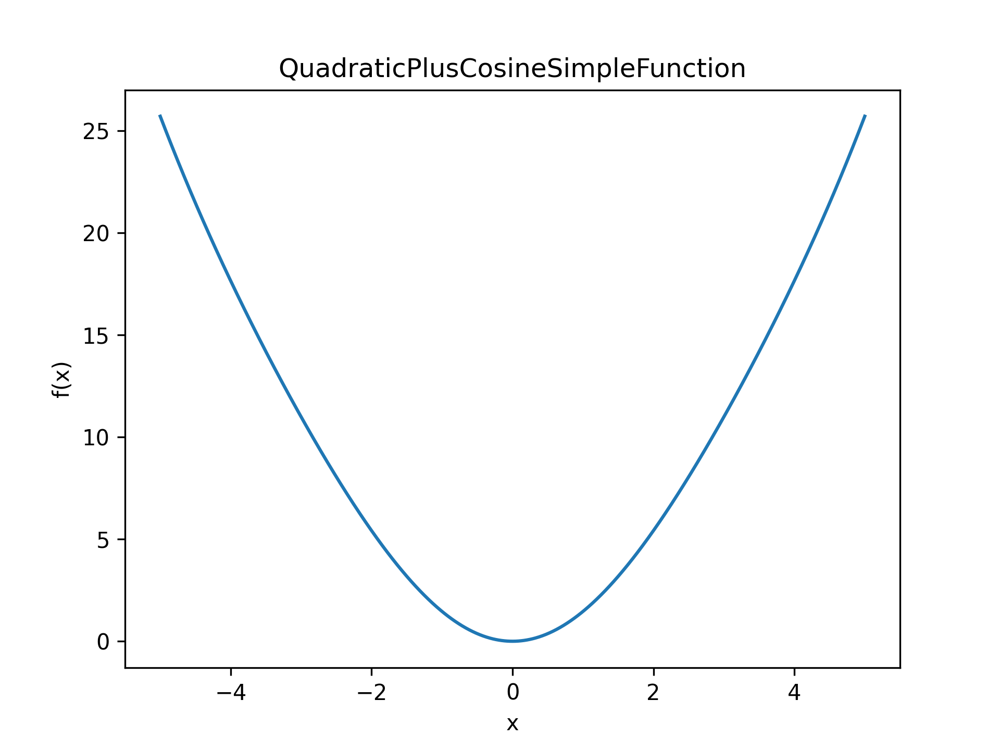 |

### Quadratic Plus Sine Squared Simple Function

<!-- prettier-ignore -->
::: umf.functions.simple.elementary
    options:
        members:
            - QuadraticPlusSineSquaredSimpleFunction
        show_root_heading: false
        show_root_full_path: false
        show_bases: false
        show_source: true
        show_inherited_members: false
        allow_inspection: false
        inheritance_graph: false
        heading_level: 0

|                                                                                                             |
| :---------------------------------------------------------------------------------------------------------: |
| 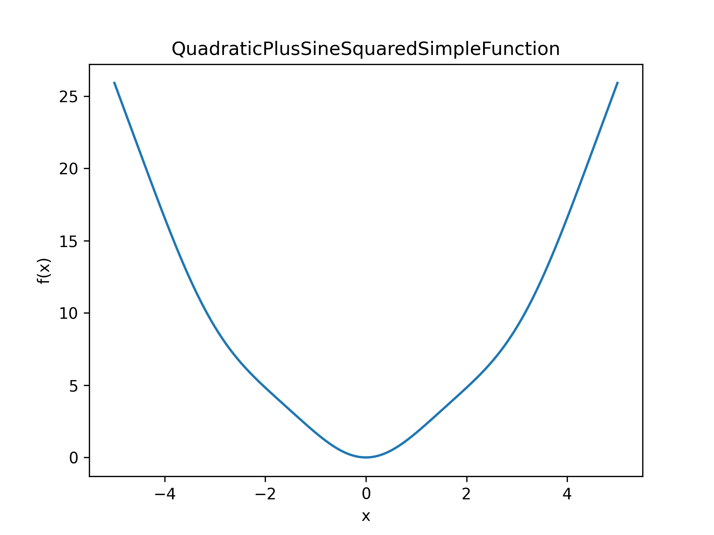 |

### Quartic Plus Cosine Simple Function

<!-- prettier-ignore -->
::: umf.functions.simple.elementary
    options:
        members:
            - QuarticPlusCosineSimpleFunction
        show_root_heading: false
        show_root_full_path: false
        show_bases: false
        show_source: true
        show_inherited_members: false
        allow_inspection: false
        inheritance_graph: false
        heading_level: 0

|                                                                                               |
| :-------------------------------------------------------------------------------------------: |
| 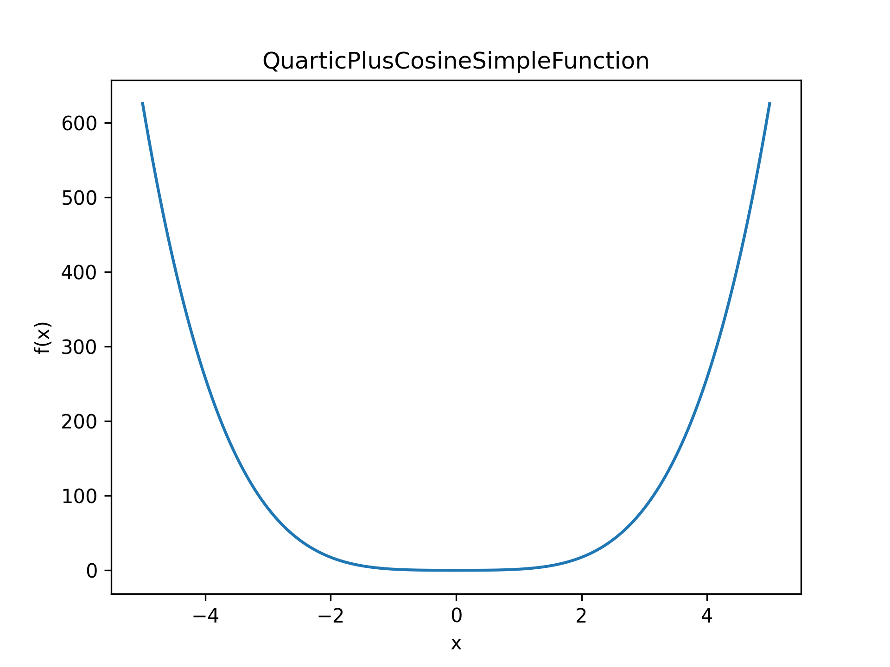 |

### Quartic Plus Sine Squared Simple Function

<!-- prettier-ignore -->
::: umf.functions.simple.elementary
    options:
        members:
            - QuarticPlusSineSquaredSimpleFunction
        show_root_heading: false
        show_root_full_path: false
        show_bases: false
        show_source: true
        show_inherited_members: false
        allow_inspection: false
        inheritance_graph: false
        heading_level: 0

|                                                                                                         |
| :-----------------------------------------------------------------------------------------------------: |
| 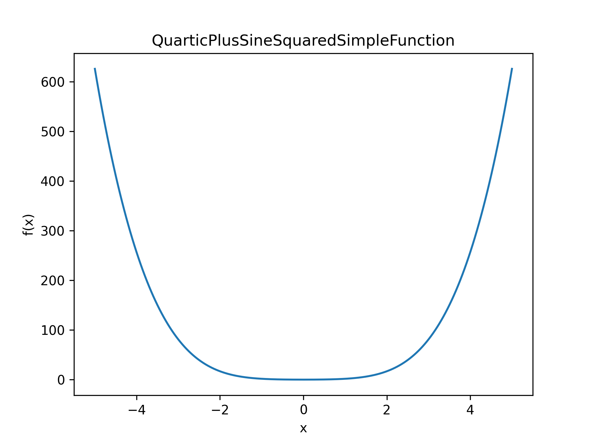 |

### Absolute Plus Cosine Simple Function

<!-- prettier-ignore -->
::: umf.functions.simple.elementary
    options:
        members:
            - AbsolutePlusCosineSimpleFunction
        show_root_heading: false
        show_root_full_path: false
        show_bases: false
        show_source: true
        show_inherited_members: false
        allow_inspection: false
        inheritance_graph: false
        heading_level: 0

|                                                                                                 |
| :---------------------------------------------------------------------------------------------: |
| 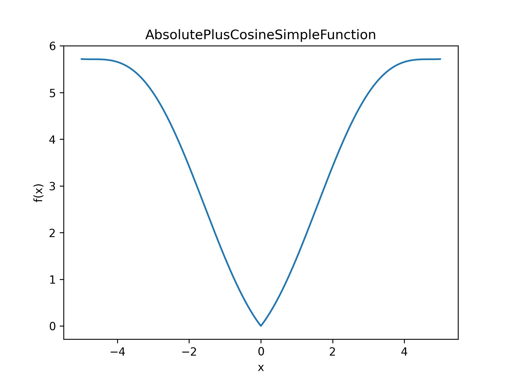 |

### Absolute Plus Sine Squared Simple Function

<!-- prettier-ignore -->
::: umf.functions.simple.elementary
    options:
        members:
            - AbsolutePlusSineSquaredSimpleFunction
        show_root_heading: false
        show_root_full_path: false
        show_bases: false
        show_source: true
        show_inherited_members: false
        allow_inspection: false
        inheritance_graph: false
        heading_level: 0

|                                                                                                           |
| :-------------------------------------------------------------------------------------------------------: |
| 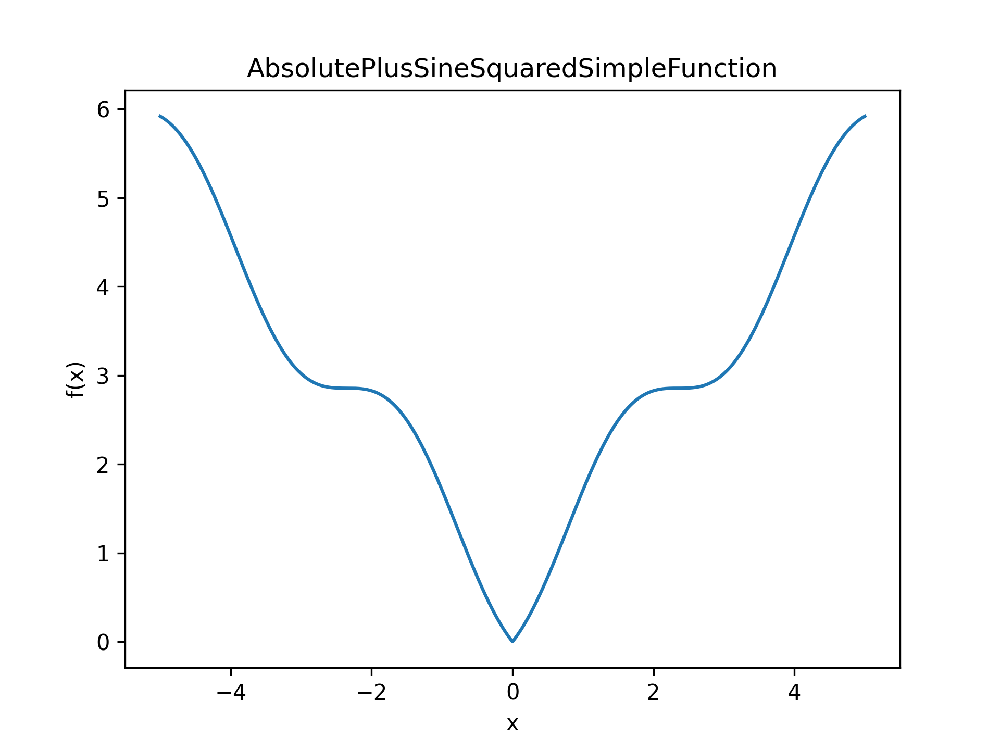 |

### Root Plus Quadratic Simple Function

<!-- prettier-ignore -->
::: umf.functions.simple.elementary
    options:
        members:
            - RootPlusQuadraticSimpleFunction
        show_root_heading: false
        show_root_full_path: false
        show_bases: false
        show_source: true
        show_inherited_members: false
        allow_inspection: false
        inheritance_graph: false
        heading_level: 0

|                                                                                               |
| :-------------------------------------------------------------------------------------------: |
| 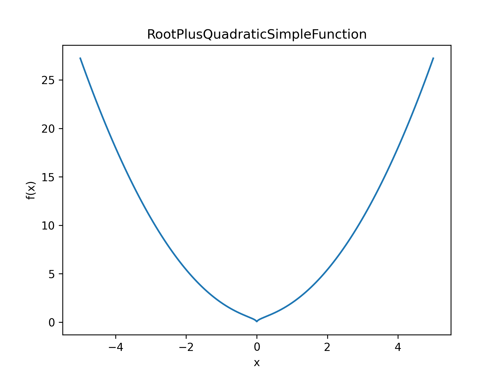 |

### Root Plus Sine Squared Simple Function

<!-- prettier-ignore -->
::: umf.functions.simple.elementary
    options:
        members:
            - RootPlusSineSquaredSimpleFunction
        show_root_heading: false
        show_root_full_path: false
        show_bases: false
        show_source: true
        show_inherited_members: false
        allow_inspection: false
        inheritance_graph: false
        heading_level: 0

|                                                                                                   |
| :-----------------------------------------------------------------------------------------------: |
| 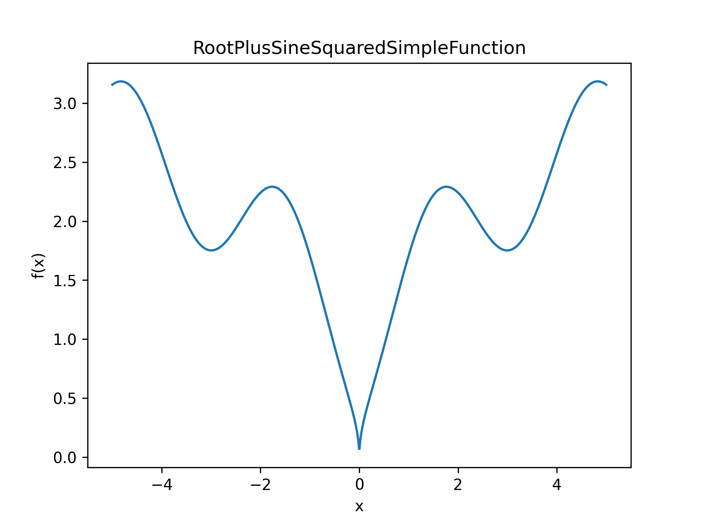 |

### Mixed Even Polynomial Simple Function

<!-- prettier-ignore -->
::: umf.functions.simple.elementary
    options:
        members:
            - MixedEvenPolynomialSimpleFunction
        show_root_heading: false
        show_root_full_path: false
        show_bases: false
        show_source: true
        show_inherited_members: false
        allow_inspection: false
        inheritance_graph: false
        heading_level: 0

|                                                                                                   |
| :-----------------------------------------------------------------------------------------------: |
| 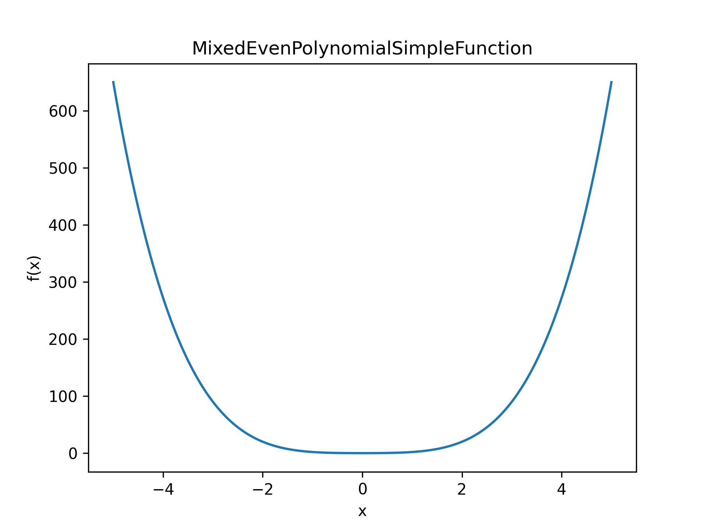 |

### Mixed Absolute Polynomial Simple Function

<!-- prettier-ignore -->
::: umf.functions.simple.elementary
    options:
        members:
            - MixedAbsolutePolynomialSimpleFunction
        show_root_heading: false
        show_root_full_path: false
        show_bases: false
        show_source: true
        show_inherited_members: false
        allow_inspection: false
        inheritance_graph: false
        heading_level: 0

|                                                                                                           |
| :-------------------------------------------------------------------------------------------------------: |
| 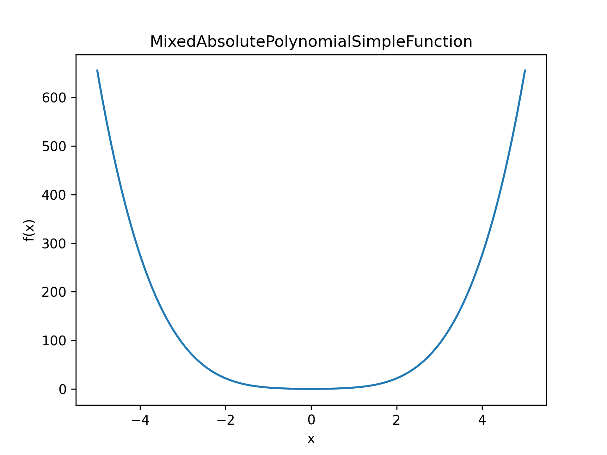 |
