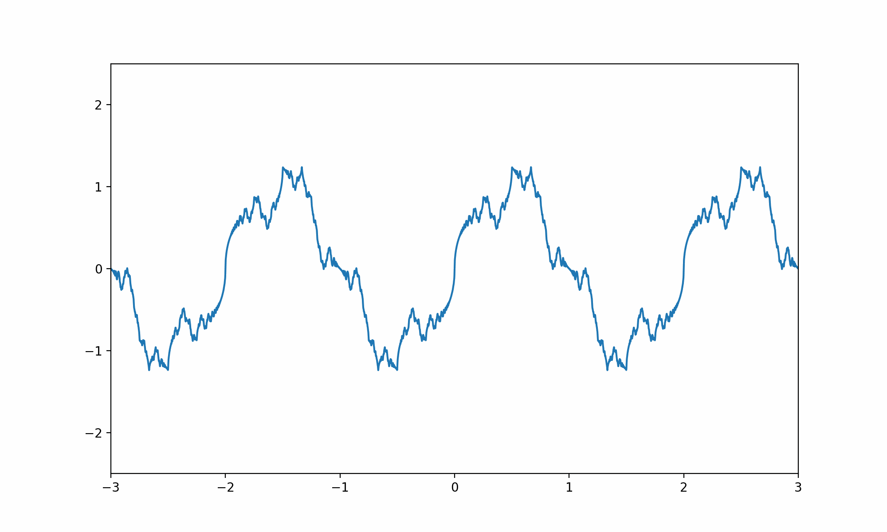
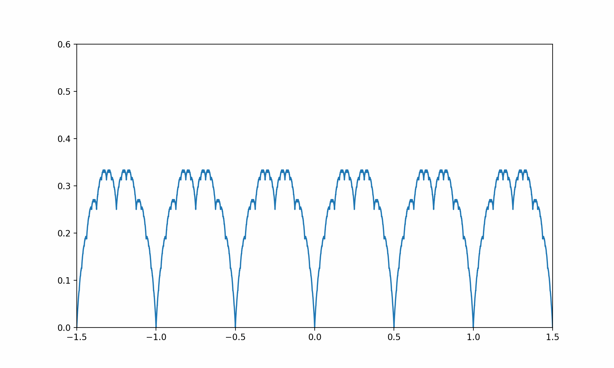
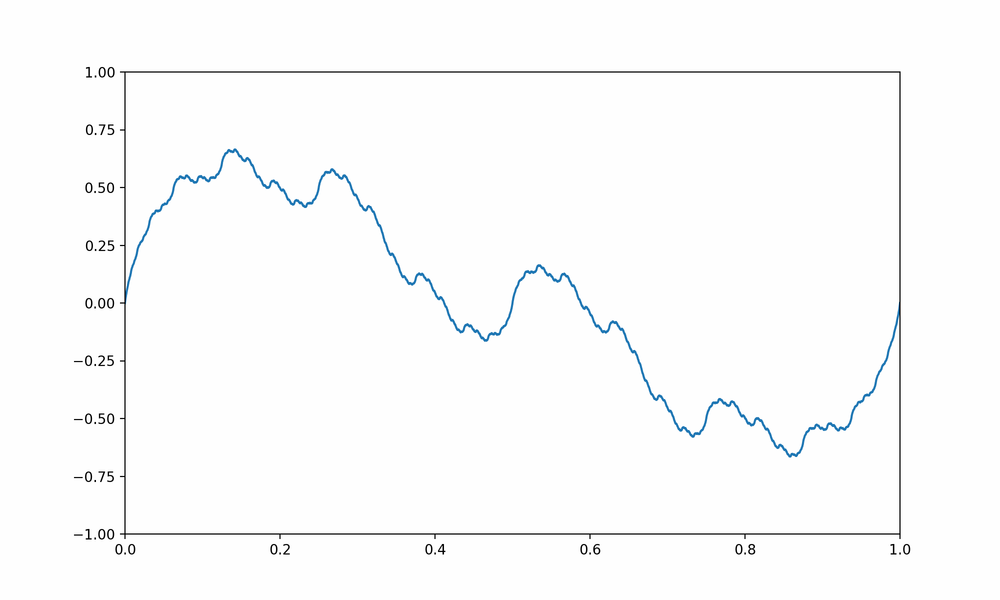

<!-- markdownlint-disable MD060 -->

## Weierstrass Function

<!-- prettier-ignore -->
::: umf.functions.theory.pathological.WeierstrassFunction
    options:
        show_bases: false
        show_source: true
        show_inherited_members: false
        allow_inspection: false
        inheritance_graph: false
        heading_level: 0

|                                                                       |
| :-------------------------------------------------------------------: |
|  |

## Riemann Function

<!-- prettier-ignore -->
::: umf.functions.theory.pathological.RiemannFunction
    options:
        show_bases: false
        show_source: true
        show_inherited_members: false
        allow_inspection: false
        inheritance_graph: false
        heading_level: 0

|                                                               |
| :-----------------------------------------------------------: |
|  |

## Takagi Function

<!-- prettier-ignore -->
::: umf.functions.theory.pathological.TakagiFunction
    options:
        show_bases: false
        show_source: true
        show_inherited_members: false
        allow_inspection: false
        inheritance_graph: false
        heading_level: 0

|                                                             |
| :---------------------------------------------------------: |
|  |

## Mandelbrot's Fractal Function

<!-- prettier-ignore -->
::: umf.functions.theory.pathological.MandelbrotsFractalFunction
    options:
        show_bases: false
        show_source: true
        show_inherited_members: false
        allow_inspection: false
        inheritance_graph: false
        heading_level: 0

|                                                                                     |
| :---------------------------------------------------------------------------------: |
|  |

## Besicovitch Function

<!-- prettier-ignore -->
::: umf.functions.theory.pathological.BesicovitchFunction
    options:
        show_bases: false
        show_source: true
        show_inherited_members: false
        allow_inspection: false
        inheritance_graph: false
        heading_level: 0

|                                                                       |
| :-------------------------------------------------------------------: |
|  |
